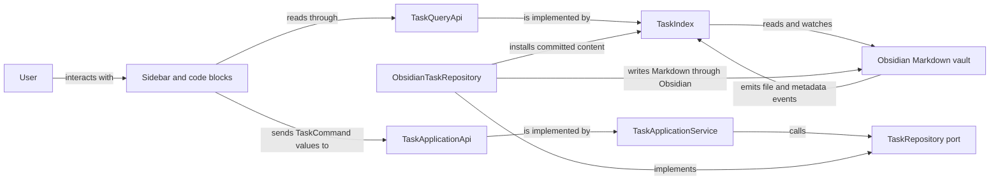

# Architecture

Abyss Tasks is an Obsidian plugin for managing Markdown tasks through a sidebar and native
`task-calendar` code blocks. Markdown remains the durable record. The plugin builds a read model over
the vault, turns user actions into explicit commands, and writes the result back to Markdown.

This document is a map of the architecture implemented on `master`. It explains responsibilities,
data flow, and dependency direction. It is not a complete source inventory or a roadmap. When you
need implementation detail, follow the linked entry points and inspect the current call paths with
CodeGraph.

## System at a glance



The two paths are deliberately separate. Queries return immutable task snapshots for rendering.
Commands validate an intended change, resolve the target, perform the write, and return a structured
result. A successful plugin write installs the committed content in the read model immediately.
Later Obsidian events reconcile it through the same parsing path used for manual edits.

## Sources of truth

The plugin has several kinds of state, but they do not have equal authority.

| Concern                                         | Authoritative source                                  | Derived or temporary representation            |
| ----------------------------------------------- | ----------------------------------------------------- | ---------------------------------------------- |
| Tasks and task metadata                         | Markdown files in the Obsidian vault                  | `TaskIndex` snapshots and calendar projections |
| Projects and project status                     | Project Markdown plus configured queries and mappings | `ProjectStore` entries and task statistics     |
| Plugin preferences and saved list view states   | Obsidian plugin data                                  | Migrated in-memory `CalendarSettings`          |
| Current mode, selection, search, and drag state | `AppState` for the current panel session              | Rendered panel DOM                             |

`TaskIndex` and `ProjectStore` are read models, not secondary databases. They may be rebuilt from the
vault and current settings. `AppState` coordinates the open interface and must not become a hidden
persistence layer.

## Runtime building blocks

### Composition root

[`src/main.ts`](src/main.ts) is the task-system composition root and the Obsidian plugin lifecycle
entry point. It loads and migrates settings, creates the status catalog, task index, Markdown codec,
repository, destination provider, and application service, then registers the sidebar, commands,
settings tab, and code block renderer. It also starts and stops the task index with the plugin.

Concrete Obsidian task adapters are wired here. Other modules should receive task capabilities
through their public interfaces instead of constructing alternate repositories or indexes.

### Public task boundary

[`src/tasks/index.ts`](src/tasks/index.ts) is the public import boundary for task functionality.
Presentation code works with four small capabilities:

- `TaskQueryApi` lists and resolves task snapshots and publishes index events.
- `TaskDependencyQueryApi` lists persisted root/subtask nodes, projects direct relations, and checks
  proposed edge eligibility. `TaskApplicationApi.queries` supplies both query capabilities.
- `TaskApplicationApi` executes `TaskCommand` values and returns `TaskCommandResult` values.
- `TaskCaptureApplicationApi` plans creation against an explicit destination before the write.

These interfaces keep presentation independent of Markdown editing and Obsidian events. Export a
capability here only when another component needs it.

### Task domain

[`src/tasks/domain/`](src/tasks/domain/) owns task value objects, immutable snapshots, references,
commands, status semantics, recurrence rules, reconciliation results, and date and time semantics.
It contains the meaning of a task change, not the mechanism used to store or display it.

The domain depends only on itself and the deterministic `rrule` boundary. It must not import
Obsidian, panels, settings UI, or infrastructure.

### Task application layer

[`src/tasks/application/`](src/tasks/application/) coordinates use cases. `TaskApplicationService`
captures the relevant clock and behavior settings, resolves a command target, validates the change,
and delegates persistence through repository and destination ports. It returns structured outcomes
such as success, conflict, invalid input, missing or ambiguous targets, partial moves, and I/O
failure.

`TaskDependencyService` coordinates public add/remove/restore dependency commands and derives the
active blockers used by completion validation. It receives query/repository ports, an ID generator,
and a diagnostic sink from the composition root. Dependencies use the same repository and source
editor as ordinary task commands.

The application layer may depend on its own ports and the domain. It must not depend on presentation
or concrete infrastructure.

### Task infrastructure and Markdown editing

[`src/tasks/infrastructure/`](src/tasks/infrastructure/) implements the task ports with Obsidian and
Markdown:

- `TaskIndex` listens to vault and metadata events, parses files, maintains immutable snapshots, and
  implements `TaskQueryApi` and `TaskDependencyQueryApi`.
- `ObsidianTaskRepository` locates a task block and performs writes through Obsidian's vault APIs.
- `TaskMarkdownCodec`, `TaskBlockEditor`, and `TaskLocator` own parsing, serialization, block edits,
  and target location.
- `TaskRefAuthority` preserves reference identity across writes and event reconciliation.

Infrastructure may depend on the task application and domain layers, the shared Markdown helpers,
and Obsidian. It must not reach into panels, views, or settings UI.

### Sidebar presentation

[`src/views/PanelView.ts`](src/views/PanelView.ts) is the sidebar shell. It creates `AppState`, lays
out the responsive panel structure, wires navigation and shortcuts, and owns the lifetime of the
panel-specific collaborators.

The visible surface is split by responsibility:

- `RailPanel` changes the high-level mode.
- `LeftPanel` presents lists, tags, and projects used for navigation.
- `CenterPanel` renders the selected task, calendar, search, or project content.
- `RightPanel` displays and edits the selected task.

Panels may issue commands and query snapshots through the public task boundary. They share
navigation and transient interaction state through `AppState`. They must not edit task Markdown
directly or import private task-layer modules.

`RightPanel` consumes dependency queries through `src/tasks` for the compact badge and direct
relation sections. Shared dependency presentation owns counts and recovery labels; the dependency
search model owns filtering, direction eligibility and stable same-file ranking. One search
controller handles general and scoped entry points, keyboard selection and focus dismissal.
The inspector keeps disclosure and search drafts only for its mounted lifetime, preserving the
search across proven selection refreshes. Index events refresh counterpart status and relation
rows. Add/remove actions use the existing task application and committed-result Undo presenter;
failed actions leave the search available and use the established command-result Notice.

`AppState.taskStack` remains one structural root-to-subtask chain. Resolved relation rows call
`openInspectorDependency()`, which stores a detached, deeply frozen complete chain in
`inspectorBackStack` and selects the destination's complete path. The Back button in the existing
breadcrumb area appears only while history exists and restores one whole frame; ancestor breadcrumbs
and subtask clicks change only the current chain. Ordinary `set('taskStack', ...)` begins a new
selection and clears history, including explicit reselection and inspector clear. Internal refresh,
command convergence and structural navigation use `updateInspectorSelection()` to preserve history.
Empty or invalid frames are never retained, invalid destinations are ignored, and opening the already
selected exact target is a no-op. Before Back pops a frame, `RightPanel` resolves its root through the
existing task query and conservatively reconstructs the complete structural path. Only an exact or
proven rebased root and a complete path can be restored; the live snapshots and frame pop commit
atomically. If the former task is unavailable or ambiguous, a Notice explains the failure and both
the current selection and retryable history remain unchanged. On each query notification, `RightPanel`
synchronously maintains proven complete frame successors before deferred DOM refresh, so successive
index transitions do not lose relocation evidence. `updateInspectorHistoryFrames()` replaces only
changed frames atomically with detached frozen snapshots, retaining unproven frames and making
unchanged refreshes no-ops. Earlier frame objects remain immutable. Frames use the canonical task
snapshot clone helper through `src/tasks`; they are transient. A modal owns its own AppState
and history for its open lifetime, independently of the main panel.

### Projects

[`src/projects/`](src/projects/) treats qualifying Markdown notes as projects. `ProjectStore`
evaluates the configured membership query against note paths, tags, and frontmatter, then combines
the result with task snapshots to calculate project statistics. It updates its derived cache in
response to both Obsidian file events and task index events.

`ProjectManager` contains project writes. It creates project notes from the configured template,
changes the configured frontmatter or tag status markers, and moves task blocks into project notes
through `TaskApplicationApi`. Membership and status are derived from Markdown through configured
queries and mappings; `ProjectStore` adds no separate persisted state.

### Settings and status semantics

[`src/settings/`](src/settings/) defines defaults, persisted settings, migrations, and the settings
interface. `TaskCalendarPlugin.loadSettings()` migrates persisted data before it merges defaults.
Changes to task status settings rebuild the shared `StatusCatalog`, `StatusRegistry`, and the
indexer's interpretation of task symbols together.

Settings that change a persisted contract need a compatibility and migration design. A new setting
must not be used to create a second implementation of an existing workflow.

### Native code blocks

[`src/code-block/registerCodeBlock.ts`](src/code-block/registerCodeBlock.ts) registers native
`task-calendar` Markdown code blocks. It resolves block parameters over the same plugin settings and
constructs `CalendarRenderer` with the same query, command, and status capabilities used by the
sidebar. Its render child owns cleanup when Obsidian removes the block from the document.

## Critical data flows

### Reading and indexing tasks

1. `TaskIndex` reads Markdown and listens to Obsidian vault and metadata events.
2. The canonical codec turns supported task blocks into immutable snapshots.
3. `TaskQueryApi` exposes filtered lists, reference resolution, and calendar projection sources.
4. Subscribers refresh presentation from the updated snapshots.

`TaskSnapshot` and `SubtaskSnapshot` expose `dependencyId` and ordered `dependsOn` values, including
authored duplicates, as immutable projections sourced only from Tasks-compatible `🆔 id` and
`⛔ id-1, id-2` Markdown carriers. The source Markdown remains authoritative and is read in place
without migration. Generated recurrence occurrences strip both task IDs and dependency edges, while
the completed original occurrence retains its authored carriers.

The pure `taskDependencies` domain module enumerates persisted roots and subtasks in canonical
file/root/source order. Each node carries its root and the complete subtask path for rebuilding a
structural inspector frame. Recurrence forecasts are not graph nodes. Concrete `TaskIndex` methods
derive direct `Blocked by` rows in declared ID order and inverse `Blocks` rows in source order.
The application consumes these methods through `TaskDependencyQueryApi`. `listNodes()` reclassifies
the detached root, path, and node snapshots through the live status catalog while retaining their
persisted refs and source bytes; it does not mutate the indexed snapshots.

Dependency activity follows Tasks semantics: both the dependent and a matching prerequisite must
be open or in progress under the live status catalog. Done and cancelled endpoints never contribute
active counts. Missing IDs remain visible but non-blocking. Duplicate IDs produce one ambiguous
prerequisite row, active if any matching task is active; each matching task's inverse relation uses
its own status. Authored duplicate declarations collapse in the projection, and authored cycles stay
visible as direct relations. Eligibility separately rejects edges that would introduce cycles.

`TaskIndex` owns the derived graph cache and invalidates it when indexed file content changes,
files are renamed or deleted, or `setStatusCatalog()` replaces the catalog. Relation activity is
classified at query time, including in-place catalog updates, without reparsing Markdown. Node and
relation results are detached through snapshot cloning and frozen, so callers cannot alter the
index or subsequent projections. No dependency data is persisted outside Markdown.

### Editing an existing task

1. A panel or calendar renderer translates the interaction into a `TaskCommand`.
2. `TaskApplicationService` resolves the current target and validates the requested transition.
3. `ObsidianTaskRepository` applies the Markdown edit through Obsidian.
4. The repository installs committed content in `TaskIndex`; the following Obsidian event confirms
   or reconciles that state.
5. The resulting command outcome drives user feedback.

The UI must not assume that its previous snapshot is still writable. Conflicts and ambiguous targets
are normal command outcomes and belong at the application boundary.

Dependency metadata writes use the repository's internal `set-dependency-id` and `set-depends-on`
edit commands. `TaskMarkdownCodec` validates IDs against the same Tasks-compatible grammar used by
the parser and serializes `🆔` and `⛔` carriers in canonical order without deduplicating authored
dependency lists. The repository resolves the root or subtask target and delegates the single-line
replacement to `TaskBlockEditor`, preserving the rest of the root aggregate and file bytes. These
commands are storage primitives; `TaskDependencyService` owns public dependency orchestration.

`add-dependency` resolves both endpoints and checks self-links, duplicates, inverse edges, cycles,
and ambiguous IDs. An ID is allocated lazily from eight lowercase base36 characters; existing IDs
and declared dependency IDs are reserved. Same-file endpoints use `editBatch()` to confirm both
roots and publish the ID and edge together. Across files, the blocker ID commits first; both
endpoints are resolved again and eligibility is checked before the dependent edge write. A changed
blocker ID rejects the attempt. Repository rebases repeat resolution and eligibility before retry.
When the second cross-file write fails, the assigned ID remains, the exact structured error is
returned, and one content-free diagnostic is emitted. There is no compensating ID deletion.

Dependency mutation validation and publication share a FIFO coordinator keyed by repository,
including separate service instances. Add/remove/restore and completion-to-done/cancelled hold
that coordinator through their final repository result and any retry. Queued completion resolves
again after acquisition; an idle acquisition continues the already prepared synchronous read.
Neither path reacquires during retry. Unrelated non-completion edits bypass the coordinator, and
failure always releases the next waiter.

Successful dependency commands return `DependencyCommandOutcome` with the fresh dependent
occurrence and a blocker occurrence when uniquely resolved. Removing a raw ID deletes every
declaration of that ID and returns its exact before/after sequences. `restore-dependency` requires
the current sequence to equal the captured after-sequence before restoring the before-sequence;
missing or ambiguous blocker IDs require no blocker lookup. Intervening changes return conflict.
Unexpected application errors return the existing I/O error and emit one diagnostic containing
only operation, phase, and a fixed cause. User feedback remains in the existing command-result
presenter, which also handles the structured blocked result.

Successful `delete-subtask` outcomes retain the ordinary updated-root shape and additionally carry
`subtaskRemovalRecovery`: the exact removed source bytes, the committed parent, the original
relative position, and committed before/after sibling references. Recovery and its owning outcome
are deeply detached and frozen. Both repository adapters capture bytes in `TaskBlockEditor` and
share recovery construction; the Obsidian adapter refreshes recovery references after installing
the authoritative commit. No subtree is reconstructed from parsed presentation fields.

`restore-subtask` follows the ordinary application, repository, editor, retry, and selection paths.
It validates task syntax and ownership under the resolved parent, checks captured sibling anchors,
and rejects changed or ambiguous parents and anchors without writing. Reconciliation requires the
parent's complete source block to remain unchanged. A relative-only placement is usable only while
the captured base revision still matches. Deleting a final subtree without a trailing newline can
consume the preceding separator; an optional ephemeral `placement.lineEnding` preserves that
otherwise-lost LF/CRLF evidence. It is validated before repository I/O and used only without an
anchor supplying context. Older recovery payloads must have unambiguous current separator evidence
or restoration conflicts. This adds no persisted task metadata and preserves existing deletion bytes.
The editor and projector share the blank/quote-only line predicate. A fresh exact-base recovery may
cross preserved, quote-compatible separator lines beyond the shortened parent's projected block,
including its implicit empty EOF line; it never crosses intervening content or synthesizes an
uncaptured gap. Such out-of-block placement cannot be rebased even with an otherwise valid anchor.
Appending the captured subtree preserves its original final-newline state.

`taskUndoNotice` owns the success/Undo surface for recoverable mutations. It constructs inverses
from committed dependency outcomes or exact subtask recovery, so Undo never reuses pre-write refs.
Dependency-add Undo leaves a lazily allocated ID intact; removal Undo restores the captured ordered
ID sequence, including unavailable, ambiguous, and repeated declarations. One native button runs
at most once, disables while pending, hides its Notice after execution, and returns focus to the
invoking inspector row when it remains connected. Failed Undo hides the success Notice and passes
one structured result to `presentTaskCommandResult`; unexpected throws produce one local diagnostic
and the same error boundary. The existing inspector subtask delete flow uses this presenter and
its normal selection convergence. On Obsidian 1.8.7+, a version guard enables public `containerEl`;
older supported versions retain the button passed in the fragment and use the longstanding `hide()`
API. The deprecated `noticeEl` is never used.

Before root or subtask toggle/set-status commands dispatch a transition to configured done or
cancelled status, the application checks every active resolved or ambiguous blocker. Missing IDs
do not block, and already completed dependents remain non-blocking. The same validation runs before
a reconciled retry, including recurrence completion. A newer proven index resolution takes
precedence over the service's recent outcome cache. For an index that is still behind the
repository, the reconciled root is reclassified through the current catalog and overlaid in the
dependency graph so newly added edges or newly active same-root blockers cannot be missed.
Overlays remove the proven predecessor by full revision identity, never by the new source line;
unrelated roots remain even when their old addresses overlap the relocated root. Graph lookup
includes revision identity for that temporary mixed-revision world. Standalone previews may use
a unique whole-tree comparison excluding only refs/source, dependency fields, and status values.
Missing or ambiguous predecessor/target proof fails closed as conflict. The application carries
its repository/reconciliation-proven completion basis through a synchronous nested-safe scope,
cleared in `finally`; this scope neither persists evidence nor implements the asynchronous lock.

Nested command reconciliation first accepts an exact full current ref. A stale source match must
be unique in both its predecessor and current sibling sets. Completion retries use the complete
matched current subtask ref, including relocated relative lines, before validation or dispatch.
For authority-proven queued status commands, dependency-only changes at the proven position may
be matched only when the shared pure `sameTaskTreeExceptDependencies` proof confirms the complete
root tree is unchanged apart from dependency metadata and expected revision/source carriers.
It retains source addresses, ordered child structure, and all other parsed fields, including root
and ancestor status, planning, descriptions, and comments. Retained source-position groups at
every sibling level also reject reorders hidden by otherwise identical dependency-stripped nodes;
duplicate source groups are never paired into invented identities. Ordinary unique source
relocation remains available when the dependency-only proof fails.

Dependency commands have no single initiating root in `PanelView` and do not use ordinary command
outcome convergence. Normal index events refresh the current structural selection in both the panel
and `TaskModal`. Selection rebuilding first accepts a complete exact root-to-child ref, including
duplicate siblings; uncertain source matching still requires uniqueness. After a proven
authority transition, selection rebuilding may retain the same relative subtask path when every
non-dependency field and child structure is unchanged across the complete root tree. Presentation
imports that same proof through the task public barrel rather than maintaining a separate
normalizer. That positional proof precedes text matching so an unchanged identical sibling cannot
steal selection. Text fallback also requires
predecessor uniqueness. Positional fallback is unavailable for uncertain or visual matches;
unrelated content or structure changes stop at the last proven ancestor.

For an inspector's own pending title, description, scalar metadata or non-recurring status edit,
`RightPanel` captures the submitted command and detached structural selection before dispatch.
`PanelView` and `TaskModal` may retain that selection through an exact owned authority transition
using the shared `ownedTaskSelection` proof. The selected and edited paths must still be unambiguous;
task topology and sibling source order must match, unaffected subtrees must retain exact source bytes,
and the edited node may differ only in the command's specified fields and their derived projections.
The actual changed values must match the submitted command. Structural commands, ambiguous sibling
paths, unrelated changes and transitions without pending ownership use the existing conservative
selection rebuilding. This proof affects presentation continuity only; it grants no write authority
and introduces no persisted identity.

`TaskRepository.editBatch()` groups these two metadata edit commands within one file. It validates
every revision precondition and complete root-to-subtask reference against the original content,
then the shared infrastructure batch preparer composes one candidate through the existing codec
and block editor. Both repository adapters use this preparation. The Obsidian adapter performs the
entire operation in one synchronous `Vault.process()` callback. Unsupported command kinds,
cross-file requests, inconsistent preconditions, and unavailable outcome targets cannot publish a
partial edit. The result contains the freshly indexed root owning `outcomeTarget`, including fresh
references for its changed descendants. An unchanged batch preserves the existing revisions.

Live authority-backed root refs distinguish byte-identical roots by exact line and revision.
Initial duplicate occurrences receive distinct ephemeral authority revisions; unchanged source
populations at the same lines retain those revisions on refresh. Unique sources retain their
generation-zero initialization, and no identity is written to Markdown for this purpose.
Before a repository edit permits that duplicate-source match, `TaskIndex.currentRoot()` confirms
the transaction's ordered occurrence lines equal the indexed source population. An unobserved
insertion, deletion, or shifted population cannot use the line hint to retarget a write. Stale and
legacy source-only references keep conservative ambiguity and relocation behavior.

Prepared repository requests in both adapters share identity-first reconciliation. An exact keyed
authority successor is checked before any source-only location; its complete current ref must
match the located snapshot. Byte-identical relocation additionally retains the consumed revision,
so a remaining identical sibling cannot authorize an application retry after the selected root
changes. `TaskIndex.resolve()` likewise accepts only an exact keyed writable authority transition
before unrelated source ambiguity; visual/source-only matches remain conservative.

The batch stages one authority transition with an explicit predecessor revision for each consumed
root. `TaskIndex` passes those individual mappings into reconciliation, so either edited root can
converge to its own successor through the normal index event. The legacy one-source authority
staging path retains its recurrence fan-out semantics. Before publication, the repository attaches
the original complete ordered line/source/revision population to the active authority token,
after confirming it against the index and canonical original blocks. Single edits, deletions,
recurrence edits and metadata batches share this rollback basis. After processor rejection, the
repository holds the file reservation until its authoritative read finishes. The original active
token can be consumed once to restore predecessor revisions only when the complete original
bytes, fingerprint and length match. Restoration emits no writable authority transitions and
clears stored writable/visual index reconciliation edges; the independent conservative same-line
visual fallback is unchanged. Commit, abort, restoration and acknowledgement terminalize token
ownership; an old or foreign token cannot affect a later same-file reservation. A failed read
still releases the reservation and revokes forward mappings. If a
processor reports an error after persisting the complete candidate, the repository preserves the
actual bytes and returns the existing I/O error with unknown content state; it does not retain the
failed operation's writable provenance or attempt a compensating file write.

### Creating a task

1. The interface chooses a capture context and asks `TaskCaptureApplicationApi` to plan a
   destination.
2. The destination provider resolves today's note or the configured file and insertion policy.
3. The ready creation session sends the create command through the application service and
   repository.
4. The creation presentation layer focuses or reveals the indexed result without inventing a
   separate persisted identifier.

### Manual and external Markdown changes

`TaskIndex` scans Markdown when it initializes. Later Obsidian vault and metadata events cause
`TaskIndex` and `ProjectStore` to reevaluate affected content and notify subscribers. Plugin writes
and external edits therefore converge on the same visible state.

### Project operations

Project discovery is a query over Markdown metadata. Project status changes update the configured
frontmatter property or tag. Moving a task into a project uses the standard task move command, so it
retains the same validation, recovery, and reindexing behavior as other task moves.

## Enforced dependency rules

[`dependency-cruiser.config.cjs`](dependency-cruiser.config.cjs) is authoritative for exact import
restrictions. The building-block sections above record their architectural intent, not every allowed
path or exception. Update [`test/dependency-rules.test.ts`](test/dependency-rules.test.ts) whenever a
rule changes; never weaken a boundary to accommodate a local implementation.

## Deliberate compatibility seams

Some older interfaces remain because current users and views still depend on them:

- `src/parser/` projects canonical task data into the legacy presentation shape used by established
  views. It may use the canonical Markdown codec where the conversion requires it, but new task
  behavior belongs in `src/tasks/`.
- `window.renderCalendar` is a legacy Dataview bridge installed and removed by `src/main.ts`. Native
  `task-calendar` code blocks are the maintained Obsidian integration.
- Several presentation modules coordinate substantial established behavior. New views should reuse
  their commands, menus, state semantics, and UI primitives instead of building a parallel task
  system beside them.

## How to change the architecture

Read this document before planning a change that crosses component boundaries. Then use CodeGraph
and the source to verify the current implementation. The document summarizes the implemented shape;
the code answers exact questions about symbols and call paths.

Update `ARCHITECTURE.md` in the same commit when a change affects any of these:

- ownership of a component or use case;
- a public boundary or cross-layer contract;
- dependency direction or the composition root;
- one of the critical data flows above;
- a persisted source of truth or its migration path;
- an explicit compatibility seam.

Do not update it for private renames, local extraction, styling details, or a new helper that leaves
the architecture unchanged. Proposed architecture belongs in an ignored design spec until the code
implements it. This file always describes the state after the commit in which it appears.

If a change introduces an exception to an existing boundary, record its reason and scope here and
encode the narrowest practical automated check. Prefer removing the cause over documenting a broad
escape hatch.

## Verification

Use the architecture check while working, then run the repository gate before integration:

```shell
pnpm arch
pnpm verify
```

`pnpm arch` checks the current dependency graph. `pnpm verify` also runs the architecture fixture
tests, formatting, lint, types, coverage, build artifacts, release metadata, and dependency health.

For presentation or interaction changes, the automated gate is necessary but not sufficient. Build
the plugin, load it in `dev-vault-tasks`, exercise the affected workflow with the Obsidian CLI, and
inspect screenshots, DOM evidence, and captured runtime errors. Check constrained widths whenever a
layout can change.
