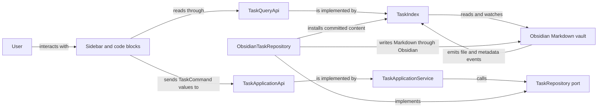

# Architecture

Abyss Tasks manages Markdown tasks through an Obsidian sidebar and native `task-calendar` code
blocks. Markdown is the durable record. The plugin builds read models over the vault and writes
user changes through application commands.

This document describes the implemented architecture on `master`: ownership, sources of truth,
dependency direction, and critical data flows. Follow the source and test links for behavior details;
use CodeGraph to inspect current call paths. Proposed architecture belongs in an ignored design spec.

## System at a glance



Queries return immutable snapshots. Commands validate fresh targets, perform writes, and return
structured outcomes. Successful writes enter the read model immediately; later Obsidian events
reconcile them through the same parsing path as manual edits.

## Sources of truth

| Concern                                              | Authoritative source                                                                     | Derived or temporary state                   |
| ---------------------------------------------------- | ---------------------------------------------------------------------------------------- | -------------------------------------------- |
| Tasks, metadata, and dependencies                    | Vault Markdown                                                                           | TaskIndex snapshots and calendar projections |
| Projects and status                                  | Project Markdown, membership query, configured status property, and literal status names | ProjectStore snapshots and task statistics   |
| Static preferences                                   | Plugin `data.json`                                                                       | Composed runtime CalendarSettings            |
| Saved list, section, and project views               | Versioned plugin `state.json`                                                            | Composed runtime CalendarSettings            |
| Navigation, selection, search, editors, and gestures | AppState or the owning view controller for the current session                           | Rendered DOM                                 |

`TaskIndex` and `ProjectStore` are rebuildable read models. `AppState` coordinates the interface;
it must not become a persistence layer. Saved view preferences and transient interaction state
remain separate even when one controller uses both.

## Boundaries and entry points

[`src/main.ts`](src/main.ts) is the task-system composition root and Obsidian lifecycle entry point.
It loads settings, creates the status catalog and task adapters, wires application capabilities,
registers views and commands, and starts and stops the index. Concrete Obsidian task adapters are
wired here; consumers receive interfaces instead of constructing alternate repositories or indexes.

| Boundary                                                  | Responsibility                                                                              | Dependency direction                                                     |
| --------------------------------------------------------- | ------------------------------------------------------------------------------------------- | ------------------------------------------------------------------------ |
| [Task public API](src/tasks/index.ts)                     | Query, dependency query, commands, and capture planning                                     | Presentation imports this boundary                                       |
| [Task domain](src/tasks/domain/)                          | Immutable values, references, commands, status, recurrence, dates, and time                 | Domain and deterministic `rrule` boundary only                           |
| [Task application](src/tasks/application/)                | Resolve and validate use cases; coordinate repository and destination ports                 | Domain and application ports; no concrete infrastructure or presentation |
| [Task infrastructure](src/tasks/infrastructure/)          | Obsidian adapters, index, canonical codec, block editing, location, and reference authority | Application, domain, shared Markdown helpers, and Obsidian; no UI        |
| [Sidebar shell](src/views/PanelView.ts)                   | AppState, responsive panels, navigation, shortcuts, and collaborator lifetimes              | Public task capabilities                                                 |
| [Native code blocks](src/code-block/registerCodeBlock.ts) | Resolve block settings and mount CalendarRenderer                                           | Same query, command, and status capabilities as the sidebar              |

The public task capabilities are `TaskQueryApi`, `TaskDependencyQueryApi`, `TaskApplicationApi`, and
`TaskCaptureApplicationApi`. Application queries supply both query capabilities. Add exports only
when another component needs them. Presentation must not edit task Markdown or import private task
layers. The domain must not import Obsidian, infrastructure, panels, or settings UI.

`PanelView` owns `RailPanel` for mode changes, `LeftPanel` for navigation, `CenterPanel` for selected
content, and `RightPanel` for the task inspector. Panels share transient navigation through
`AppState`. The native code block render child owns cleanup when Obsidian removes its block.

Navigation finishes the active project editor before changing mode. A rejected draft leaves the
current mode and projection intact. Inspector history stores structural task paths for its session;
only proven successor references survive writes, and history never becomes persisted task identity.

## Task commands and reconciliation

### Reads, writes, and identity

`TaskIndex` watches vault and metadata events and discovers task candidates from Markdown source,
including tasks inside Obsidian comment blocks while excluding frontmatter and fenced examples.
Obsidian list-item metadata enriches those candidates but cannot remove a source task by omission;
the canonical `TaskMarkdownCodec` parses each candidate. The index exposes detached snapshots and
reference resolution through public queries. `src/main.ts` injects the configured source-exclusion
predicate. The index applies it before every public publication and reconciliation transition,
while its raw content preview remains available to repository proof. Excluded roots therefore do
not enter task, calendar, dependency, statistics, or task-tag projections. Source tags are derived
from committed Markdown through the shared lossless tag-scanning boundary, combined with parsed
frontmatter tags, and evaluated before the committed projection can be installed.
`TaskApplicationService` captures the relevant clock and behavior settings, resolves a command,
validates it, and delegates persistence through repository and destination ports.

The repository locates the current block, writes through Obsidian, and installs committed content
in the index before returning. Conflicts, invalid input, missing or ambiguous targets, partial moves,
and I/O failures are structured outcomes; the initiating presentation boundary reports failures.
The UI must not treat an earlier snapshot as continuing write authority.

`TaskRefAuthority` distinguishes even byte-identical occurrences without adding Markdown IDs. It
stages proven successor references and rejects ambiguous or externally changed targets. A successor
may preserve selection or retries, but does not grant general write authority.

Vault and metadata events reconcile external and plugin edits through the same index path.
`TaskIndexEvent.changed` identifies changed task projections. A separate reconciled-file signal
also covers accepted metadata events with unchanged tasks, including notes without tasks.
`ProjectStore` waits for these barriers before combining frontmatter with matching task statistics.

Task creation freezes its capture context before `TaskCaptureApplicationApi` plans a destination.
The provider resolves the captured local date through the configured `taskFilePath` pattern and
retains its template and insertion policy without writing. `NoteTemplateService` provisions that
path only when the command executes: it creates nested folders, applies a selected template once,
and shares in-flight preparation by App and path. Project capture uses the selected note and project
insertion policy. Overview capture follows the active Table, Kanban, or Timeline selection. Creation
then uses the same application/repository path and reveals the indexed result without inventing
another persisted identity. The create session also freezes the task prefix, Inbox tag policy, and
lifecycle settings. `TaskApplicationService` applies the Markdown prefix once for roots, ordinary
subtasks, and linked subtasks; normalizes explicit tag input atomically; and owns Inbox-tag removal
for creation and tag patches. Presentation sends capture tags as typed initial fields and does not
repeat either the prefix or Inbox-removal policy.

`collectTaskTags` builds the assignable picker catalog from public `TaskNodeSnapshot` values plus
explicit tag configuration and the current selection. Picker and inspector surfaces consume that
catalog instead of vault-wide metadata, so note-body/frontmatter tags and excluded archive-source
tags cannot become suggestions unless they are also configured or present on a public task node.
Selected tags remain available even when they are otherwise absent from the catalog.

Archive uses the same exact-root transfer machinery as ordinary moves, but produces an `archived`
outcome because its destination is intentionally absent from public queries. One planned archive
session freezes the date-expanded destination and shares lazy note preparation across a batch.
The repository proves the appended raw root before source removal, retains bounded unresolved
receipts without eviction, and requires fresh target evidence before retrying removal. A prepared
archive retains the original command target as its receipt identity while the current root reference
locates a rebased source; equivalent freshly selected roots resume only with the same authority
revision. Raw-block equality without revision continuity is ambiguous and rejected. Canonical vault
casing is reused for an existing archive file or parent folder. Ordinary capture destinations are
rejected before provisioning when the injected exclusion predicate matches them.

### Dependencies

Dependency IDs and ordered prerequisites use the Tasks-compatible `🆔` and `⛔` Markdown carriers.
`TaskIndex` derives direct and inverse relations over persisted roots and subtasks, excluding
recurrence forecasts. Direct relations follow declared ID order; inverse relations follow canonical
source order. Duplicate declarations collapse only in the projection.

`TaskDependencyService` owns dependency commands, linked subtask creation, and completion checks.
Queries preview eligibility; application commands validate it again. The live status catalog defines
active blockers. Missing IDs remain visible for repair without blocking completion; ambiguous IDs
block if any matching task is active. Authored cycles remain readable, but new cyclic edges fail.
Completion rechecks blockers before the first write and a reconciled retry; unproven identity or
blocker state returns a conflict.

Dependency changes share a mutation coordinator across service instances. Same-file metadata
changes are batched. A cross-file add writes the blocker ID before the dependent edge; failure of
the second write leaves the ID in place and reports failure. Same-file reversal is atomic;
cross-file reversal publishes only after final proof, or attempts compensation against exact owned
source. Unproven recovery reports unknown content state and reconciles from the vault.

Linked subtask creation writes the child and its edge in one root operation. Application code owns
eligibility and ID allocation; the repository owns placement and validates the resulting tree.
Removal returns exact transient recovery data for a local inspector Undo, valid only while the
committed result still owns the source. Undo data stays out of AppState and Markdown.

Task cards, subtasks, and relation rows share a transient dependency drag payload. Dependency drops
change edges through public commands; existing tag, project, and subtask reorder drops keep their
own source rules. Calendar and sidebar views share dependency/status presentation and completion
blocking. See [dependency reversal tests](test/task-dependency-reversal.test.ts) and
[linked subtask tests](test/task-create-dependency-subtask.test.ts).

## Projects

### Discovery and field authority

[`src/projects/`](src/projects/) treats qualifying Markdown notes as projects. `ProjectStore`
evaluates membership against paths, tags, and frontmatter, combines task snapshots into statistics,
and updates from vault and task-index events. It adds no persisted cache.

[ProjectManager](src/projects/ProjectManager.ts) creates notes, edits project frontmatter, and moves
tasks through `TaskApplicationApi`. Membership comes from the configured query. Status uses one configured
frontmatter property and literal status-definition names; project tags do not carry status.

`projectFields` owns case-insensitive field lookup and the shared catalog. Status, start, and end
have configured source properties; description uses `description`. Name comes from the filename,
and progress is derived from completed top-level tasks over non-cancelled top-level tasks.
Curated types are fixed. Custom types and preset presentation in `projects.propertyDefinitions`
remain authoritative when Obsidian's registry changes or is unavailable. A custom definition whose
source is assigned to a curated role stays saved but inactive until that role moves away.

Malformed, ambiguous, unconfigured, or unsupported custom sources remain visible but unavailable.
Curated source collisions preserve metadata and spelling while making the roles read-only. The
native property adapter discovers and suggests values/types; it never writes Obsidian's registry.
`projectPropertyPresets` supplies shared typed identity, validation, and presentation to settings,
projections, and editors. See [field tests](test/project-fields.test.ts) and
[property-definition tests](test/project-property-definitions.test.ts).

### Shared projections and retained views

`projectTableModel` is the DOM-free source of search, typed sorting, status filtering, grouping,
and unique visible counts. Link groups use resolved note paths as identity while retaining raw
values and source paths for rendering and edits; external targets keep source-independent identity.
Kanban and Timeline models reuse this projection. Their settings modules own independent saved
presentation and organization, initialized from Table only when first requested.

`ProjectsPanel` owns a long-lived [overview controller](src/panels/projects/ProjectsTableView.ts) and
property-catalog subscription. The controller shares the toolbar, field renderer, editor boundary, mutation queues,
receipt projection, and history across Table, Kanban, and Timeline. Each surface retains its own
search, selection, organization, and viewport. Switching hides inactive surfaces instead of
rebuilding them. A dashboard temporarily detaches the overview and invalidates Timeline interaction
authority; reattachment preserves the session but cannot revive an old queued gesture.

Table rows, Kanban cards, and Timeline ranges reconcile keyed DOM. Surviving listeners read current
reconciled contexts. Shared `ViewOptionsPopover`, field menus, cell renderers, commands, and
selection paths preserve one interaction model. Editors retain drafts on failure and route explicit
assignments through the controller. Navigation and view changes use the same editor-completion
boundary. Transient selection distinguishes grouped occurrences; mutations deduplicate physical
cells. Clipboard payloads preserve raw types and source context, rebase links, and carry no write or
history capabilities.

Kanban manual path ranks are saved view state. Filtering or sorting does not discard hidden ranks.
`projectKanbanDrop` revalidates captured source capabilities and current target/group meaning inside
the shared mutation queue, batches metadata assignments, and updates manual rank only after success.
Native drag presentation owns payload and cleanup, not metadata or settings writes.

Timeline separates pure `projectTimelineModel`,
[projectTimelineAxis](src/projects/projectTimelineAxis.ts), and `projectTimelineEdits` from native
`projectTimelineInteraction` and `ProjectsTimelineView`. Calendar geometry uses inclusive
day ordinals. The axis generates only the visible slice plus overscan; a browser-safe physical width
cap never changes logical mapping. Minimum bar/handle presentation does not alter edit geometry.
Direct and options scale changes share the guarded controller path and fit valid filtered bounds;
Today and navigation preserve the selected scale.

Timeline interaction emits frozen pointer intents or relative keyboard intents and never writes
Markdown or records history. Preview tokens remain tied to their captured source until authoritative
receipt projection arrives. Rejection, source replacement, supersession, hiding, or destruction
clears the preview; an older settlement cannot alter a newer one. Scroll/resize patches only visible
axis and grid nodes, preserving range nodes and focus. The view owns occurrence visibility:
collapsed or detached occurrences cannot capture queued commands or retain gestures/previews.
See [Timeline interaction tests](test/project-timeline-interaction.test.ts),
[Timeline axis tests](test/project-timeline-axis.test.ts), and
[overview view tests](test/projects-views.test.ts).

### Mutation ordering, receipts, and history

Three coordination scopes remain distinct. The overview orders submitted actions, then serializes
session metadata mutations together with history recording. `ProjectManager` separately serializes
metadata operations per App across panel and settings manager instances. Timeline waits for one
active-editor attempt outside the metadata queue, so correction/retry can persist without waiting
behind the range command. A failed editor attempt cancels that command.

Pointer ranges freeze occurrence, path, field binding, exact source key, raw value, existence, and
projected range; a mismatch rejects the command. Keyboard ranges freeze binding but apply relative
changes to the latest receipt projection at their queue turn. Range edits send both endpoints in
one batch, retaining the unchanged endpoint as an exact companion guard. No-op plans skip writes
and history.

`ProjectManager.applyEdits()` preflights the batch, then rechecks current source/type binding, exact
key, existence, and expected value inside each note's `Vault.process` transaction. Combined final
date values must form a valid range. Partial multi-file failure returns exact applied and failed
receipts. Status and description edits use this same path; status input becomes a configured literal
name. Failures propagate to the initiating presentation boundary.

Successful receipts enter the session projection immediately. Ordinary store/settings/task refreshes
do not retire them. Only verified per-path source observations acknowledge or supersede receipts;
observations received during a write are revalidated after receipt installation. An old observation
or async check cannot retire a newer receipt. Delete, rename, and membership loss retire affected
paths without allowing an overlay to resurrect them. Store/catalog refreshes defer during the
coordinated mutation and reconcile afterward.

`ProjectEditHistory` stores bounded session-only receipt groups. Undo/Redo use the same batch path
with exact expected values, key spelling, and presence provenance, preserving owned unknown/empty
values without overwriting external edits or rebound properties. A cleared inferred custom property
may retain cell-bound restore/refill authority derived from actual receipts. Supersession, refill,
eviction, discard, or session end removes it; it grants neither general absent-property authority
nor native type writes. See [manager tests](test/project-manager.test.ts),
[history tests](test/projectEditHistory.test.ts), and [store-event tests](test/project-store-events.test.ts).

### Creation and status renames

Overview project creation belongs to its retained session. The composer freezes a configured
status; `ProjectManager` validates its writable source before creating a note through the shared
`NoteTemplateService`, awaits template preparation, and applies final status through serialized
metadata mutation. Without a template it creates the configured task heading before applying the
status, yielding a minimal project note with no synthetic date fields. Folder creation remains lazy;
an existing folder whose case differs from the configured path is reused without renaming it.
`ProjectStore` publication owns the visible snapshot. The overview matches the owned path/status,
relaxes obstructing filters, and reuses selection/reveal.

`ProjectCreationError` identifies the owned path and failed phase. Status recovery writes only that
file. Template recovery offers the owned note and requires a fresh draft before another create;
collision or retry must not silently duplicate a project.

Status-definition renames share per-App metadata serialization with assignments and batches. A
rename rechecks role, membership, and expected literal against fresh source, tracks owned note edits,
and persists the definition. Failure restores the definition and compensates only values still
owned by the operation. Unresolved paths reach one settings failure boundary. Recovery across files
and settings is best effort, not crash-atomic. See [rename tests](test/projectStatusRename.test.ts)
and [creation presentation tests](test/project-creation-presentation.test.ts).

## Settings and compatibility

[`SettingsPersistenceCoordinator`](src/settings/persistence.ts) serializes two documents through
Obsidian's public vault adapter. `data.json` owns static configuration; adjacent versioned
`state.json` owns list/section state and project Table, Kanban, Timeline, and active-view preferences.
One composed `CalendarSettings` object remains the runtime authority. Panels do not receive separate
settings copies.

Archive-path and ignored-source settings commit as one validated static draft. A changed archive
path adds the previous path to the ignore expression before the single save; only a durable save
replaces the effective predicate and rebuilds task projections. Save rejection restores the prior
effective storage configuration under the shared settings revision coordinator.

Migration captures untouched legacy data, writes and verifies the versioned state envelope with an
exact recovery snapshot, then removes moved static keys. Recognized state wins when both copies
exist. Corrupt, unreadable, or future-version state stays untouched: view writes suspend and runtime
uses temporary defaults. Static saves preserve unmarked legacy view fields until recovery is
verified. Unknown static/nested view values survive; detached write snapshots queue in order,
unchanged writes deduplicate, and rejection does not stop later operations.

Static and view-state saves use separate callbacks. Static durability advances the rollback revision
and refreshes project settings; view-state writes do neither and narrowly refresh the existing view
controller when needed. Task-status changes rebuild the catalog, registry, and index interpretation
together. ProjectStore rescans only for membership/status inputs; presentation changes reuse its
snapshots and update retained views.

Initial custom-property type capture fills only missing static definitions, before view registration,
with bounded metadata/layout follow-ups. Failed saves retain the current draft for Retry, including
later user edits. Settings UI lifecycles preserve active drafts across rebuilds and dispose listeners.
Legacy project status migration preserves recoverable conflicts and requires explicit source
selection or discard; loading never rewrites vault notes. Any persisted-contract change needs a
compatibility/migration design. See [persistence tests](test/settings-persistence.test.ts).

Two compatibility boundaries remain explicit:

- [`src/parser/`](src/parser/) adapts canonical task data to legacy presentation. It may use codec
  internals for that conversion; new task behavior belongs in `src/tasks/`.
- `window.renderCalendar` is the legacy Dataview bridge installed and removed by `src/main.ts`.
  Native `task-calendar` code blocks are the maintained integration.

## Changes and verification

[`dependency-cruiser.config.cjs`](dependency-cruiser.config.cjs) defines exact import restrictions;
[test/dependency-rules.test.ts](test/dependency-rules.test.ts) checks them. Fix violations at their
source instead of weakening boundaries. New views reuse established commands, menus, state
semantics, and UI primitives.

Update this document in the implementing commit when ownership, a public boundary, dependency
direction, a critical data flow, persisted authority/migration, or a compatibility seam changes.
Private renames, local helpers, and styling do not require architecture prose. Record any necessary
boundary exception with its reason, narrow scope, and automated check.

```shell
pnpm arch
pnpm verify
```

The repository gate covers architecture, formatting, lint, types, coverage, artifacts, release
metadata, and dependency health. UI changes also require native `dev-vault-tasks` interaction,
screenshots, DOM evidence, and captured runtime errors, including constrained widths for layout
changes. Follow [AGENTS.md](AGENTS.md) for the development-vault and integration workflow.
