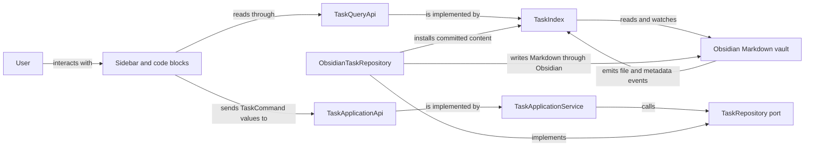

# Architecture

Abyss Tasks is an Obsidian plugin for managing Markdown tasks through a sidebar and native
`task-calendar` code blocks. Markdown remains the durable record. The plugin builds a read model over
the vault, turns user actions into explicit commands, and writes the result back to Markdown.

This document is a map of the architecture implemented on `master`. It explains responsibilities,
data flow, and dependency direction. It is not a complete source inventory or a roadmap. When you
need implementation detail, follow the linked entry points and inspect the current call paths with
CodeGraph.

## System at a glance



The two paths are deliberately separate. Queries return immutable task snapshots for rendering.
Commands validate an intended change, resolve the target, perform the write, and return a structured
result. A successful plugin write installs the committed content in the read model immediately.
Later Obsidian events reconcile it through the same parsing path used for manual edits.

## Sources of truth

The plugin has several kinds of state, but they do not have equal authority.

| Concern                                         | Authoritative source                                                                             | Derived or temporary representation            |
| ----------------------------------------------- | ------------------------------------------------------------------------------------------------ | ---------------------------------------------- |
| Tasks and task metadata                         | Markdown files in the Obsidian vault                                                             | `TaskIndex` snapshots and calendar projections |
| Projects and project status                     | Project Markdown plus membership query, one configured status property, and literal status names | `ProjectStore` entries and task statistics     |
| Plugin preferences and saved view states        | Obsidian plugin data                                                                             | Migrated in-memory `CalendarSettings`          |
| Current mode, selection, search, and drag state | `AppState` for the current panel session                                                         | Rendered panel DOM                             |

`TaskIndex` and `ProjectStore` are read models, not secondary databases. They may be rebuilt from the
vault and current settings. `AppState` coordinates the open interface and must not become a hidden
persistence layer.

## Runtime building blocks

### Composition root

[`src/main.ts`](src/main.ts) is the task-system composition root and the Obsidian plugin lifecycle
entry point. It loads and migrates settings, creates the status catalog, task index, Markdown codec,
repository, destination provider, and application service, then registers the sidebar, commands,
settings tab, and code block renderer. It also starts and stops the task index with the plugin.

Concrete Obsidian task adapters are wired here. Other modules should receive task capabilities
through their public interfaces instead of constructing alternate repositories or indexes.

### Public task boundary

[`src/tasks/index.ts`](src/tasks/index.ts) is the public import boundary for task functionality.
Presentation code works with four small capabilities:

- `TaskQueryApi` lists and resolves task snapshots and publishes index events.
- `TaskDependencyQueryApi` lists persisted root/subtask nodes, projects direct relations, and checks
  proposed edge eligibility. `TaskApplicationApi.queries` supplies both query capabilities.
- `TaskApplicationApi` executes `TaskCommand` values and returns `TaskCommandResult` values.
- `TaskCaptureApplicationApi` plans creation against an explicit destination before the write.

These interfaces keep presentation independent of Markdown editing and Obsidian events. Export a
capability here only when another component needs it.

### Task domain

[`src/tasks/domain/`](src/tasks/domain/) owns task value objects, immutable snapshots, references,
commands, status semantics, recurrence rules, reconciliation results, and date and time semantics.
It contains the meaning of a task change, not the mechanism used to store or display it.

The domain depends only on itself and the deterministic `rrule` boundary. It must not import
Obsidian, panels, settings UI, or infrastructure.

### Task application layer

[`src/tasks/application/`](src/tasks/application/) coordinates use cases. `TaskApplicationService`
captures the relevant clock and behavior settings, resolves a command target, validates the change,
and delegates persistence through repository and destination ports. It returns structured outcomes
such as success, conflict, invalid input, missing or ambiguous targets, partial moves, and I/O
failure.

`TaskDependencyService` owns dependency commands, linked subtask creation, and completion-blocker
checks.

The application layer may depend on its own ports and the domain. It must not depend on presentation
or concrete infrastructure.

### Task infrastructure and Markdown editing

[`src/tasks/infrastructure/`](src/tasks/infrastructure/) implements the task ports with Obsidian and
Markdown:

- `TaskIndex` listens to vault and metadata events, parses files, maintains immutable snapshots, and
  implements `TaskQueryApi` and `TaskDependencyQueryApi`.
- `ObsidianTaskRepository` locates a task block and performs writes through Obsidian's vault APIs.
- `TaskMarkdownCodec`, `TaskBlockEditor`, and `TaskLocator` own parsing, serialization, block edits,
  and target location.
- `TaskRefAuthority` preserves reference identity across writes and event reconciliation.

Infrastructure may depend on the task application and domain layers, the shared Markdown helpers,
and Obsidian. It must not reach into panels, views, or settings UI.

### Sidebar presentation

[`src/views/PanelView.ts`](src/views/PanelView.ts) is the sidebar shell. It creates `AppState`, lays
out the responsive panel structure, wires navigation and shortcuts, and owns the lifetime of the
panel-specific collaborators.

The visible surface is split by responsibility:

- `RailPanel` changes the high-level mode.
- `LeftPanel` presents lists, tags, and projects used for navigation.
- `CenterPanel` renders the selected task, calendar, search, or project content.
- `RightPanel` displays and edits the selected task.

Panels may issue commands and query snapshots through the public task boundary. They share
navigation and transient interaction state through `AppState`. They must not edit task Markdown
directly or import private task-layer modules.

`RightPanel` owns dependency search, direct relation lists, local removal Undo, and navigation between
related tasks. Inspector history lives in `AppState` for the panel or modal session. It stores complete
structural task paths, preserves only proven successors after a write, and never becomes persisted
task identity.

Task cards, subtasks, and relation rows share one transient drag payload. Dependency drops add or
reverse an edge through the public task commands; they do not move the dragged task. Existing tag,
project, and subtask reorder drops keep their narrower source rules. The query layer previews
eligibility and the application layer validates it again before writing.

`CenterPanel`, `RightPanel`, and `CalendarRenderer` use the same dependency projection and status
presentation. Active blockers disable completion in the interface, while the application layer
enforces the same rule for pointer, keyboard, menu, and retry paths. Presentation state such as
search drafts, drag state, disclosure, history, and Undo remains local and transient.

### Projects

[`src/projects/`](src/projects/) treats qualifying Markdown notes as projects. `ProjectStore`
evaluates the configured membership query against note paths, tags, and frontmatter, then combines
the result with task snapshots to calculate project statistics. It updates its derived cache in
response to both Obsidian file events and task index events.

`ProjectManager` contains project writes. It creates project notes from the configured template,
changes the configured project frontmatter, and moves task blocks into project notes through
`TaskApplicationApi`. Membership comes from the configured query. Status comes from one configured
frontmatter property whose literal value is the status definition's name; project tags do not carry
status. `ProjectStore` adds no separate persisted state.

`projectFields` owns the shared project-field vocabulary and case-insensitive frontmatter lookup.
Its catalog combines the curated name, status, progress, start, and end fields with the vault's
native property catalog. Status, start, and end each have one configured source property. Name is
the filename and progress is derived from tasks, so neither has a metadata source. Unsupported,
type-conflicting, and temporarily unavailable properties retain their exact source key without
being treated as editable text, and curated source properties cannot also become generic fields.
The native property catalog distinguishes successful empty discovery from an unavailable registry:
an absent Start or End source is editable after successful discovery because its curated role fixes
the date type, while an existing incompatible source or unavailable discovery remains read-only.

`projectTableModel` is a DOM-free projection over `Project` snapshots. It applies typed sorting,
search, status filtering, and scalar or multi-value grouping while reporting a unique visible
project count. It also owns the shared progress calculation: completed top-level tasks divided by
all non-cancelled top-level tasks. `projectTableSettings` owns defaults and normalization for saved
column order, aliases, widths, visibility, grouping, sorting, and hidden statuses. These preferences
live under `projects.table`; project metadata remains in Markdown.

`ProjectsPanel` owns the long-lived project-table controller and the vault property-catalog
subscription. Ordinary project-store refreshes update that controller instead of reconstructing
it, so search text, collapsed groups, scroll position, focused cells, and active editor drafts remain
session state. The controller renders the table through the shared view-options primitive and sends
all edits through `ProjectManager`; it does not write Markdown or frontmatter itself. Switching to a
project dashboard temporarily detaches the table surface, and returning reattaches the same session.

Property edits go through `ProjectManager.setProperty()`. The manager validates the field's type,
checks the edited field's expected value inside Obsidian's frontmatter transaction, validates
curated date ranges against the latest opposite bound, and updates or removes only that property.
Status changes continue through `setStatus()` so the configured global status property remains
authoritative. Write failures propagate to the presentation boundary that initiated the action.

### Settings and status semantics

[`src/settings/`](src/settings/) defines defaults, persisted settings, migrations, and the settings
interface. `TaskCalendarPlugin.loadSettings()` migrates persisted data before it merges defaults.
Changes to task status settings rebuild the shared `StatusCatalog`, `StatusRegistry`, and the
indexer's interpretation of task symbols together.

Project settings migrate legacy per-status property definitions to one global source and literal
names using the old persisted values. Removed tag definitions leave note tags untouched. Conflicting
property sources or malformed definitions retain recoverable migration evidence and require an
explicit source selection or discard action in settings; loading never rewrites vault notes.
Settings that change a persisted contract need a compatibility and migration design. A new setting
must not be used to create a second implementation of an existing workflow.

### Native code blocks

[`src/code-block/registerCodeBlock.ts`](src/code-block/registerCodeBlock.ts) registers native
`task-calendar` Markdown code blocks. It resolves block parameters over the same plugin settings and
constructs `CalendarRenderer` with the same query, command, and status capabilities used by the
sidebar. Its render child owns cleanup when Obsidian removes the block from the document.

## Critical data flows

### Reading and indexing tasks

1. `TaskIndex` reads Markdown and listens to Obsidian vault and metadata events.
2. The canonical codec turns supported task blocks into immutable snapshots.
3. `TaskQueryApi` exposes filtered lists, reference resolution, and calendar projection sources.
4. Subscribers refresh presentation from the updated snapshots.

Task snapshots expose dependency IDs and ordered prerequisite IDs from the Tasks-compatible `🆔`
and `⛔` Markdown carriers. `TaskIndex` derives the direct and inverse relation graph over persisted
roots and subtasks. Recurrence forecasts are excluded, and no dependency data is stored outside
Markdown.

Relation activity uses the live status catalog. Missing and ambiguous IDs remain visible for repair,
but only active resolved or ambiguous blockers prevent completion. Authored cycles remain readable;
eligibility checks reject new edges that would create a cycle. Query results are detached and
immutable.

Direct relations follow declared ID order, while inverse relations follow canonical source order.
The projection collapses repeated declarations without rewriting Markdown.

### Editing an existing task

1. A panel or calendar renderer translates the interaction into a `TaskCommand`.
2. `TaskApplicationService` resolves the current target and validates the requested transition.
3. `ObsidianTaskRepository` applies the Markdown edit through Obsidian.
4. The repository installs committed content in `TaskIndex`; the following Obsidian event confirms
   or reconciles that state.
5. The resulting command outcome drives user feedback.

The UI must not assume that its previous snapshot is still writable. Conflicts and ambiguous targets
are normal command outcomes and belong at the application boundary.

Dependency edits use Tasks-compatible IDs and carriers through `TaskDependencyService`; the
repository exposes only the storage operations needed to update them. Adds, removals, restoration,
reversal, linked subtask creation, and completion checks share one mutation coordinator. This keeps
eligibility validation and publication in order even when several service instances issue commands.

An add validates both endpoints, assigns an ID only when needed, and writes the edge through the
ordinary repository path. Same-file metadata changes are committed in one batch. A cross-file add
writes the blocker ID first and then the dependent edge. If the second write fails, the ID remains;
the service reports the structured failure and does not risk deleting an ID now used elsewhere.

Same-file reversal is atomic. Cross-file reversal publishes only after final proof and otherwise
attempts exact-source compensation without overwriting an external edit. Unproven recovery returns
an I/O error with unknown content state and reconciles from the vault.

`TaskRefAuthority` gives repository operations temporary evidence that a resolved task is still the
same writable occurrence. It distinguishes byte-identical tasks without adding IDs to Markdown,
stages proven successor references, and rejects ambiguous or externally changed targets. The
application and presentation may use a proven transition to preserve retries or selection, but that
proof never grants general write authority.

Removing a dependency or subtask returns exact transient recovery data. `RightPanel` turns that
data into one local, short-lived Undo action and restores only while the committed result still owns
the affected source. Undo state is not stored in `AppState` or Markdown. Creation and successful
ordinary edits do not show success notices; failures continue through the shared command-result
presenter.

Completion commands check active blockers before the first write and again before a reconciled
retry. Missing dependency IDs do not block completion, while ambiguous IDs block if any matching
task is active. If current identity or blocker state cannot be proven, the command returns a
conflict instead of guessing.

`TaskRepository.createDependencySubtask()` creates a direct child and its requested edge in one
same-root write. The application owns eligibility and ID allocation; the repository owns exact
Markdown placement and validates the resulting tree. `editBatch()` remains the narrower primitive
for same-file metadata changes.

### Creating a task

1. The interface chooses a capture context and asks `TaskCaptureApplicationApi` to plan a
   destination.
2. The destination provider resolves today's note or the configured file and insertion policy.
3. The ready creation session sends the create command through the application service and
   repository.
4. The creation presentation layer focuses or reveals the indexed result without inventing a
   separate persisted identifier.

### Manual and external Markdown changes

`TaskIndex` scans Markdown when it initializes. Later Obsidian vault and metadata events cause
`TaskIndex` and `ProjectStore` to reevaluate affected content and notify subscribers. Plugin writes
and external edits therefore converge on the same visible state.

`TaskIndexEvent` `changed` identifies files whose indexed tasks changed. A separate reconciled-file
subscription is a synchronization barrier for accepted metadata observations whose task projection
stayed identical, including notes without tasks. `ProjectStore` uses both signals as barriers: it
waits until task reconciliation finishes, then reads the latest frontmatter and combines it with the
matching task statistics in one coherent project snapshot.

### Project operations

Project discovery is a query over Markdown metadata. Table status edits carry the captured resolved
`statusId` plus `rawStatus` into `ProjectManager`. The manager performs one `Vault.process`
transaction over fresh source, rejects a stale status snapshot before mutation, and updates only
the configured global property while preserving its current spelling. Unguarded dashboard and
default-status callers retain the same status operation.

Status-definition renames also run through `ProjectManager`. One per-App coordinator serializes
renames with ordinary status assignments across the settings-owned and panel-owned manager
instances; panel managers still receive their panel-specific task-selection capability. A rename
rechecks membership and the expected literal in fresh source, records each owned note edit, then
persists the renamed definition. On write or settings-save failure it restores the definition and
compensates only note values still owned by that operation. Unresolved paths propagate to the
settings boundary, which shows one Notice and logs diagnostic detail. This recovery is best effort
across files and settings and does not claim crash atomicity.

Moving a task into a project uses the standard task move command, so it retains the same validation,
recovery, and reindexing behavior as other task moves.

## Enforced dependency rules

[`dependency-cruiser.config.cjs`](dependency-cruiser.config.cjs) is authoritative for exact import
restrictions. The building-block sections above record their architectural intent, not every allowed
path or exception. Update [`test/dependency-rules.test.ts`](test/dependency-rules.test.ts) whenever a
rule changes; never weaken a boundary to accommodate a local implementation.

## Deliberate compatibility seams

Some older interfaces remain because current users and views still depend on them:

- `src/parser/` projects canonical task data into the legacy presentation shape used by established
  views. It may use the canonical Markdown codec where the conversion requires it, but new task
  behavior belongs in `src/tasks/`.
- `window.renderCalendar` is a legacy Dataview bridge installed and removed by `src/main.ts`. Native
  `task-calendar` code blocks are the maintained Obsidian integration.
- Several presentation modules coordinate substantial established behavior. New views should reuse
  their commands, menus, state semantics, and UI primitives instead of building a parallel task
  system beside them.

## How to change the architecture

Read this document before planning a change that crosses component boundaries. Then use CodeGraph
and the source to verify the current implementation. The document summarizes the implemented shape;
the code answers exact questions about symbols and call paths.

Update `ARCHITECTURE.md` in the same commit when a change affects any of these:

- ownership of a component or use case;
- a public boundary or cross-layer contract;
- dependency direction or the composition root;
- one of the critical data flows above;
- a persisted source of truth or its migration path;
- an explicit compatibility seam.

Do not update it for private renames, local extraction, styling details, or a new helper that leaves
the architecture unchanged. Proposed architecture belongs in an ignored design spec until the code
implements it. This file always describes the state after the commit in which it appears.

If a change introduces an exception to an existing boundary, record its reason and scope here and
encode the narrowest practical automated check. Prefer removing the cause over documenting a broad
escape hatch.

## Verification

Use the architecture check while working, then run the repository gate before integration:

```shell
pnpm arch
pnpm verify
```

`pnpm arch` checks the current dependency graph. `pnpm verify` also runs the architecture fixture
tests, formatting, lint, types, coverage, build artifacts, release metadata, and dependency health.

For presentation or interaction changes, the automated gate is necessary but not sufficient. Build
the plugin, load it in `dev-vault-tasks`, exercise the affected workflow with the Obsidian CLI, and
inspect screenshots, DOM evidence, and captured runtime errors. Check constrained widths whenever a
layout can change.
