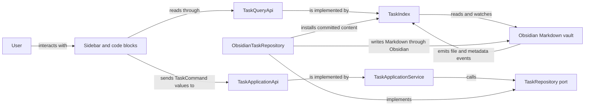

# Architecture

Abyss Tasks is an Obsidian plugin for managing Markdown tasks through a sidebar and native
`task-calendar` code blocks. Markdown remains the durable record. The plugin builds a read model over
the vault, turns user actions into explicit commands, and writes the result back to Markdown.

This document is a map of the architecture implemented on `master`. It explains responsibilities,
data flow, and dependency direction. It is not a complete source inventory or a roadmap. When you
need implementation detail, follow the linked entry points and inspect the current call paths with
CodeGraph.

## System at a glance



The two paths are deliberately separate. Queries return immutable task snapshots for rendering.
Commands validate an intended change, resolve the target, perform the write, and return a structured
result. A successful plugin write installs the committed content in the read model immediately.
Later Obsidian events reconcile it through the same parsing path used for manual edits.

## Sources of truth

The plugin has several kinds of state, but they do not have equal authority.

| Concern                                         | Authoritative source                                                                             | Derived or temporary representation            |
| ----------------------------------------------- | ------------------------------------------------------------------------------------------------ | ---------------------------------------------- |
| Tasks and task metadata                         | Markdown files in the Obsidian vault                                                             | `TaskIndex` snapshots and calendar projections |
| Projects and project status                     | Project Markdown plus membership query, one configured status property, and literal status names | `ProjectStore` entries and task statistics     |
| Static plugin preferences                       | Obsidian plugin `data.json`                                                                      | Composed runtime `CalendarSettings`            |
| Saved list, section, and project overview views | Versioned plugin `state.json`                                                                    | Composed runtime `CalendarSettings`            |
| Current mode, selection, search, and drag state | `AppState` or the owning view controller for the current panel session                           | Rendered panel DOM                             |

`TaskIndex` and `ProjectStore` are read models, not secondary databases. They may be rebuilt from the
vault and current settings. `AppState` coordinates the open interface and must not become a hidden
persistence layer.

## Runtime building blocks

### Composition root

[`src/main.ts`](src/main.ts) is the task-system composition root and the Obsidian plugin lifecycle
entry point. It loads and migrates settings, creates the status catalog, task index, Markdown codec,
repository, destination provider, and application service, then registers the sidebar, commands,
settings tab, and code block renderer. It also starts and stops the task index with the plugin.

Concrete Obsidian task adapters are wired here. Other modules should receive task capabilities
through their public interfaces instead of constructing alternate repositories or indexes.

### Public task boundary

[`src/tasks/index.ts`](src/tasks/index.ts) is the public import boundary for task functionality.
Presentation code works with four small capabilities:

- `TaskQueryApi` lists and resolves task snapshots and publishes index events.
- `TaskDependencyQueryApi` lists persisted root/subtask nodes, projects direct relations, and checks
  proposed edge eligibility. `TaskApplicationApi.queries` supplies both query capabilities.
- `TaskApplicationApi` executes `TaskCommand` values and returns `TaskCommandResult` values.
- `TaskCaptureApplicationApi` plans creation against an explicit destination before the write.

These interfaces keep presentation independent of Markdown editing and Obsidian events. Export a
capability here only when another component needs it.

### Task domain

[`src/tasks/domain/`](src/tasks/domain/) owns task value objects, immutable snapshots, references,
commands, status semantics, recurrence rules, reconciliation results, and date and time semantics.
It contains the meaning of a task change, not the mechanism used to store or display it.

The domain depends only on itself and the deterministic `rrule` boundary. It must not import
Obsidian, panels, settings UI, or infrastructure.

### Task application layer

[`src/tasks/application/`](src/tasks/application/) coordinates use cases. `TaskApplicationService`
captures the relevant clock and behavior settings, resolves a command target, validates the change,
and delegates persistence through repository and destination ports. It returns structured outcomes
such as success, conflict, invalid input, missing or ambiguous targets, partial moves, and I/O
failure.

`TaskDependencyService` owns dependency commands, linked subtask creation, and completion-blocker
checks.

The application layer may depend on its own ports and the domain. It must not depend on presentation
or concrete infrastructure.

### Task infrastructure and Markdown editing

[`src/tasks/infrastructure/`](src/tasks/infrastructure/) implements the task ports with Obsidian and
Markdown:

- `TaskIndex` listens to vault and metadata events, parses files, maintains immutable snapshots, and
  implements `TaskQueryApi` and `TaskDependencyQueryApi`.
- `ObsidianTaskRepository` locates a task block and performs writes through Obsidian's vault APIs.
- `TaskMarkdownCodec`, `TaskBlockEditor`, and `TaskLocator` own parsing, serialization, block edits,
  and target location.
- `TaskRefAuthority` preserves reference identity across writes and event reconciliation.

Infrastructure may depend on the task application and domain layers, the shared Markdown helpers,
and Obsidian. It must not reach into panels, views, or settings UI.

### Sidebar presentation

[`src/views/PanelView.ts`](src/views/PanelView.ts) is the sidebar shell. It creates `AppState`, lays
out the responsive panel structure, wires navigation and shortcuts, and owns the lifetime of the
panel-specific collaborators.

The visible surface is split by responsibility:

- `RailPanel` changes the high-level mode.
- `LeftPanel` presents lists, tags, and projects used for navigation.
- `CenterPanel` renders the selected task, calendar, search, or project content.
- `RightPanel` displays and edits the selected task.

Panels may issue commands and query snapshots through the public task boundary. They share
navigation and transient interaction state through `AppState`. They must not edit task Markdown
directly or import private task-layer modules.

`PanelNavigator` asks `CenterPanel` to finish any active project-table editor before the existing
mode-changing `AppState.batch()`. The delegate remains local to the center/project/table ownership
chain, so a rejected draft leaves both the active mode and table projection unchanged. The table
retains only the newest deliberate continuation until a successful retry or Escape.

`RightPanel` owns dependency search, direct relation lists, local removal Undo, and navigation between
related tasks. Inspector history lives in `AppState` for the panel or modal session. It stores complete
structural task paths, preserves only proven successors after a write, and never becomes persisted
task identity.

Task cards, subtasks, and relation rows share one transient drag payload. Dependency drops add or
reverse an edge through the public task commands; they do not move the dragged task. Existing tag,
project, and subtask reorder drops keep their narrower source rules. The query layer previews
eligibility and the application layer validates it again before writing.

`CenterPanel`, `RightPanel`, and `CalendarRenderer` use the same dependency projection and status
presentation. Active blockers disable completion in the interface, while the application layer
enforces the same rule for pointer, keyboard, menu, and retry paths. Presentation state such as
search drafts, drag state, disclosure, history, and Undo remains local and transient.

Within one task-list context, `CenterPanel` retains the task header, options anchor, scroll surface,
and add-task bar while rebuilding the list contents. View-option changes therefore update the live
list without replacing the open popover; changing list context or mode tears down that retained
surface through the normal panel lifecycle.

### Projects

[`src/projects/`](src/projects/) treats qualifying Markdown notes as projects. `ProjectStore`
evaluates the configured membership query against note paths, tags, and frontmatter, then combines
the result with task snapshots to calculate project statistics. It updates its derived cache in
response to both Obsidian file events and task index events.

`ProjectManager` contains project writes. It creates project notes from the configured template,
changes the configured project frontmatter, and moves task blocks into project notes through
`TaskApplicationApi`. Membership comes from the configured query. Status comes from one configured
frontmatter property whose literal value is the status definition's name; project tags do not carry
status. `ProjectStore` adds no separate persisted state.

`projectFields` owns the shared project-field vocabulary and case-insensitive frontmatter lookup.
Its catalog combines the curated name, status, progress, start, end, and description fields with
custom properties discovered from the vault or retained by saved table references. Status, start,
and end each have one configured source property; description is fixed to `description`. Name is the
filename and progress is derived from tasks, so neither has a metadata source. Curated types are
fixed by their role. Custom types and optional preset presentation live in the static
`projects.propertyDefinitions` map and remain authoritative when Obsidian's registry later changes
or is unavailable. A valid custom definition whose source is temporarily assigned to a curated
field stays saved but inactive; it becomes authoritative again when that curated source moves away.
Unconfigured, malformed, case-ambiguous, and unsupported custom properties remain visible but
unavailable until their static definition is repaired. Curated source collisions retain their
configured spelling and note metadata but make each colliding role read-only. The native property
adapter remains a read-only discovery and suggestion boundary. Its
per-property inspection distinguishes live properties, explicit type assignments, and absent names;
it never writes Obsidian's registry.

`projectPropertyPresets` owns DOM-free typed preset identity, validation, compatibility, and display
metadata. Settings, table projection, and cell editors consume that shared interpretation. Presets
are active whenever valid configured entries exist, regardless of the retained deprecated
`presetsEnabled` compatibility field. They are offered before cached same-property vault values,
and the editor excludes selected values by typed raw identity.
`ProjectValuePresentation` carries badge, text, or dot appearance through suggestion popups and
cells without importing settings UI. Group labels retain their existing single color marker while
sharing the compiled label and color metadata.

`projectTableModel` is a DOM-free projection over `Project` snapshots. It applies typed sorting,
search, status filtering, and scalar or multi-value grouping while reporting a unique visible
project count. Link-valued groups receive a narrow native resolver from the table, use the resolved
note path as identity, and retain the representative raw value and its original source path for
rendering and later edits. A shared link-target helper strips note subpaths and decodes Markdown
path escaping only for native lookup; absolute external Markdown targets instead keep their exact,
source-independent identity. It also owns the shared progress calculation: completed top-level
tasks divided by all non-cancelled top-level tasks. `projectTableSettings` owns defaults and
normalization for saved column order, aliases, widths, alignment, visibility, raw, relative, or
pretty date presentation, bar or full progress presentation, under-name description display,
grouping, sorting, and hidden statuses. Table progress defaults to bars and numbers. An absent table
date override is Custom: each column uses its saved mode or Pretty. A global table mode applies to
every known temporal column and remains effective for later temporal columns; changing one column
or choosing Custom first materializes that global mode across current temporal columns, then clears
the global override. Reset clears these table presentation overrides while preserving column order,
visibility, aliases, widths, and alignment. Explicit modes roundtrip through table and Kanban view
state, while Kanban retains its independent field and progress presentation. An
explicit `none` sort preserves incoming project order. A legacy custom description column becomes the under-name
display preference while valid grouping and sorting references are remapped to the curated field.
These preferences live under `projects.table`; project metadata remains in Markdown.

`projectKanbanSettings` owns the optional saved card fields, presentation, independent grouping,
sorting and status filters, collapsed columns, and path-based manual order for the project Kanban
view. Missing Kanban state leaves existing installations on the table and is initialized from the
current table filters, grouping, and sorting only when requested. `projectKanbanModel` partitions
projects by the shared status-group identity, then delegates search, typed sorting, and inner
grouping to `projectTableModel`; configured statuses remain ordered even when empty, while synthetic
raw and No status columns exist only for source values that are present. Card descriptions persist
as hidden, one line, two lines, or full; the additive full value removes the visual line clamp, while
older binaries retain it in recovery and fall back to their existing default.

The overview controller initializes each status column's manual path sequence from its first complete
project snapshot and appends newly observed paths even while a field sort, search, or status filter
hides their manual projection. Missing and filtered paths keep their remembered ranks. These
state-only changes use the existing saved-view persistence and Retry boundary.

`ProjectsPanel` owns one long-lived project-overview controller and the vault property-catalog
subscription. Ordinary project-store refreshes update that controller instead of reconstructing
it. The controller keeps the shared toolbar, editor boundary, mutation queue, receipt projection,
source observations, and edit history while delegating keyed board DOM to `ProjectsKanbanView`.
Table and Kanban retain separate searches, selections, filters, sorting, grouping, and viewport
positions; switching hides the inactive surface without destroying its nodes. Both surfaces render
metadata and progress through the shared project-cell renderer and send edits through the same
`ProjectManager.applyEdits` coordinator. Switching to a project dashboard temporarily detaches the
overview surface, and returning reattaches the same session and active overview mode.

The project toolbar composes the shared recursive `ViewOptionsPopover` as Group by, Sort by, and one
active-view group. Nested disclosures close only siblings at their own level. The Table group owns
column, description, progress, and date-display controls; its date row shows Custom whenever no
global date override is active. Table column and Kanban card-field visibility, order, and temporal
presentation actions stay inside the existing guarded view-state mutation path; reorder controls
target the neighboring visible row while hidden configuration stays in place, and the required Name
column remains first and visible. An auxiliary native menu registers its exact DOM surface as a
child of the popover, so that menu retains the popover's shortcut ownership and disclosure state
until it closes; parent teardown closes any registered child.

`ProjectsKanbanView` projects ordered status columns and optional inner groups from
`projectKanbanModel`. It reconciles columns by status key, cards by grouped project occurrence, and
fields by catalog id, moving surviving card elements between columns. Its context contains only
rendering, selection, and view-state callbacks from the overview controller; it does not construct a
manager, history, receipt cache, or Markdown writer. Exposed column, group, card, and cell contexts
are the native drag-and-drop adapter seam.

`projectKanbanDrop` captures exact status and grouping source capabilities at native drag start and
revalidates them, the source occurrence, visible target column, explicit target-group meaning, and
active group/sort settings against the fresh session projection inside the shared mutation queue.
It combines status and editable group assignments into one guarded note batch, applies the
normalized assignments to one detached project, and rebuilds `projectKanbanModel` for the actual
sorted/grouped landing occurrence. Manual rank is state-only and is changed after the note batch
succeeds; its destination seed includes saved paths plus every current destination-column path, so
filters do not discard hidden ranks. Unknown status columns and impossible inner-group assignments
remain readable targets only. `projectKanbanDrag` owns native payload, drag image, target decoration,
collapsed-column hover forecast, insertion line, edge scrolling, click suppression, and complete
Escape/drop/dragend teardown; it delegates plans and commits through `ProjectsKanbanView` and never
writes metadata or settings itself.

`ProjectsTableView` also owns a long-lived table element and reconciles its body by group key,
project path, and field id. Projection changes patch changed cell contents, insert or remove affected
rows, and move only rows whose relative order changed. Surviving cell listeners read their mutable
reconciled context, so a later edit uses the current project snapshot and source capability. The
column renderer owns header controls and live width preview. The Name cell also projects the first
description line as its direct edit affordance and exposes the same curated description editor from
one pointer-and-keyboard context-menu path when that line is absent. Its multiline editor anchors to
the description region without hiding the project title or adding a visible column. Native
checkbox and tag values retain Obsidian's public DOM classes and theme variables while their edits
continue through the table mutation coordinator. Viewport spare width is rendered into Name without
changing saved state; a manual Name-boundary drag couples it to the next visible column and persists
both explicit widths through the view-state channel.

Column headers open one native Obsidian menu for exact sorting, alignment, display-label rename,
editable custom-property type, and temporal display choices. A guarded runtime submenu capability
uses ordinary public secondary menus as its fallback; the table controller owns final focus recovery
through its selection identity. Presentation choices use the view-state save path. Custom type
changes mutate the shared static definition, preserve its preset payload, refresh the current table
session, and use the composition root's static settings save callback with current-draft retry.

Pretty and Relative project dates share the strict parser in the pure `projectDatePresentation`
formatter. Pretty preserves date-only calendar values and converts offset datetimes to the system
timezone; invalid values fall back to their authored text. `ProjectsTableView` owns one minute timer
for all visible temporal columns whose effective table or independent Kanban field mode is Relative,
and refreshes only their text spans on ticks and foreground resume. It stops the timer at teardown
and leaves table nodes, selection, editors, source values, tooltips, clipboard values, and
persistence untouched.

`ProjectsTableView` owns spreadsheet selection as an occurrence-and-column range over the current
visible projection. Repeated list-group occurrences remain distinct in that transient range, while
batch mutations deduplicate their physical project cells. Projection changes reconcile the range
and move keyboard ownership to the stable table session when the focused occurrence disappears, so
Undo and Redo remain available after a mutation regroups a row. Copy is synchronous on the DOM
clipboard event and carries typed raw values plus source-note context in a private payload alongside
quoted TSV. Paste parses that captured payload before its asynchronous mutation, rebases recognized
wiki and Markdown links into each destination note's context while preserving syntax, and never
copies native-type or history capabilities.

Row-to-group moves start from the non-interactive surface of a project row, including its displayed
project title, and target the full group row, including collapsed and no-value groups. Links,
checkboxes, remove controls, and active editors do not initiate row drags; a completed title drag
suppresses its following click. Scalar moves replace the grouped value; list moves replace only the
source group value, preserve unrelated values, and deduplicate with the same resolved-link identity
used by grouping. Dropping a list into No value explicitly clears the whole list. Selection,
clipboard payloads, drag payloads, and edit history remain bounded to the table session.
During a recognized row drag, the table caches one full target-group preview per source, target,
and rendered projection. It decorates the group header and all visible body rows together, and may
forecast a sorted insertion edge by applying the proposed assignment to one detached project and
reusing `projectTableModel`; the drop still rebuilds its guarded plan before writing. The forecast
and `ProjectManager` share `projectEdits` value/presence normalization, while unreliable tag-query,
filtered, collapsed, self, and already-present occurrences deliberately omit the insertion edge.

`ProjectCellEditor` owns typed drafts, suggestion-popup lifetime, validation, and autosave. Its
async commit handle remains mounted on failure and coalesces a newer draft while a save is pending.
The table mounts that handle without focus, positions its bounded out-of-flow surface against the
edited cell or description region, registers the active handle, and then focuses it, so editing does
not change row height and native suggestions measure the final input position. List chips and their
entry share one horizontally bounded band. Suggestions come only from the edited property's native
value catalog; they do not enumerate vault notes. Scalar editors browse those values on a fresh
focus without clearing the raw draft, then filter readable link labels and exact raw values after
typing. Escape closes the editor in one action even when the suggestion popup is open.
On close it reports restore-current, forward Tab, backward Tab, or preserve-focus intent;
`ProjectsTableView` resolves that intent against the post-commit visible occurrence projection and
uses the same selection, focus, and reveal path as ordinary keyboard navigation.
`ProjectsTableView` owns a single mutation coordinator around each `applyEdits()` plus
`ProjectEditHistory.record()` pair; editor saves, paste, clear, group drops, Undo, and Redo use that
same coordinator and publish successful receipts through its session projection seam. Store and native catalog refreshes
are deferred while a coordinated mutation is active and reconciled afterward, so
history-owned clear lookup never races a busy history operation. Successful receipts enter a
latest-per-cell table overlay immediately. Ordinary task, settings, and unrelated-path store
refreshes update the base snapshot without retiring that overlay. `ProjectStore` publishes a
separate per-path source observation after the existing metadata/task barrier; it verifies the
native event content against a fresh vault read and carries the Project snapshot derived from that
event's cache. A matching observation acknowledges the receipt, while a verified later differing
observation supersedes it. When a differing observation arrives during a write, the table asks the
store to revalidate that exact published observation after installing the receipt; a fresh vault
read retires only the same latest local receipt, so neither an older observation nor an older async
check can retire a newer write. Deletion, rename, or source-based membership loss also retires the
affected path without allowing an overlay to resurrect it. Cell and group links reuse the shared
Markdown renderer with their original source paths and ask the same editor boundary to finish before
navigation.

Property edits go through `ProjectManager`. `applyEdits()` performs a full guarded preflight, groups
all changes to one note into one `Vault.process` transaction, and returns exact applied and failed
receipts when later file writes fail. It rechecks each field's current configured source and type, exact
frontmatter key, presence, and expected value before mutation, and validates curated date ranges
against the combined final values. `setProperty()` and `setStatus()` use the same guarded write path;
status inputs become configured literal names before metadata is written. Description uses that same
receipt and history path and never receives the absent custom-property capability. Write failures
propagate to the presentation boundary that initiated the action.

`ProjectEditHistory` stores at most 50 session-only receipt groups. Undo and Redo use the same batch
capability with reversed expected values and exact source-key and presence provenance, so they restore
owned unknown literals and empty values without overwriting external edits or a rebound property.
When a committed clear removes the final occurrence of an inferred custom property, its receipt also
owns immutable, cell-bound source provenance. History derives the currently cleared cells
from its two bounded stacks and replaces capabilities from actual partial Undo and Redo results. This
allows only that absent cell to be restored or refilled without granting general write authority.
Refill, supersession, eviction, discard, or session end removes the provenance, and no private native
type write is created.

### Settings and status semantics

[`src/settings/`](src/settings/) defines defaults, persisted settings, migrations, and the settings
interface. `SettingsPersistenceCoordinator` serializes two documents through Obsidian's public
vault adapter: `data.json` contains static configuration, while adjacent `state.json` contains
`listViewStates`, `sectionCollapse`, the complete `projects.table` preference, and optional
`projects.kanban` and `projects.overviewView` preferences. A single
`CalendarSettings` object remains the runtime authority; the persistence boundary partitions and
recomposes it instead of giving panels independent settings copies.

After composing both settings documents, the plugin captures supported native types for still
unconfigured custom column, grouping, and sorting references. The initial capture is awaited before
view registration; one early metadata-resolved event and one layout-ready callback provide bounded
additional opportunities. Each attempt merges only missing definitions synchronously into the
shared settings object before persistence. A failed save keeps that current draft and presents the
existing persistent Retry action, so later user edits remain part of the retried snapshot.

`TaskCalendarPlugin.loadSettings()` captures the untouched legacy document before destructive
normalization. On first migration it writes and verifies the versioned state envelope, including an
exact pre-split recovery snapshot, before removing moved keys from `data.json`. A recognized state
document wins when both copies exist. Corrupt, unreadable, and future-version state is left in place,
view writes are suspended, and the runtime uses temporary view defaults. The coordinator retains
unmarked legacy view fields during subsequent static saves until state recovery is verified, so an
unrelated static change cannot complete migration or discard the only usable legacy copy. It also retains
unknown static and nested view keys, queues detached write snapshots in order, deduplicates unchanged
writes, and continues the queue after a rejected operation.

Static and saved-view changes use separate callbacks. Static saves advance the existing rollback
revision and refresh project settings after durability. State-only saves do not advance that
revision or refresh the project store; project-table changes made in Settings narrowly ask each
mounted `PanelView` to refresh its existing table controller after the state write succeeds. Changes to task
status settings rebuild the shared `StatusCatalog`, `StatusRegistry`, and the
indexer's interpretation of task symbols together.

`ProjectStore.refreshSettings()` compares only membership and status-resolution inputs before it
rescans projects or recomputes task statistics. Type, preset, alias, color, alignment, and sidebar
presentation changes reuse the existing project snapshots. `PanelView` then reconciles the current
project table once and asks `LeftPanel` to replace only its project section, so a presentation save
does not query the task-wide list. The settings UI uses one shared expandable-card primitive for tag,
task-status, and project-property rows. Project statuses and custom-property presets use one shared
compact value-row primitive inside their expanded property cards; adapters retain domain validation
and persistence while the row owns native value, display-name, color, appearance, drag, and remove
controls. Runtime preset row identities stay outside persisted settings so reorder can move existing
DOM and preserve draft, scroll, and focus state without changing the raw preset records.

Project settings migrate legacy per-status property definitions to one global source and literal
names using the old persisted values. Removed tag definitions leave note tags untouched. Conflicting
property sources or malformed definitions retain recoverable migration evidence and require an
explicit source selection or discard action in settings; loading never rewrites vault notes.
Settings that change a persisted contract need a compatibility and migration design. A new setting
must not be used to create a second implementation of an existing workflow.

### Native code blocks

[`src/code-block/registerCodeBlock.ts`](src/code-block/registerCodeBlock.ts) registers native
`task-calendar` Markdown code blocks. It resolves block parameters over the same plugin settings and
constructs `CalendarRenderer` with the same query, command, and status capabilities used by the
sidebar. Its render child owns cleanup when Obsidian removes the block from the document.

## Critical data flows

### Reading and indexing tasks

1. `TaskIndex` reads Markdown and listens to Obsidian vault and metadata events.
2. The canonical codec turns supported task blocks into immutable snapshots.
3. `TaskQueryApi` exposes filtered lists, reference resolution, and calendar projection sources.
4. Subscribers refresh presentation from the updated snapshots.

Task snapshots expose dependency IDs and ordered prerequisite IDs from the Tasks-compatible `🆔`
and `⛔` Markdown carriers. `TaskIndex` derives the direct and inverse relation graph over persisted
roots and subtasks. Recurrence forecasts are excluded, and no dependency data is stored outside
Markdown.

Relation activity uses the live status catalog. Missing and ambiguous IDs remain visible for repair,
but only active resolved or ambiguous blockers prevent completion. Authored cycles remain readable;
eligibility checks reject new edges that would create a cycle. Query results are detached and
immutable.

Direct relations follow declared ID order, while inverse relations follow canonical source order.
The projection collapses repeated declarations without rewriting Markdown.

### Editing an existing task

1. A panel or calendar renderer translates the interaction into a `TaskCommand`.
2. `TaskApplicationService` resolves the current target and validates the requested transition.
3. `ObsidianTaskRepository` applies the Markdown edit through Obsidian.
4. The repository installs committed content in `TaskIndex`; the following Obsidian event confirms
   or reconciles that state.
5. The resulting command outcome drives user feedback.

The UI must not assume that its previous snapshot is still writable. Conflicts and ambiguous targets
are normal command outcomes and belong at the application boundary.

Dependency edits use Tasks-compatible IDs and carriers through `TaskDependencyService`; the
repository exposes only the storage operations needed to update them. Adds, removals, restoration,
reversal, linked subtask creation, and completion checks share one mutation coordinator. This keeps
eligibility validation and publication in order even when several service instances issue commands.

An add validates both endpoints, assigns an ID only when needed, and writes the edge through the
ordinary repository path. Same-file metadata changes are committed in one batch. A cross-file add
writes the blocker ID first and then the dependent edge. If the second write fails, the ID remains;
the service reports the structured failure and does not risk deleting an ID now used elsewhere.

Same-file reversal is atomic. Cross-file reversal publishes only after final proof and otherwise
attempts exact-source compensation without overwriting an external edit. Unproven recovery returns
an I/O error with unknown content state and reconciles from the vault.

`TaskRefAuthority` gives repository operations temporary evidence that a resolved task is still the
same writable occurrence. It distinguishes byte-identical tasks without adding IDs to Markdown,
stages proven successor references, and rejects ambiguous or externally changed targets. The
application and presentation may use a proven transition to preserve retries or selection, but that
proof never grants general write authority.

Removing a dependency or subtask returns exact transient recovery data. `RightPanel` turns that
data into one local, short-lived Undo action and restores only while the committed result still owns
the affected source. Undo state is not stored in `AppState` or Markdown. Creation and successful
ordinary edits do not show success notices; failures continue through the shared command-result
presenter.

Completion commands check active blockers before the first write and again before a reconciled
retry. Missing dependency IDs do not block completion, while ambiguous IDs block if any matching
task is active. If current identity or blocker state cannot be proven, the command returns a
conflict instead of guessing.

`TaskRepository.createDependencySubtask()` creates a direct child and its requested edge in one
same-root write. The application owns eligibility and ID allocation; the repository owns exact
Markdown placement and validates the resulting tree. `editBatch()` remains the narrower primitive
for same-file metadata changes.

### Creating a task

1. The interface chooses and freezes a capture context before asking `TaskCaptureApplicationApi` to
   plan a destination.
2. For the project overview, `PanelView` delegates through `CenterPanel` and `ProjectsPanel` to the
   active table row or Kanban card; an absent selection retains the default projects context.
3. The destination provider resolves today's note or the configured file, while project contexts
   use the selected note and the existing project insertion policy.
4. The ready creation session sends the create command through the application service and
   repository.
5. The creation presentation layer focuses or reveals the indexed result without inventing a
   separate persisted identifier.

### Manual and external Markdown changes

`TaskIndex` scans Markdown when it initializes. Later Obsidian vault and metadata events cause
`TaskIndex` and `ProjectStore` to reevaluate affected content and notify subscribers. Plugin writes
and external edits therefore converge on the same visible state.

`TaskIndexEvent` `changed` identifies files whose indexed tasks changed. A separate reconciled-file
subscription is a synchronization barrier for accepted metadata observations whose task projection
stayed identical, including notes without tasks. `ProjectStore` uses both signals as barriers: it
waits until task reconciliation finishes, then reads the latest frontmatter and combines it with the
matching task statistics in one coherent project snapshot.

### Project operations

Project discovery is a query over Markdown metadata. Table status edits carry the captured resolved
`statusId` plus `rawStatus` into `ProjectManager`. The manager performs one `Vault.process`
transaction over fresh source, rejects a stale status snapshot before mutation, and updates only
the configured global property while preserving its current spelling. Unguarded dashboard and
default-status callers retain the same status operation.

Status-definition renames also run through `ProjectManager`. One per-App coordinator serializes
renames with ordinary status assignments and metadata batches across the settings-owned and panel-owned manager
instances; panel managers still receive their panel-specific task-selection capability. A rename
preflights the configured status source's native text role, rechecks that role plus membership and
the expected literal in fresh source, records each owned note edit, then
persists the renamed definition. On write or settings-save failure it restores the definition and
compensates only note values still owned by that operation. Unresolved paths propagate to the
settings boundary, which shows one Notice and logs diagnostic detail. This recovery is best effort
across files and settings and does not claim crash atomicity.

Moving a task into a project uses the standard task move command, so it retains the same validation,
recovery, and reindexing behavior as other task moves.

Project creation from the overview is a background command owned by the retained table/Kanban
session. The composer freezes the selected configured status, then `ProjectsPanel` asks
`ProjectManager` to create without opening a workspace leaf. The manager validates the requested
status and its writable property before creating anything, creates the note through the shared
`DailyNoteResolver` template path, awaits Templater as the readiness barrier, and applies the final
status through the serialized metadata command. `ProjectStore` publication remains the source of
the visible project snapshot; the overview presentation matches the owned path and expected final
status against an already-published or later snapshot, selectively relaxes only obstructing active
filters, expands the destination, and reuses the existing selection and reveal behavior.

If template application fails after the resolver owns a file, or the final status write fails,
`ProjectCreationError` carries the exact created path and phase to the single overview error
boundary. Status recovery writes only that owned file. Template recovery offers the owned note and
requires an explicit fresh draft before another create, so neither path collision nor retry can
silently duplicate the project.

## Enforced dependency rules

[`dependency-cruiser.config.cjs`](dependency-cruiser.config.cjs) is authoritative for exact import
restrictions. The building-block sections above record their architectural intent, not every allowed
path or exception. Update [`test/dependency-rules.test.ts`](test/dependency-rules.test.ts) whenever a
rule changes; never weaken a boundary to accommodate a local implementation.

## Deliberate compatibility seams

Some older interfaces remain because current users and views still depend on them:

- `src/parser/` projects canonical task data into the legacy presentation shape used by established
  views. It may use the canonical Markdown codec where the conversion requires it, but new task
  behavior belongs in `src/tasks/`.
- `window.renderCalendar` is a legacy Dataview bridge installed and removed by `src/main.ts`. Native
  `task-calendar` code blocks are the maintained Obsidian integration.
- Several presentation modules coordinate substantial established behavior. New views should reuse
  their commands, menus, state semantics, and UI primitives instead of building a parallel task
  system beside them.

## How to change the architecture

Read this document before planning a change that crosses component boundaries. Then use CodeGraph
and the source to verify the current implementation. The document summarizes the implemented shape;
the code answers exact questions about symbols and call paths.

Update `ARCHITECTURE.md` in the same commit when a change affects any of these:

- ownership of a component or use case;
- a public boundary or cross-layer contract;
- dependency direction or the composition root;
- one of the critical data flows above;
- a persisted source of truth or its migration path;
- an explicit compatibility seam.

Do not update it for private renames, local extraction, styling details, or a new helper that leaves
the architecture unchanged. Proposed architecture belongs in an ignored design spec until the code
implements it. This file always describes the state after the commit in which it appears.

If a change introduces an exception to an existing boundary, record its reason and scope here and
encode the narrowest practical automated check. Prefer removing the cause over documenting a broad
escape hatch.

## Verification

Use the architecture check while working, then run the repository gate before integration:

```shell
pnpm arch
pnpm verify
```

`pnpm arch` checks the current dependency graph. `pnpm verify` also runs the architecture fixture
tests, formatting, lint, types, coverage, build artifacts, release metadata, and dependency health.

For presentation or interaction changes, the automated gate is necessary but not sufficient. Build
the plugin, load it in `dev-vault-tasks`, exercise the affected workflow with the Obsidian CLI, and
inspect screenshots, DOM evidence, and captured runtime errors. Check constrained widths whenever a
layout can change.
