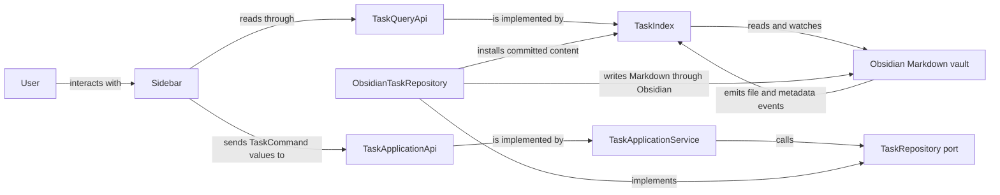

# Architecture

Abyss Tasks manages Markdown tasks through an Obsidian sidebar. Markdown is the durable record.
The plugin builds read models over the vault and writes user changes through application commands.

This document describes the implemented architecture: ownership, sources of truth, dependency
direction, and the contracts that changes must preserve. Source links lead to implementation details.
Proposed architecture belongs in an ignored design spec.

## System at a glance


```mermaid
flowchart LR
  Person[User] -->|interacts with| UI[Sidebar]
  UI -->|reads through| Query[TaskQueryApi]
  Query -->|is implemented by| Index[TaskIndex]
  Index -->|reads and watches| Vault[Obsidian Markdown vault]
  Vault -->|emits file and metadata events| Index
  UI -->|sends TaskCommand values to| Commands[TaskApplicationApi]
  Commands -->|is implemented by| Service[TaskApplicationService]
  Service -->|calls| Port[TaskRepository port]
  Repository[ObsidianTaskRepository] -->|implements| Port
  Repository -->|writes Markdown through Obsidian| Vault
  Repository -->|installs committed content| Index
```

Queries return detached, immutable snapshots. Commands validate fresh targets, perform writes, and
return structured outcomes. Successful writes enter the read model immediately; later Obsidian
events reconcile them through the same parsing path as manual edits.

## Sources of truth

| Concern                                             | Authoritative source                                         | Derived or temporary state                   |
| --------------------------------------------------- | ------------------------------------------------------------ | -------------------------------------------- |
| Tasks, metadata, and dependencies                   | Vault Markdown                                               | TaskIndex snapshots and calendar projections |
| Tracked time                                        | Markdown time entry lines                                    | TimeEntryIndex and tracked totals            |
| Project membership and fields                       | Project Markdown and configured membership/field definitions | ProjectStore snapshots and statistics        |
| Static preferences                                  | Plugin `data.json`                                           | Composed runtime CalendarSettings            |
| Saved list, section, and project views              | Versioned plugin `state.json`                                | Composed runtime CalendarSettings            |
| Navigation, selection, search, drafts, and gestures | AppState or the owning controller for the session            | Rendered DOM                                 |

`TaskIndex` and `ProjectStore` are rebuildable read models. `AppState` coordinates the interface;
it is not a persistence layer. Saved view preferences and transient interaction state remain
separate even when one controller uses both. CalendarMode owns its calendar date and view type.

## Dependency boundaries

[`src/main.ts`](src/main.ts) is the task-system composition root and Obsidian lifecycle entry point.
It loads settings, creates the status catalog and concrete task adapters, injects application
capabilities, registers views and commands, and starts and stops the index. Consumers receive those
capabilities instead of constructing alternate task repositories or indexes.

| Boundary                                         | Responsibility and allowed dependencies                                                                                                                                   |
| ------------------------------------------------ | ------------------------------------------------------------------------------------------------------------------------------------------------------------------------- |
| [Task public API](src/tasks/index.ts)            | Presentation's entry point for task queries, commands, capture, and public task values                                                                                    |
| [Task domain](src/tasks/domain/)                 | Immutable values, identity, validation, status, recurrence, dates, and time; depends on its own modules, deterministic `rrule`, and the narrow shared tag-syntax boundary |
| [Task application](src/tasks/application/)       | Resolves and validates use cases through domain contracts and application ports                                                                                           |
| [Task infrastructure](src/tasks/infrastructure/) | Obsidian adapters, index, codec, block editing, and reference authority; depends inward on application/domain and on shared Markdown helpers and Obsidian                 |
| [Shared Markdown helpers](src/markdown/)         | Shared source syntax and display parsing; imports no task layer                                                                                                           |
| [Presentation](src/panels/)                      | Composes views and interactions over public task capabilities; owns no task Markdown writer                                                                               |

The public capabilities are `TaskQueryApi`, `TaskDependencyQueryApi`, `TimeTrackingQueryApi`,
`TaskApplicationApi`, and `TaskCaptureApplicationApi`. Observed tag discovery belongs to
`TaskQueryApi`. The application also composes the inward `TaskReadProjectionApi` through `queries`;
its organization/hydration port has no direct public barrel export. It inherits the observed-tag
signature from `TaskQueryApi`. Add public exports only for a real consumer. Domain and application
code cannot import Obsidian or presentation; infrastructure cannot import UI.

[`src/parser/`](src/parser/) adapts canonical task data to legacy presentation. It may import codec
internals for that conversion. New task behavior belongs in `src/tasks/`.

Text-write authority is explicit. The repository owns task transactions, `ProjectManager` owns
project frontmatter edits, `NoteTemplateService` owns note preparation, and `TagManager` owns global
tag renames. Settings writes pass through the composition root's persistence ports. The exact
file/owner/API roster and each exception's reason live in
[`storageAuthority.ts`](test/architecture/storageAuthority.ts).

## Task commands and reconciliation

### Source parsing and write identity

[`TaskIndex`](src/tasks/infrastructure/TaskIndex.ts) discovers tasks from Markdown, including
Obsidian comment blocks but excluding frontmatter and fenced examples. List-item metadata enriches
source candidates; its omissions do not remove tasks. The canonical
[`TaskMarkdownCodec`](src/tasks/infrastructure/markdown/TaskMarkdownCodec.ts) parses candidates.
Source exclusions, injected by the composition root, apply to path, tags, and frontmatter before
public projections or reconciliation transitions are published. Excluded content remains available
for repository proof.

The shared task-line source model recognizes dash, star, plus, and decimal ordered checkbox
markers. Edits and subtree transfers preserve authored markers, indentation, quotes, and line
endings. Creation uses its own dash-prefix policy. New nested content reuses authored indentation
or the native indentation setting through a read-only adapter injected by `main.ts`. Reading existing
source never normalizes it to the creation format.

[`TaskApplicationService`](src/tasks/application/TaskApplicationService.ts) captures the relevant
clock and behavior settings, resolves and validates the command, and delegates persistence through
repository and destination ports. The repository locates the current block, writes through
Obsidian, and installs committed content in the index before returning. Conflicts, invalid input,
missing or ambiguous targets, partial moves, and I/O failures are structured outcomes. The initiating
presentation boundary reports them.

[`TaskRefAuthority`](src/tasks/infrastructure/TaskRefAuthority.ts) distinguishes even byte-identical
occurrences without adding Markdown IDs. It records proven successor references and rejects
ambiguous or externally changed targets. A successor can preserve selection or a retry; it does not
grant general write authority. An earlier snapshot is never sufficient authority for a later write.

Committed content remains authoritative in the index until a conflicting cache observation matches
a fresh vault read. Delayed events therefore cannot roll back a published write. Vault and metadata
events use the same reconciliation path. Task-change events describe changed projections; a separate
reconciled-file signal also covers accepted metadata events with unchanged tasks or no tasks.
`ProjectStore` waits for this barrier before combining frontmatter with task statistics. A throwing
subscriber is reported without preventing delivery to later subscribers or the reconciled signal.

Link edits retain their identity in original authored Markdown. The rendered title, description,
or comment identifies an occurrence; the repository must find the corresponding source occurrence
before replacing it. Missing or synthetic joined-fragment targets fail instead of authorizing an
edit to another link.

Task timing edits normalize duration at the codec's final correlated candidate, using the domain
`clampDurationToDay` rule. Only explicit time/duration edits and newly created task lines acquire
that normalization; legacy reads, unrelated edits, and transfers preserve authored bytes. Without a
start time, new duration is capped at 24 hours; an explicit start caps it to the remaining day,
including after a later time edit. Clearing time retains at most 24 hours without restoring discarded
overflow. Ordinary and linked-child creation share this normalization; their result proof accepts
only the exact canonical duration change. The existing duration token writer retains validation
and source ownership.
Retries compare the effective requested timing and protect any implicit companion-duration write.
Root timing retries require faithful source projections; opaque or ambiguous timing fails closed
rather than treating an invalid authored time as absent.
Subtask projections do not expose duration, so a subtask time-edit retry requires an unchanged
original block; concurrent edits within that block require a fresh user action.

### Canonical read projections

`TaskIndex` owns a disposable private search-source port over its accepted task store. It publishes
initializing, ready, failed and disposed states, accepted file changes and status-semantic changes.
Global publication generations protect organization streams; exact handles use a session epoch,
accepted file version, numeric root ID and child-relative-line path. The compact directory retains
only coordinates, accepted root ordinals and versions, never a second source block or serialized
task reference. Exact root lookup indexes the accepted file array by ordinal after version validation.
IDs are never reused within the index lifetime and accepted replacement removes the file's old handles.
Unrelated file updates preserve exact handles for unchanged files.

The source allocates compact handles one node per iterator step, reusing prefixes across partial
and overlapping iterators without extracting text. Document projection uses the current borrowed
node during that same walk, avoiding repeated root and sibling searches. It projects each node's own
Markdown, comments, tags and scalar metadata when documents are requested. The infrastructure
`taskSearchDocuments` adapter consumes shared `markdown/searchText` visible projections for each
field and separately indexes authored link destinations. Comments are projected independently
before joining for retrieval. Metadata contains canonical planning, duration, priority, recurrence
and dependency values; status rules and checkbox markers are excluded. Status-catalog changes
advance semantic generation and organization/counts without changing text documents. This boundary
does not resolve outgoing links. Organization emits detached root scalars, tree tags and tracked totals in batches of at most
200, checking its requested generation before traversal, each yield and completion. Its read-yield
hook cooperates between slices. Presentation still resolves outgoing grouping links through
`taskLinkValues` and evaluates open timer totals at its explicit instant.

Exact hydration accepts at most 200 occurrences and 50 distinct roots, validates every address,
detaches each requested canonical root once and reconstructs ordinary root/subtask refs against that
page's detached trees. It never invokes proof-rebasing `resolve` or guesses child positions. Invalid
bounds, stale authority, cancellation and unavailable lifecycle states have typed outcomes; no
Notice belongs to this read boundary. Existing list, resolve and command contracts remain intact.

Observed tag strings are maintained per accepted file. Card/status badges use dependency counts
without hydrating relation trees; tag menus and inspector tag suggestions consume those detached
strings with the existing configured/selected tag policy. These reads introduce no persisted data.

### Inward full-text matching

`TaskSearchEngine` is an inward application port implemented by one pinned MiniSearch 7.2.0
instance. The disposable engine indexes own-node fields once with no stored fields; its companion
maps retain numeric IDs, root IDs, file membership, source order and per-node astral-field bits.
Seven field counts track live documents containing astral word tokens; replacements, removals and
disposal release this presence metadata without retaining another vocabulary. Exact refs remain with
TaskIndex. Root matching requires all distinct query tokens across fields and descendants; node
matching restricts coverage to that node's title, tags and optionally source path. Root relevance
combines the strongest node with a capped contribution from the rest, discounts children and
orders exact title coverage before typo alternatives. File preference breaks nonempty relevance
ties; blank browse uses it before stable source order. Replacements discard prior file handles;
explicit vacuum releases stale postings. These contracts have no public barrel or UI consumer yet.

The pure `searchMatchPolicy` owns NFC/lowercase normalization, code-point edit limits, exact short
swaps, final-token prefixes and UTF-16 match ranges. Word segmentation is injected, with a
Unicode/CJK fallback. Queries are bounded before segmentation; punctuation-only queries are not
match-all. MiniSearch measures edits in UTF-16 units. A normal branch retains its original radius
when the query and searched fields contain only BMP words; an astral query word or live astral word
in a searched field permits at most twice the semantic budget. Discarded emoji and excluded fields
cannot trigger widening. Its derived-term `boostDocument` hook rejects out-of-policy words before
scoring or coverage, caching acceptance per original token only during that query. Swap branches
remain exact. This retains MiniSearch ranking and a linear number of query branches, without a
second index or corpus scanner. Only this engine file may import MiniSearch; other infrastructure
package imports remain restricted.

Shared `markdown/searchText` owns visible text and original-field provenance. It consumes the
existing link scanner's value-only search spans and inline-code ranges, preserving editable link
occurrence numbering. Balanced delimiters and punctuation escapes share one projection pass;
code contents and compact embed labels retain their own policy. Prose excludes recognized HTML
scaffolding. Visible aliases and destinations have separate UTF-16 source maps; removed markup
creates gaps, and no generated attachment decoration becomes searchable authored text. The helper
emits contiguous literal and code contents as runs, splitting at syntax or normalization boundaries
before assembling text and provenance. Mixed prose and Markdown link labels use this same pass;
ordinary spans do not create a temporary object graph per UTF-16 unit. Projection still completes
synchronously within each requested source document. The helper imports no task layer and grants
no write authority.

### Creation, transfer, and tags

`TaskCaptureApplicationApi` retains a creation session with a frozen destination, local date,
template, insertion policy, prefix, tags, and lifecycle settings. Planning expands the configured
path without writing. [`NoteTemplateService`](src/notes/NoteTemplateService.ts) prepares the note
when the command executes and coordinates concurrent preparation of the same path. A failed or
uncertain preparation requires proof of resolved content before a retry can write. Capture checks
current source exclusions before provisioning and before each retained-session write.

Sidebar retries reuse the session. Project capture uses the selected note and project insertion
policy; overview capture follows the active surface's logical selection. Both panel capture routes
select the query-resolved root through AppState before reveal presentation.

Application code owns prefix and Inbox policy for roots, subtasks, and linked subtasks, including
atomic tag validation. Presentation supplies typed fields. Transient Inbox intent can suppress the
global prefix for one retained session and is not persisted. Tag changes share case identity,
removal-wins precedence, and preservation of authored spelling.

Moves and archives use the same root-transfer path. The repository proves the appended destination
root before removing the source. Bounded recovery receipts require fresh destination evidence and
source revision continuity on retry; identical Markdown alone cannot authorize removal. Archive
sessions freeze the date-expanded destination and share note preparation across a batch. They return
an `archived` outcome because the destination is outside public queries.

Hierarchy commands (`reparent-task` and `promote-subtask`) dispatch to
[`TaskHierarchyService`](src/tasks/application/TaskHierarchyService.ts), which resolves both
endpoints and captures immutable revision preconditions without entering the one-root edit/retry
path. Same-parent operations return unchanged without writing or handing off selection. The
repository passes its existing `Vault.process` capability into
[`taskHierarchyTransaction`](src/tasks/infrastructure/obsidian/taskHierarchyTransaction.ts).
The pure transfer uses canonical root blocks and owned subtree ranges, changes only the required
prefix and source references inside the moved range, and preserves existing metadata, duration,
comments, tracking entries, and imported Markdown. Promotion inserts after the complete old root.
Shared Markdown reference tokenization includes embeds for transfers while ordinary `parseLinks`
continues to exclude them; shared fence parsing prevents rewriting code examples. Cross-note
transfer additionally proves the bounded single-line reference inventory before any write. It rejects
uncovered bracket/HTML syntax (including empty-label and reference-style links), complex Markdown
destinations, and multiline inline-code spans whose block scope cannot be proved. For example,
`[](note.md)`, `[](note.md)`, `[text][id]`, and even literal `[aside]`
are rejected because their reference meaning is not proved; escaped `\[aside\]`, task checkboxes,
ordinary `[[note]]`, `[text](note.md)`, ``, and single-line code/fenced examples
retain their supported behavior. This is a conservative transfer boundary, not exhaustive Markdown
parsing. Same-note hierarchy changes preserve those authored forms without reference rebasing.
Ordinary editable-link and Projects clipboard policies remain unchanged.

Structural authority separately proves the complete indexed predecessor population, exact source
bytes, complete candidate population, and surviving root transitions. It supports disappearing and
newly promoted roots, including task-empty source notes; ordinary edit batches retain their equal
correspondence checks. Surviving roots retain explicit authority continuity, while new roots receive
fresh revisions. The transform's physical moved-line locator identifies a node in the committed
snapshots and grants no independent write authority.

Same-note hierarchy changes use one process callback. Cross-note changes write the destination
first, then the source. Batch installation proves every resulting root, the moved node's parent,
and owned mutation completion synchronously before publishing any candidate snapshots. Failure
compensation restores only exact owned bytes and verifies both notes. Unproved restoration returns
a structured hierarchy partial result naming both paths, reconciles readable current content,
and never retries the destructive phase. Phase/path diagnostics use the injected application sink;
callback failures do not alter compensation. Only source and destination notes are authorized.
Inbound links outside the moved subtree remain unchanged, including links elsewhere in either
note or in third notes; explicit links to the old source's moved block IDs can therefore become
stale. Markdown block and dependency IDs within the moved subtree remain intact.

Hierarchy presentation is shared by [`taskHierarchyActions`](src/ui/taskHierarchyActions.ts).
Existing centre cards and the inspector header preview exact live endpoints through the public
`hierarchyWouldCycle` boundary, after tag/project/attachment handlers; inspector relation drags
retain dependency meaning. The ordinary selected-subtask menu sends `promote-subtask`. AppState's
single drag payload is claimed once per drop, independent of outgoing-link row occurrences.

AppState owns a transient selection-intent generation outside its published/persisted data. Explicit
selection, inspector navigation (including dependency Back), and effective mode changes advance
it; query refreshes and unavailable-result clears remain neutral. Hierarchy success can hand off
only a captured exact descendant path inside the moved subtree, with unchanged intent and a live
owner. It expires unsafe history, uses the proven outcome and current exact query path, and emits
no new selection-begun event or focus request. Unchanged or failed operations never select.
Root reparenting retains the existing removal hold through outcome application so a task inheriting
the source line cannot inherit selection; promotion keeps ordinary containing-root reconciliation.

RightPanel discriminates hierarchy mutation lifecycle events from ordinary draft writes. TaskModal
holds a continuation only for that opening's hierarchy tokens, deferring automatic clean close when
an affected selected root becomes unavailable. Settlement retains proven successor or later user
selection, restores an unchanged full-reference exact source path after failure, or closes an empty
clean modal after its continuations settle. Dirty detached drafts remain recoverable; manual close
is immediate and settlements from earlier openings are inert. Delete/archive lifetimes retain their
existing early-publication close behavior. Hierarchy partial/unknown results use the existing command
notice boundary with both paths; nested copies never enter the root-only move recovery modal.

[`TagManager`](src/tags/TagManager.ts) owns navigation tag settings, promotion, appearance, ordering,
and rollback. Effective groups combine configured groups with public root/subtask tags; discovery
is derived until an appearance or reorder action persists a group. Suggestions likewise use public
task tags, configured tags, and the selection, rather than note-only tags or excluded sources.
Navigation archives hide exact tags, discovered prefixes, or configured groups in `data.json`;
they do not change task Markdown or membership in other views. Global rename also updates saved tag
views through the settings coordinator.

### Dependencies

Tasks-compatible `🆔` and `⛔` Markdown carriers store dependencies. The index derives relations
from persisted roots and subtasks, excluding recurrence forecasts, without rewriting declarations.
The standalone graph defensively detaches and freezes its input; the index privately borrows
canonical nodes with current status scalars and uses the same graph assembly and reverse-edge
rules. Rich queries detach each requested neighbor root once and freeze only their detached result.
Graph exact-reference maps key first by the existing revision string, then by the small structural
address, preserving multiple revisions without serializing source-bearing revisions into new keys.

[`TaskDependencyService`](src/tasks/application/TaskDependencyService.ts) owns dependency commands,
linked subtask creation, and completion checks against the live status catalog. Query eligibility
is advisory: commands revalidate identity, graph constraints, and blockers at the write boundary,
including a reconciled retry.

Dependency mutations share a coordinator across service instances. Same-file changes can be atomic;
cross-file operations can partially succeed and require final proof or compensation against exact
owned source. Unproven recovery reports unknown content state and reconciles from the vault.

Linked subtask creation writes the child and edge in one root operation. Application code owns
eligibility and ID allocation; the repository owns placement and validates the resulting tree.
Removal can return exact, transient recovery data for inspector Undo, valid only while the committed
result still owns the source. Neither AppState nor Markdown stores Undo state.

### Time tracking

Nested time entry lines are the sole record of tracked time. Unreadable entries remain visible and
contribute nothing to totals. [`TimeTrackingService`](src/tasks/application/TimeTrackingService.ts)
owns start/stop operations and uses the same mutation coordinator as dependencies. Starting tracking
closes other running entries before opening the requested entry. Each step uses the previous write's
returned root. Entries that cannot be closed are reported and skipped; I/O failure aborts, so repair
may be needed when a previous entry remains running.

Completing or cancelling a node closes its subtree's running entries in a follow-up write using the
same clock reading and serialized mutation. Recurrence completion closes the completed occurrence's
entries; the next occurrence starts with none. Hand-edited status symbols trigger no writes because
the index only reads.

TaskIndex owns [`TimeEntryIndex`](src/tasks/infrastructure/TimeEntryIndex.ts) and updates it on the
same per-file path as tasks. `PanelView` and `TaskModal` each share one `TrackingTicker` and one
`TrackingActions` command boundary among their controls. The ticker listens to index changes and
runs only while an entry is active and a surface listens; ticks update cached totals without queries.
Cards and calendar items use the render snapshot, and forecasts carry no tracked time. Selection
continuity after entry writes requires proof that the task tree changed only in time entries.

## Presentation ownership

[`PanelView`](src/views/PanelView.ts) owns AppState, the rail, navigation panel, centre panel,
inspector, shortcuts, and their lifetimes. Panels share navigation and selection through AppState.
The shell constructs collaborators with explicit capabilities and callbacks; delegated UI owners
do not acquire independent task writers or duplicate shell subscriptions.

| Owner                                               | Responsibility retained by that owner                                                                                                            |
| --------------------------------------------------- | ------------------------------------------------------------------------------------------------------------------------------------------------ |
| [CompactPaneAccess](src/views/CompactPaneAccess.ts) | Compact pane DOM, responsive state, focus, observers, and pending pane intent; PanelView retains subscriptions and capture/result authority      |
| [LeftPanel](src/panels/LeftPanel.ts)                | Navigation sections, project/smart navigation, creation routing, and the shared tag/project inline-add session                                   |
| [TagNavigation](src/panels/left/TagNavigation.ts)   | Tag/group rows, menus, expanded state, reorder, and drops through retained TagManager/task command paths                                         |
| [CenterPanel](src/panels/CenterPanel.ts)            | Mode composition, state/query subscriptions, Markdown Component, task selection, whole-card interactions, and task modal/recurrence coordination |
| [RightPanel](src/panels/RightPanel.ts)              | Inspector edit session, selected targets, command execution, drafts and recovery, Undo, history, subscriptions, and result ordering              |
| [TaskModal](src/ui/TaskModal.ts)                    | A local AppState and the same inspector, with its own interaction lifetime, owner document, and tracking surface                                 |
| [CalendarSettingsTab](src/settings/SettingsTab.ts)  | Settings staging, commit/retry, semantic rebuild, and shared lifecycle; section owners render their controls                                     |

Today list membership and sidebar counts share the date-only
[`todayTaskCategory`](src/task-lists/todayTaskCategory.ts), supplied an explicit local date. Past due
dates take precedence over scheduling today. The list selector retains its configured status filters;
LeftPanel counts unique active roots (open and in-progress) by file and line and displays separate
today/overdue totals.

### Centre services, rows, and calendar

CenterPanel shares these services across its task surfaces. They depend on task contracts and host
capabilities, never on CenterPanel itself.

| Service                                                   | Responsibility                                                                                                           |
| --------------------------------------------------------- | ------------------------------------------------------------------------------------------------------------------------ |
| [TaskCommands](src/panels/center/TaskCommands.ts)         | Task submissions and result presentation, archive batch rebasing, link edits, project moves, and completion confirmation |
| [TaskMenus](src/panels/center/TaskMenus.ts)               | Single/bulk menus and tag pickers, using TaskCommands and live shell callbacks                                           |
| [CaptureSessions](src/panels/center/CaptureSessions.ts)   | Capture target/session lifetime, placement, remounting, feedback, and focus                                              |
| [ListViewControls](src/panels/center/ListViewControls.ts) | Saved list options, property chips, and popovers through the existing view-state save callback                           |
| [TaskSearch](src/panels/center/TaskSearch.ts)             | Search input/results and refresh scheduling, reusing shell rendering and navigation                                      |
| [TaskCardRenderer](src/panels/center/TaskCardRenderer.ts) | Shared card DOM, Markdown, metadata, and tracked badges; shell retains selection and whole-card interactions             |

[`src/panels/task-list/`](src/panels/task-list/) separates the pure ordered row model and
multi-selection from DOM mounting. `TaskRowSelection` works against an explicit display order;
`MountedTaskListRows` maps row keys to mounted elements. Logical multi-selection belongs to Lists
and Tags; other surfaces reuse card rendering without acquiring that selection model. CenterPanel
owns selection across renders and mode changes.

List organization can use the exact containing source-note path or outgoing wiki-note links in the
root title. `taskLinkValues` derives links once per organization pass with the shared Markdown
tokenizer and a host-supplied resolver. Resolved paths retain exact case; aliases, headings, and
blocks share note identity. Unresolved targets retain source context. Shared `markdown/linkTarget`
owns target/subpath parsing; the Projects helper is a compatibility export of that parser.

Outgoing-link groups show a task in each linked note group. Logical and mounted row keys identify
visual occurrences; each row also carries its physical file/line key. Selection, ranges, keyboard
navigation, and focus receipts retain occurrence keys. Focus restoration also checks the full task
reference and yields to outside focus. Menu counts and command lists deduplicate physical tasks in
visual order. Archive rebasing preserves selected occurrence groups through proven source-line
successors. Running timers retain all mounted badge elements per physical root and clear them at
render/disposal boundaries.

The `source-note` and `outgoing-link` group/sort choices are additive saved list enums in `state.json`.
Existing defaults and schema version remain unchanged, and list sort merges preserve unknown nested
extensions. Older binaries may use their existing fallback for these choices; task Markdown needs
no migration.

`mountTaskListRows` currently mounts every row. The logical/mounted distinction is a boundary for
future windowing, not an implemented virtual task list. Actions use the snapshots and order that
produced the cards; DOM access serves rendering, pointer targeting, focus, and reveal.

[`CalendarMode`](src/panels/calendar/CalendarMode.ts) owns date/view state, calendar view lifetime,
navigation, query-driven patches, and forecast presentation. Its host interface connects it to the
centre shell. CalendarCommands translates gestures into public task commands; the view factory
selects Today, Week, or Month. Calendar policy/content helpers receive time and data explicitly.
Capture placement belongs to the grid; CaptureSessions retains the capture session. Calendar
collaborators use their owning document/window and release scheduled work on teardown.

The shared timed-day layout bounds effective durations before overlap packing and caps minimum
heights at the next block or day end. Labels and gesture origins consume this derived geometry,
including for legacy overflow and recurrence forecasts, without writing source. Move previews
project the final time-only command candidate at the destination: a legacy oversized duration can
therefore occupy more of the day when moved earlier. Preview boxes remain bounded by day end.

### Inspector sessions and interaction continuity

RightPanel constructs three presentation owners:

| Owner                                                                      | Responsibility                                                                                |
| -------------------------------------------------------------------------- | --------------------------------------------------------------------------------------------- |
| [InspectorPlanningSurfaces](src/panels/right/InspectorPlanningSurfaces.ts) | Planning/status controls, chips, menus, recurrence editor, placement, and local focus cleanup |
| [InspectorDependencies](src/panels/right/InspectorDependencies.ts)         | Dependency sections, disclosure, search, badge, and drop gestures                             |
| [InspectorSections](src/panels/right/InspectorSections.ts)                 | Title/description editors, subtask/comment sections, attachments, and link-edit UI            |

They read live shell state and invoke retained command callbacks. RightPanel keeps write targets,
submission records, late-result handling, draft ownership, and the decision to restore a draft.
The owners share its Markdown Component and drag cleanup rather than introducing separate
subscriptions or persistence.

Refresh continuity depends on identity and interaction ownership. Focused, unsubmitted date/tag
entries keep their connected input and original command target while the full selected reference
is unchanged. Dependency sections retain an open interaction only while its selected/counterpart
references and relevant relations/status inputs still match. Drop eligibility is checked again at
the actual drop; a retained preview or menu never grants write authority.

Continuous subtask/comment entry and selected-child restoration after owned writes require a
command-specific successor proof. The proof checks the permitted source change and captured creation
or tag policy. Only a proven successor can receive continuation, selection, or focus. A recovered
draft may reopen only for its original selection or proven successor and draft owner. Newer live
input, including an intentionally empty value, wins; conflicting recovery stays unfocused in Unsaved
drafts with its origin. Navigation, dismissal, and teardown end the owned interaction.

AppState distinguishes beginning a selection from refreshing one. Compact details can open for an
explicit selection or navigation transition; an ordinary refresh does not open them. During a
panel-owned root delete, archive, move, or qualifying Delete-on-completion command, a transient
removal hold prevents index reconciliation from selecting the task that inherits the old line.
The exact result clears only the initiating selection. Valid recurrence successors remain selectable;
a successful move carries proven subtask selection and history to the destination. Repository policy
remains authoritative even when presentation predicts removal.

Navigation completes an active project editor before changing mode; a rejected draft keeps the
current mode and projection. Focus return is local to the interaction's owner and actual opener,
requires a connected target and valid identity, and yields to later user focus or navigation.
Inspector history records structural paths for its session, not durable task identity. Focus
restoration never writes data or changes task selection. PanelView rebinds shortcuts and
native interaction blocking when its document changes. Owners release listeners, observers,
interaction leases, and scheduled work on teardown.

### Task text

[`renderTaskText`](src/ui/renderTaskText.ts) shares title-only inline presentation across cards,
inspector titles, and real calendar titles. It uses Obsidian MarkdownRenderer with the source path
and Component lifetime. Compact title embeds/images become inert labels instead of loading previews.
Descriptions, comments, and project values retain their ordinary Markdown contract.

Editable links keep original source offsets and occurrence order even when display labels change
length; inert labels gain no edit authority. Forecast/continuation titles share
[`plainGhostTaskTitle`](src/ui/plainGhostTaskTitle.ts) and remain inert.

## Projects

### Discovery and field authority

[`ProjectStore`](src/projects/ProjectStore.ts) evaluates note membership against paths, tags, and
frontmatter, and combines reconciled task snapshots into statistics. Rename/delete updates the
visible path or removes the snapshot immediately, followed by a source refresh. It adds no persisted
cache. [`ProjectManager`](src/projects/ProjectManager.ts) creates notes and owns guarded frontmatter
writes. Task moves go through TaskApplicationApi, including the caller's selection-aware wrapper
when provided.

[`projectFields`](src/projects/projectFields.ts) owns case-insensitive field lookup, source binding,
and the shared catalog. Status comes from a configured frontmatter property and literal definition
names, independently of project tags. Derived statistics use the task/time indexes and remain
read-only, so field rendering cannot create a competing persisted value.

Curated types are fixed. Custom types and presets in `projects.propertyDefinitions` form the static
configured inventory, independently of native discovery or column visibility. All overview views
use that catalog. A custom definition assigned to a curated source remains saved but inactive.
Malformed, ambiguous, or unsupported sources remain available for recovery; curated collisions
preserve metadata and make the affected roles read-only. The native property adapter suggests types
and values but never writes Obsidian's registry.

Hide changes view preferences. Remove deletes one unambiguous custom definition and prunes known
references from initialized views without touching note metadata. Typed preset identity, validation,
and presentation come from [`projectPropertyPresets`](src/projects/projectPropertyPresets.ts).

### Shared projections and retained surfaces

[`projectTableModel`](src/projects/projectTableModel.ts) is the DOM-free source of search, typed
sorting, filtering, grouping, and unique visible counts. Kanban and Timeline reuse it. The overview
supplies one render instant for all models and tracked totals; pure models never read ambient time.
Link groups use resolved note paths as identity while retaining raw values and source context for
rendering and edits. Each view has independent saved organization, initially derived from Table
when first requested. Table and Timeline group collapse is independent saved organization in
`state.json`, namespaced by the active grouping field. Collapse defaults empty rather than being
copied from Table into Timeline. Hidden groups retain their saved collapse; reset and reveal change
only the owning view through the existing view-state mutation flow.

`ProjectsPanel` owns a retained [`ProjectsTableView`](src/panels/projects/ProjectsTableView.ts)
overview controller. The controller shares toolbar, field rendering, editor boundary, mutation
queues, receipt projection, history, and clipboard operations across Table, Kanban, and Timeline.
Surfaces retain their own search, selection, organization, and viewport, and are hidden rather than
rebuilt on a view switch. A dashboard temporarily detaches the overview without ending its session.

[`ProjectsOverviewSurface`](src/panels/projects/ProjectsOverviewSurface.ts) separates the complete
logical cell list from mounted cells. Selection, keyboard movement, clipboard operations, creation,
and reveal all use the active surface contract. Reveal mounts a logical cell before focus.
Grouped selection distinguishes occurrences, while mutations deduplicate physical cells. Clipboard
payloads carry raw types and source context, rebase links, and confer no write/history authority.
Editors retain failed drafts, and navigation uses their shared completion boundary.

[`ProjectsTableSurface`](src/panels/projects/ProjectsTableSurface.ts) owns Table DOM, scrolling,
row windowing, and physical drag. The controller retains drop planning, validation, writes, and
history. Editors and native drag sources pin their occurrence rows; evicted rows release listeners
and Markdown Components. [`projectTableViewport`](src/panels/projects/projectTableViewport.ts)
owns geometry only. Logical projection, sorting, and grouping still process the full collection.
Table has windowed rows; centre task lists, Kanban cards, and Timeline rows have no new virtual
mounting layer.

All three surfaces reconcile keyed DOM and update surviving listeners' contexts. Table and Kanban
retain viewport offsets across dashboard detachment; explicit Back can restore the exact retained
cell after those offsets settle. Outside input focus wins. Hidden, detached, or disposed Timeline
occurrences lose gesture and preview authority; reattachment cannot revive queued work. Native
surfaces use their owning document/window and dispose pending callbacks.

Kanban manual path ranks are saved view state. Filtering and sorting retain hidden ranks; rename
moves them, deletion removes them, and absence from a scan does not prune them. A drop revalidates
captured source and current group meaning inside the mutation queue, batches metadata assignments,
and changes rank only after success. Drag presentation owns payload and cleanup, not writes.

### Mutation ordering, receipts, and history

The overview orders submitted actions and serializes session mutations with history recording.
ProjectManager separately serializes metadata operations per App, including operations from other
panels and Settings. Active-editor completion happens outside the metadata queue so a retry can
persist; failure cancels the waiting range command.

`ProjectManager.applyEdits` preflights a batch, then rechecks field/type binding, exact source key,
property presence, and expected value inside each note's `Vault.process` transaction. Multi-file
failure returns exact applied and failed receipts. Status and description edits use the same path.
Successful receipts enter the session projection immediately. Ordinary store/settings/task refreshes
do not retire them: only verified per-path source observations acknowledge or supersede them.
Observations during a write are revalidated afterward; old observations cannot retire newer receipts.
Delete, rename, and membership loss retire affected paths so overlays cannot resurrect them.

[`ProjectEditHistory`](src/projects/projectEditHistory.ts) stores bounded session-only receipt
groups. Undo/Redo use the same guarded batch path, preserving expected values, source-key spelling,
and property presence without overwriting external edits or rebound fields. A receipt for clearing
an inferred custom property can retain authority to restore/refill that exact cell. Supersession,
eviction, discard, or session end removes it; this is not general authority to create missing
properties or change native types.

### Timeline and creation

Timeline separates pure model, axis, and endpoint planning from native interaction and rendering.
[`projectTimelineEndpointEdits`](src/projects/projectTimelineEndpointEdits.ts) translates calendar
geometry into source-preserving date/datetime edits; preview and persistence use the same plan.
Interaction supplies intents, while the controller revalidates their source authority at the queue turn.
The manager validates both endpoints together inside the source transaction, preventing a range
edit from overwriting an independently changed companion field.

Preview authority remains tied to captured source until receipts arrive. Source replacement,
supersession, hiding, or teardown invalidates it, and older settlements cannot alter newer previews.
Axis windowing changes physical rendering without changing logical date mapping.

Overview creation retains a session with a configured status. ProjectManager prepares the note
through NoteTemplateService and applies status through serialized metadata mutation. ProjectStore
owns publication; the overview matches the created path/status and reveals it through ordinary
selection. `ProjectCreationError` identifies the owned file and failed phase: status recovery writes
only that file, and template recovery requires a fresh draft before another create. Sidebar creation
uses the same manager without a recovery session, opens its owned note, and retries only while no
note exists. Failures must not silently duplicate a project.

Status-definition renames share per-App metadata serialization. They recheck membership, field
binding, and expected literal against fresh source, track owned edits, and persist the definition.
Failure restores the definition and compensates only values still owned by that operation.
Cross-file/settings recovery is best effort, not crash-atomic.

## Settings and compatibility

### Persistence and migration

[`SettingsPersistenceCoordinator`](src/settings/persistence.ts) serializes `data.json` and adjacent,
versioned `state.json` through composition-root ports. One composed CalendarSettings object remains
the runtime authority; panels do not receive separate settings copies. Static saves advance the
rollback revision and refresh project settings. View-state saves use a separate callback and do
neither. Task-status changes rebuild the catalog, registry, and index interpretation together;
ProjectStore rescans membership/status changes while presentation changes reuse its snapshots.

Migration captures untouched legacy data, writes and verifies the state envelope with a recovery
snapshot, then removes moved static keys. Recognized state wins when both copies exist. Corrupt,
unreadable, or future-version state stays untouched; view writes suspend and runtime uses temporary
defaults. Static saves preserve unmarked legacy view fields until recovery is verified. Unknown
static and nested view values survive ordinary writes. Detached snapshots queue in order, duplicate
writes are skipped, and a rejected write does not stop later operations.

[`ViewStatePathOwner`](src/settings/ViewStatePathOwner.ts) follows note deletes/renames for the
plugin lifetime, updating Kanban ranks, project list states, and file filters. PanelNavigator brings
session navigation into line. A moved note's list state keeps recognized fields; unknown fields come
from any existing raw entry at its destination key. Tag renames have a separate
[`tagViewState`](src/settings/tagViewState.ts) transform that carries entire raw entries, including
inactive keys and unknown extensions. Conflicting aliases or occupied destinations reject before
vault writes. A later view-write failure retains staged preferences for retry, and older queued
saves cannot replace the newer staging base.

Archive-path and source-exclusion settings commit as one validated draft. Changing the archive path
adds the previous destination to the ignore expression. Only successful persistence replaces the
effective predicate and rebuilds task projections; rejection restores the prior configuration.

Custom-property schema is static configuration. Its
[initialization](src/projects/initializeProjectPropertyDefinitions.ts) and
[versioned definitions](src/projects/projectPropertyDefinitions.ts) prevent later native discovery
from undoing explicit schema edits; unknown versions preserve data and disable schema editing.
Schema changes persist before view cleanup. If cleanup fails, durable schema remains authoritative
and the cleanup can be retried. These saves are not a two-file transaction: stale view references
can survive restart or be recaptured by an older binary after partial failure. Active views derive
safe choices through the configured catalog.

Settings drafts that can be retried retain later edits. Suspended view writes are reported once
without Retry. Presentation owns user-facing failure reporting; the persistence coordinator performs
plain writes, and background note-path saves log failures. ShortcutSettings retains its save/retry
queue across redraw/hide; TaskStatusSettings owns control rendering and local cleanup. The Settings
tab retains staging, persistence, and semantic rebuild authority. Legacy project-status migration
keeps recoverable conflicts and never rewrites vault notes on load. Persisted-contract changes need
an explicit compatibility and migration design.

### Shared syntax and host compatibility

[`tagSyntax`](src/markdown/tagSyntax.ts) defines Unicode/nested non-numeric validity and
locale-independent case comparison. Scanners retain their context and source ranges; commands
preserve authored spelling and unrelated Markdown. Derived group IDs use lowercase identity;
configured IDs remain exact. Saved-view lookup resolves case aliases without deleting or rebinding
physical keys.

Task-domain atomic ranges and shared Markdown link tokens have separate readers because shared
Markdown cannot import the task layer. Their link/inline-code interpretation and duplicated code
point search are held in agreement by [link-reading tests](test/link-reading-layers.test.ts) and
[code-point tests](test/preceding-code-point.test.ts). Embeds/images are atomic source ranges, so task
fields and editable link tokens cannot originate inside them. Source and shipped code avoid regex
lookbehind to support older iOS engines.

[`obsidianMoment.ts`](src/obsidianMoment.ts) is the single boundary for Obsidian's host Moment
export. It repairs the callable TypeScript declaration without wrapping or replacing the runtime
instance; the bundle keeps Obsidian external. Consumers import through this boundary. Remove the
type correction when upstream declarations support the same callable use.

## Architecture checks

| Contract                                   | Enforcement and limits                                                                                                                                                                                                     |
| ------------------------------------------ | -------------------------------------------------------------------------------------------------------------------------------------------------------------------------------------------------------------------------- |
| Import direction and public task consumers | [Dependency rules](dependency-cruiser.config.cjs) and [architecture tests](test/architecture-boundaries.test.ts)                                                                                                           |
| Text-write acquisition                     | [Exact storage roster](test/architecture/storageAuthority.ts) and [audit](test/storage-authority.test.ts); does not follow every passed capability or dynamic property name                                                |
| Settings ownership and migration           | [Key classification](test/architecture/settingsOwnership.ts) and [real coordinator tests](test/settings-persistence.test.ts)                                                                                               |
| Pure models and native lifetime            | [ESLint rosters](eslint.config.mts), [project policy](eslint-project-policy.mts), and [lifecycle tests](test/project-owner-lifecycle.test.ts); lexical checks do not establish transitive purity or native popout behavior |
| Host lint and supported syntax             | [Lint parity](test/obsidian-lint-parity.test.ts), [community review configuration](test/store-review.test.ts), and [built artifacts](test/build-artifacts.test.ts)                                                         |
| CSS scope, tokens, and runtime variables   | [CSS policy](tooling/css-policy.mjs) and [finite contracts](tooling/css-contracts.mjs), checked in authored and shipped CSS; native layout, inheritance, and contrast still require visual inspection                      |

New write acquisitions, settings keys, pure modules, and dynamic CSS values must extend their exact
rosters with reasons and tests. Fix violations at their source rather than weakening checks. Reuse
existing commands, UI primitives, menus, and state semantics when extending a workflow.

Update this document in the implementing commit when ownership, a public boundary, dependency
direction, critical data flow, persisted authority, or compatibility changes. Private helpers,
render recipes, styling details, and test inventories belong in their source and tests.

```shell
pnpm arch
pnpm verify
```

`pnpm verify` is the authoritative local, CI, and pre-push gate. `pnpm verify:task` is the fast
iteration gate. Styles stay scoped to plugin-owned surfaces and use semantic host tokens.
The full gate includes source CSS, community review rules, and freshly built
artifact CSS. UI changes also require native interaction, screenshots, DOM evidence, and captured
runtime errors in `dev-vault-tasks`, including constrained widths when layout changes. Follow
[AGENTS.md](AGENTS.md) for development-vault restoration and integration rules.
