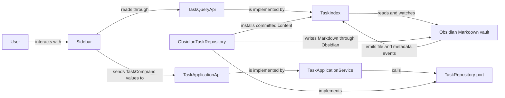

# Architecture

Abyss Tasks manages Markdown tasks through an Obsidian sidebar. Markdown is the durable record.
The plugin builds read models over the vault and writes user changes through application commands.

This document describes the implemented architecture: ownership, sources of truth,
dependency direction, and critical data flows. Follow the source and test links for behavior details;
use CodeGraph to inspect current call paths. Proposed architecture belongs in an ignored design spec.

## System at a glance


```mermaid
flowchart LR
  Person[User] -->|interacts with| UI[Sidebar]
  UI -->|reads through| Query[TaskQueryApi]
  Query -->|is implemented by| Index[TaskIndex]
  Index -->|reads and watches| Vault[Obsidian Markdown vault]
  Vault -->|emits file and metadata events| Index
  UI -->|sends TaskCommand values to| Commands[TaskApplicationApi]
  Commands -->|is implemented by| Service[TaskApplicationService]
  Service -->|calls| Port[TaskRepository port]
  Repository[ObsidianTaskRepository] -->|implements| Port
  Repository -->|writes Markdown through Obsidian| Vault
  Repository -->|installs committed content| Index
```

Queries return immutable snapshots. Commands validate fresh targets, perform writes, and return
structured outcomes. Successful writes enter the read model immediately; later Obsidian events
reconcile them through the same parsing path as manual edits.

## Sources of truth

| Concern                                              | Authoritative source                                                                                               | Derived or temporary state                   |
| ---------------------------------------------------- | ------------------------------------------------------------------------------------------------------------------ | -------------------------------------------- |
| Tasks, metadata, and dependencies                    | Vault Markdown                                                                                                     | TaskIndex snapshots and calendar projections |
| Tracked time                                         | Vault Markdown time entry lines                                                                                    | TimeEntryIndex projection and tracked totals |
| Projects and status                                  | Project Markdown, membership query, configured status property, and literal status names                           | ProjectStore snapshots and task statistics   |
| Static preferences                                   | Plugin `data.json`                                                                                                 | Composed runtime CalendarSettings            |
| Saved list, section, and project views               | Versioned plugin `state.json`                                                                                      | Composed runtime CalendarSettings            |
| Navigation, selection, search, editors, and gestures | AppState or the owning view controller for the current session (CalendarMode owns the calendar date and view type) | Rendered DOM                                 |

`TaskIndex` and `ProjectStore` are rebuildable read models. `AppState` coordinates the interface;
it must not become a persistence layer. Saved view preferences and transient interaction state
remain separate even when one controller uses both.

## Boundaries and entry points

[`src/main.ts`](src/main.ts) is the task-system composition root and Obsidian lifecycle entry point.
It loads settings, creates the status catalog and task adapters, wires application capabilities,
registers views and commands, and starts and stops the index. Concrete Obsidian task adapters are
wired here; consumers receive interfaces instead of constructing alternate repositories or indexes. The
composition root injects a native indentation provider into the Markdown block editor through a
checked, read-only adapter for Obsidian's untyped `getConfig('useTab')` method. Each block mutation captures
the current unit: a tab by default, or four spaces when disabled. New nested content reuses the
existing nested prefix or appends that unit to its owner's exact prefix; description replacements
retain their original prefixes. Reading, reordering, moving, and restoring source preserve authored
indentation.

| Boundary                                         | Responsibility                                                                                | Dependency direction                                                     |
| ------------------------------------------------ | --------------------------------------------------------------------------------------------- | ------------------------------------------------------------------------ |
| [Task public API](src/tasks/index.ts)            | Query, dependency query, commands, and capture planning                                       | Presentation imports this boundary                                       |
| [Task domain](src/tasks/domain/)                 | Immutable values, references, commands, status, recurrence, dates, and time                   | Domain and deterministic `rrule` boundary only                           |
| [Task application](src/tasks/application/)       | Resolve and validate use cases; coordinate repository and destination ports                   | Domain and application ports; no concrete infrastructure or presentation |
| [Task infrastructure](src/tasks/infrastructure/) | Obsidian adapters, index, canonical codec, block editing, location, and reference authority   | Application, domain, shared Markdown helpers, and Obsidian; no UI        |
| [Shared Markdown helpers](src/markdown/)         | Links, tags, inline code, note names, note path patterns, and the preceding code point search | Itself and the host Moment boundary; no task layer                       |
| [Sidebar shell](src/views/PanelView.ts)          | AppState, responsive panels, navigation, shortcuts, and collaborator lifetimes                | Public task capabilities                                                 |

The public task capabilities are `TaskQueryApi`, `TaskDependencyQueryApi`, `TimeTrackingQueryApi`,
`TaskApplicationApi`, and `TaskCaptureApplicationApi`. Application queries supply all three query
capabilities. Add exports only when another component needs them. Presentation must not edit task
Markdown or import private task layers. The domain must not import Obsidian, infrastructure, panels,
or settings UI.

`PanelView` owns `RailPanel` for mode changes, `LeftPanel` for navigation, `CenterPanel` for selected
content, and `RightPanel` for the task inspector. Centre composition uses readonly named options,
including distinct callbacks for static settings and saved view state. Inspector and TaskModal
composition also use readonly named options. PanelView and TaskModal forward the same task
capability, interaction ownership and comment-time provider, plus their existing mutation lifecycle
callbacks. TaskModal keeps a local AppState, lease, owner document and ticker, mounts RightPanel
before subscribing active-selection convergence to queries, and retains the inspector's continuity
methods. Panels share transient navigation through
`AppState`. `set('taskStack')` begins a selection and `updateInspectorSelection` refreshes one;
`AppState` tells its selection-begun listeners after a begun selection is delivered. At a compact
width in Tasks mode, `PanelView` opens the details pane when a selection begins, when the rail's
time tracking opens a tracked task (a dependency hop, which begins no selection), when Tasks mode
returns with a task selected, and when the panel turns compact with a task selected, besides the
pane's own button. A refresh of the selection never opens it.

When a panel moves between windows, `PanelView` rebinds its shortcut router and native interaction
blocker to the current document, retains its state and capture coordinator, and releases the
migration subscription and router on close.

Navigation finishes the active project editor before changing mode. A rejected draft leaves the
current mode and projection intact. Inspector history stores structural task paths for its session;
only proven successor references survive writes, and history never becomes persisted task identity.

A panel's own delete, archive, or move of a root task registers that root's reference in `AppState`
until the command settles: `PanelView`'s selection wrapper registers every such command, and the
inspector registers its Delete task and Archive in its own state, the task modal's included. The
registry is transient and unpublished. While the selected root's removal is pending, an index
update that does not resolve it exactly clears the selection instead of following its line to the
next task. A successful move then selects the moved task in its new note, with the sub-task and the
inspector history the selection had before the move, and at once points that history at the lines
its tasks moved to, while the index can still prove them.

## Centre panel shell

`CenterPanel` composes its centre collaborators through named options. Task actions route through
[`TaskCommands`](src/panels/center/TaskCommands.ts), constructed once before CalendarMode with the
panel's exact task capability and shared TaskRowSelection. It owns command submission/result
presentation, archive session rebasing and stop-on-failure, root selection cleanup, link edits,
project moves and completion-confirmation teardown. Its selection-change callback reads the shell's
current method at call time. Cards, menus, date presets and calendar host actions use this service;
the shell retains drag validation and both recurrence editor submissions. Services never import
CenterPanel. Files under `src/panels/center/` use owner capabilities and task contracts from `src/tasks`.

[`TaskMenus`](src/panels/center/TaskMenus.ts) owns single-task and bulk context menu registration,
priority/status submenus, pinned-tag items and tag-picker composition. Constructed once before
CalendarMode, it uses the existing TaskCommands service and live shell callbacks for date/repeat
editors, filters and tag catalogue/color reads. The shell keeps context-menu selection handling,
visual-order snapshot capture and status-popover close sequencing. TaskMenus owns no lifecycle
registry or task write authority.

| Centre service                                              | Responsibility                                                                                       |
| ----------------------------------------------------------- | ---------------------------------------------------------------------------------------------------- |
| [`TaskMenus`](src/panels/center/TaskMenus.ts)               | Context menus and tag pickers; shared TaskCommands submissions and call-time host callbacks          |
| [`CaptureSessions`](src/panels/center/CaptureSessions.ts)   | Capture target/session lifecycle, surface placement and focus; public capture application capability |
| [`ListViewControls`](src/panels/center/ListViewControls.ts) | List view initialization, property chips and sort/group popover; shared settings save callback       |

[`CaptureSessions`](src/panels/center/CaptureSessions.ts) owns list/dashboard/calendar capture
placement, retained target resolution, controller/surface mount/remount, feedback and Escape focus
restoration. It is constructed once before CalendarMode with the default resolver today provider,
live task-node/root/result callbacks and the retained panel capture capability. The shell preserves
mode/list/projects subscription and teardown ordering while delegating session cancellation.
`cancelActiveCapture` invalidates pending resolution and disposes its controller/surface; no separate
lifecycle registry is added.

[`ListViewControls`](src/panels/center/ListViewControls.ts) owns list view initialization,
property-filter labels, chip insertion/removal, deduplication and sort/group/status popover cleanup.
It is constructed once before CalendarMode with the same settings entry and save callback, plus
call-time root and date-format callbacks. Updates change the settings entry, start the existing
async save action, then notify AppState synchronously. The shell retains headers, filter debounce,
formatDate and lifecycle close ordering.

## Calendar mode

`CenterPanel` routes modes, delegates task actions to TaskCommands, and keeps the task modal and
both recurrence editors. Capture sessions live in the centre CaptureSessions service. Calendar mode
lives in [`src/panels/calendar/`](src/panels/calendar/)
and never imports `CenterPanel`:

| Module                                                                        | Responsibility                                                                                                                                                                                                                                                       |
| ----------------------------------------------------------------------------- | -------------------------------------------------------------------------------------------------------------------------------------------------------------------------------------------------------------------------------------------------------------------- |
| [`CalendarMode`](src/panels/calendar/CalendarMode.ts)                         | Calendar date and view type, view lifetime, navigation bar, query subscription for patches, forecast-menu and projection-diagnostic owners; reaches `CenterPanel` only through `CalendarModeHost` and shares `AppState` and the panel navigation port with the shell |
| [`CalendarCommands`](src/panels/calendar/calendarCommands.ts)                 | Turns drag payloads and gestures into `TaskApplicationApi.execute` calls and presents the result                                                                                                                                                                     |
| [`TimedBlockFocusRetention`](src/panels/calendar/timedBlockFocusRetention.ts) | Keyboard queue and deferred focus restoration with the owning window's timer                                                                                                                                                                                         |
| [`calendarViewFactory`](src/panels/calendar/calendarViewFactory.ts)           | The single view-selection point: maps the controller's handler set onto the Today, Week, and Month view classes                                                                                                                                                      |
| [`CalendarNavigationBar`](src/panels/calendar/CalendarNavigationBar.ts)       | Toolbar DOM, title, month and year pickers, view switcher                                                                                                                                                                                                            |
| [`calendarCapturePlacement`](src/panels/calendar/calendarCapturePlacement.ts) | Resolves capture hosts from the mounted grid; CaptureSessions owns the session                                                                                                                                                                                       |

Every file under `src/panels/calendar/` uses owner capabilities: no ambient window, document, or
timers. The four pure helpers `calendarPolicy`, `calendarDateNavigation`, `visibleCalendarDates`,
and `calendarContent` receive time and data explicitly. `calendarPolicy.initialCalendarView`
supplies the phone initial view and `PanelView` applies it.

Regression entry points: [calendar date navigation](test/calendar-date-navigation.test.ts),
[calendar content](test/calendar-content.test.ts), [calendar commands](test/calendar-commands.test.ts),
[navigation bar](test/calendar-navigation-bar.test.ts), [view factory](test/calendar-view-factory.test.ts),
[focus retention](test/timed-block-focus-retention.test.ts), [calendar mode](test/calendar-mode.test.ts),
and the calendar cases of [the centre panel integration suite](test/center-panel-integration.test.ts).

## Centre task list

`CenterPanel` renders one task card on three surfaces: Lists and Tags, Search results, and the task
list of a project dashboard. Their rows and selection live in
[`src/panels/task-list/`](src/panels/task-list/):

| Module                                                         | Responsibility                                                                                                                                                                                                                                                                                         |
| -------------------------------------------------------------- | ------------------------------------------------------------------------------------------------------------------------------------------------------------------------------------------------------------------------------------------------------------------------------------------------------ |
| [`taskListRows`](src/panels/task-list/taskListRows.ts)         | Pure row model: the selected, sorted root tasks become task rows keyed by note and line and, when grouped, header rows keyed by grouping and bucket from [`taskGrouping`](src/views/taskGrouping.ts), with display-order lookups; `taskStackRowKey` names the card of the task open in the detail pane |
| [`taskRowSelection`](src/panels/task-list/taskRowSelection.ts) | Pure multi-selection: the selected keys in the order they were added, the anchor, and the keyboard focus; clicks, Shift ranges, arrows, the reconcile after a render, display order for bulk actions, and archive rebasing, all against an order it is handed                                          |
| [`taskListRowView`](src/panels/task-list/taskListRowView.ts)   | The only code that turns rows into elements: mounts them in order as direct children of the list, renders headers, takes each card from `CenterPanel`, and returns the key-to-element handle                                                                                                           |

`CenterPanel` owns one `TaskRowSelection` for the session and resets the handle before every card
render. Its list order is the mounted rows in Lists and Tags and the empty order in Search, a
dashboard, and Calendar, so those surfaces have no ranges, arrows, or bulk menu, and a mode round
trip keeps the selection. A list change clears the selection, and each Lists and Tags render
reconciles it. Arrows and bulk actions act on the snapshots the cards were rendered from. Selection
classes, the detail highlight, and card focus are patched through the handle. A click or an arrow
focuses only a card of Lists and Tags; a card's date picker returns focus to its card on every
surface. Creation reveal, the calendar half of the detail highlight, and event-target reads still
read the mounted DOM, and none of them reads the list's order. A windowed renderer would implement
the handle for the rows it mounts. Every file under `src/panels/task-list/` uses owner
capabilities, and its pure modules are in the pure roster.

Regression entry points: [row model](test/task-list-rows.test.ts),
[selection model](test/task-row-selection.test.ts), [row mounting](test/task-list-row-view.test.ts),
[multi-selection](test/center-panel-multi-select.test.ts), the bulk and date menus of
[the tag actions suite](test/center-panel-tag-actions.test.ts), and the list, Search, and grouping
cases of [the centre panel integration suite](test/center-panel-integration.test.ts).

## Task commands and reconciliation

### Reads, writes, and identity

`TaskIndex` discovers tasks from Markdown, including Obsidian comment blocks but excluding
frontmatter and fenced examples. List-item metadata enriches source candidates; its omissions do
not remove tasks. `TaskMarkdownCodec` parses each candidate; the index exposes detached snapshots
and reference resolution. `src/main.ts` injects source exclusions, which the index evaluates against
the file's path, Markdown tags, and frontmatter before publishing tasks or reconciliation transitions.
Excluded files stay outside public projections; raw content remains available for repository proof.
`TaskApplicationService` captures the relevant clock and behavior settings, resolves a command,
validates it, and delegates persistence through repository and destination ports.

The repository locates the current block, writes through Obsidian, and installs committed content
in the index before returning. Conflicts, invalid input, missing or ambiguous targets, partial moves,
and I/O failures are structured outcomes; the initiating presentation boundary reports failures.
The UI must not treat an earlier snapshot as continuing write authority.

A link edit names a link by its number in the text the panel renders: the title, the description,
or a comment. The repository finds that same link in the source and replaces only that link.
Descriptions number the lines that
[`TaskSnapshotProjector.ts`](src/tasks/infrastructure/markdown/TaskSnapshotProjector.ts) reads
with `readTaskDescriptionLine`, through `TaskBlockEditor.descriptionLink`. Titles rewrite the
source link that renders with the same text at the same place in the rendered title. Comments
number a line whose prefix and timestamp hold no link syntax. When the source does not hold the
numbered link, the edit returns a conflict or an invalid target rather than rewriting another link.

After a repository write, the index retains the committed content. A conflicting cache observation
must match a fresh vault read before it can replace that content, so delayed events cannot undo a
published write.

`TaskRefAuthority` distinguishes even byte-identical occurrences without adding Markdown IDs. It
stages proven successor references and rejects ambiguous or externally changed targets. A successor
may preserve selection or retries, but does not grant general write authority.

`RightPanel` uses the pending command's selection proof for continuous subtask, comment, and
linked-subtask entry in both the sidebar and `TaskModal`. An ordinary insertion must add exactly
one direct child or comment and preserve every existing source byte. The domain proof checks the
submitted text with the prefix, Inbox, and creation-date policy captured before submission.
Only that proven successor can receive an empty focused continuation; newer text stays intact.
Escape, outside interaction, navigation, and teardown end the session. Dependency search keeps its
ownership lease across successful writes, then resets the query and reads current candidates.
Inspector planning controls, the tracked-time badge, and the recurrence editor keep keyboard focus
across a rebuild of the same selection or its proven successor, unless the user moved focus
elsewhere.

Vault and metadata events reconcile external and plugin edits through the same index path.
`TaskIndexEvent.changed` identifies changed task projections. A separate reconciled-file signal
also covers accepted metadata events with unchanged tasks, including notes without tasks.
`ProjectStore` waits for these barriers before combining frontmatter with matching task statistics.
Every index subscriber receives each event; a throwing subscriber is reported and does not stop
later subscribers or the reconciled signal.

Task creation freezes its destination, local date, template, insertion policy, prefix, tags, and
lifecycle settings in a retained `TaskCaptureApplicationApi` session. Sidebar capture reuses that
session for retries. Planning expands the configured `taskFilePath`
without writing; `NoteTemplateService` prepares the note when the command executes and coordinates
concurrent preparation of the same path. Project capture uses the selected note and project
insertion policy. Overview capture follows the active Table, Kanban, or Timeline selection. Creation
uses the application/repository path. Both panel capture routes select the query-resolved root
through shared `AppState` before running the existing reveal presentation.

`TaskApplicationService` owns prefix and Inbox-tag policy for roots, subtasks, and linked subtasks.
It validates explicit tags atomically, combines the root's initial tags with its Markdown tags, and
evaluates each created task line independently. Tag patches use the same Inbox policy. Presentation
supplies typed fields and does not duplicate these policies. `planCreate` accepts transient Inbox
intent, which freezes a session without the global prefix while keeping the same authored-tag and
Inbox policy. The intent is not persisted.

Tag pickers use `collectTaskTags`, which combines public task-node tags, configured tags, and the
current selection. Note-only tags and excluded sources do not supply suggestions. Selected tags and
archived prefix roots remain available.

`resolveEffectiveTagGroups` combines configured groups with tags from public roots and subtasks.
Unclaimed standalone tags form exact groups; nested tags form top-prefix groups. Discovery is
derived. An appearance or reorder action persists the affected groups in `tagGroups` while
preserving their IDs.

Navigation archive preferences live in `data.json`: `archivedTags` hides exact entries,
`archivedTagPrefixes` hides discovered branches and future descendants, and `TagGroup.archived`
hides a configured group while retaining its metadata. These preferences leave task Markdown and
membership in other views unchanged. `TagManager` owns their saves and rollback, including group
promotion, appearance, and order. Settings uses the same manager and retains archived entries with
no tasks.

Task archive reuses root transfer and returns an `archived` outcome because the destination is
excluded from public queries. A retained archive session freezes its date-expanded destination and
shares note preparation across a batch. The repository proves the appended root before removing
the source. Unresolved transfers retain bounded recovery receipts; retries require fresh destination
evidence and source revision continuity, so identical Markdown alone cannot authorize removal.

Capture validates the current destination against source exclusions before provisioning and before
every retained-session write. `NoteTemplateService` retains failed preparation state and requires
proof that uncertain content has been resolved before a retry can write.

### Dependencies

Dependency IDs and ordered prerequisites use the Tasks-compatible `🆔` and `⛔` Markdown carriers.
`TaskIndex` derives direct and inverse relations over persisted roots and subtasks, excluding
recurrence forecasts. Direct relations follow declared ID order; inverse relations follow canonical
source order. Duplicate declarations collapse only in the projection.

`TaskDependencyService` owns dependency commands, linked subtask creation, and completion checks.
Queries preview eligibility; application commands validate it again. The live status catalog defines
active blockers. Missing IDs remain visible for repair without blocking completion; ambiguous IDs
block if any matching task is active. Authored cycles remain readable, but new cyclic edges fail.
Completion rechecks blockers before the first write and a reconciled retry; unproven identity or
blocker state returns a conflict.

Dependency changes share a mutation coordinator across service instances. Same-file metadata
changes are batched. A cross-file add writes the blocker ID before the dependent edge; failure of
the second write leaves the ID in place and reports failure. Same-file reversal is atomic;
cross-file reversal publishes only after final proof, or attempts compensation against exact owned
source. Unproven recovery reports unknown content state and reconciles from the vault.

Linked subtask creation writes the child and its edge in one root operation. Application code owns
eligibility and ID allocation; the repository owns placement and validates the resulting tree.
Removal returns exact transient recovery data for a local inspector Undo, valid only while the
committed result still owns the source. Undo data stays out of AppState and Markdown.

Task cards, subtasks, and relation rows share a transient dependency drag payload. Dependency drops
change edges through public commands; existing tag, project, and subtask reorder drops keep their
own source rules. Calendar and sidebar views share dependency/status presentation and completion
blocking. See [dependency reversal tests](test/task-dependency-reversal.test.ts) and
[linked subtask tests](test/task-create-dependency-subtask.test.ts).

### Time tracking

A time entry is a nested list line that opens with a start stamp and `→`. Entry lines are the only
record of tracked time. An entry the parser cannot read stays visible on its task and counts
nothing. A new nested line joins its group in the order description, subtasks, comments, entries.
Existing lines never move, and reading does not depend on their order.

`TimeTrackingService` owns `start-tracking` and `stop-tracking`. Neither command writes to a single
root, so both bypass the rooted command path, and their writes are serialized on the mutation
coordinator that dependency changes use. A start closes every other running entry and then opens its
own, which keeps one timer running at a time. Each step reads the root the previous write returned
and does not wait for the index. An entry the service cannot close goes to diagnostics and is
skipped; only an I/O failure aborts. A session under a minute with no note is discarded, and the
outcome reports it. Entry removal returns transient recovery data for a local inline Undo.

`TaskIndex` owns `TimeEntryIndex`, updates it on the same per-file path as the task map, and serves
it through `TimeTrackingQueryApi`. `PanelView` and `TaskModal` each own one `TrackingTicker` and one
`TrackingActions` write boundary and share them with the controls they host. The ticker re-reads
active entries when the index changes and runs its interval only while an entry is running and a
surface listens. A tick adds to a cached total and never queries the index. Cards and calendar items
read the render's snapshot; forecast occurrences carry no tracked time. The inspector badge outlives
the chips row, so its sessions popover survives its own writes. An entry write changes its node's
source block, so a selected subtask can no longer be matched by its text. `rebuildTaskSelection`
follows it by child position, and only where `sameTaskTreeExceptTimeEntries` proves that nothing but
time entries changed.

Completing or cancelling a node closes its subtree's running entries in a follow-up write with the
same clock reading, inside the same serialized mutation. The status result changes only by reporting
a discarded short session. The follow-up skips and aborts by the same rule as a start, and an entry
it leaves running stays visible for repair. Recurrence completion closes the completed occurrence's
entries, and the next occurrence starts with none. The index only reads, so a status symbol edited
by hand closes nothing.
See [service tests](test/tasks/time-tracking-service.test.ts) and
[ticker tests](test/tracking-ticker.test.ts).

## Projects

### Discovery and field authority

[`src/projects/`](src/projects/) treats qualifying Markdown notes as projects. `ProjectStore`
evaluates membership against paths, tags, and frontmatter, combines task snapshots into statistics,
and updates from vault and task-index events. A rename or delete moves or drops the note's snapshot
at once, before any render the change causes, so the paths on screen agree with saved view state;
the debounced refresh then re-reads the note. It adds no persisted cache.

[ProjectManager](src/projects/ProjectManager.ts) creates notes without opening them, edits project
frontmatter, and moves tasks through `TaskApplicationApi`, the caller's when it passes one: a panel's
project drop passes its selection wrapper, so the panel sees its own move. Membership comes from the
configured query. Status uses one configured frontmatter property and literal status-definition
names; project tags do not carry status.

`projectFields` owns case-insensitive field lookup and the shared catalog. Status, start, and end
have configured source properties; description uses `description`. Name comes from the filename,
and progress is derived from completed top-level tasks over non-cancelled top-level tasks.
Time is derived from the note's time entries. `ProjectStore` reads the index's per-file total when
it re-evaluates the note; a project never walks entries itself. Both derived fields are read-only
wherever a field can be written. Time's curated column is hidden by default.
Curated types are fixed. Custom types and preset presentation in `projects.propertyDefinitions`
form the static configured inventory, independent of native discovery and Table column visibility.
The shared configured catalog supplies Table, Kanban, and Timeline choices in definition order;
Time can be sorted but cannot name groups. A custom definition whose source is assigned to a curated
role stays saved but inactive until that role moves away.

Projects settings renders configured property cards even without a Table preference. Freeform Add
creates a text property unless a supported native suggestion supplies its type; Tags has its fixed
type. A view action creates an absent column preference. Hide retains the schema and presets;
Remove deletes one unambiguous custom definition and prunes its known references from initialized
views, leaving note metadata untouched.

Malformed, ambiguous, unconfigured, or unsupported custom sources remain available for recovery.
Curated source collisions preserve metadata and spelling while making the roles read-only. The
native property adapter discovers and suggests values/types; it never writes Obsidian's registry.
`projectPropertyPresets` supplies shared typed identity, validation, and presentation to settings,
projections, and editors. See [field tests](test/project-fields.test.ts) and
[property-definition tests](test/project-property-definitions.test.ts).

### Shared projections and retained views

`projectTableModel` is the DOM-free source of search, typed sorting, status filtering, grouping,
and unique visible counts. Link groups use resolved note paths as identity while retaining raw
values and source paths for rendering and edits; external targets keep source-independent identity.
The overview captures one render instant and supplies the required `ProjectTableModelInput.nowMs`
to Table, Kanban, Timeline, and their preview projections. Tracked totals sort and display at that
instant; the pure models never read ambient time. Kanban and Timeline models reuse this projection.
Their settings modules own independent saved presentation and organization, initialized from Table
only when first requested.

`ProjectsPanel` owns a long-lived [overview controller](src/panels/projects/ProjectsTableView.ts) and
property-catalog subscription. The controller shares the toolbar, field renderer, editor boundary, mutation queues,
receipt projection, and history across Table, Kanban, and Timeline. Each surface retains its own
search, selection, organization, and viewport. Switching hides inactive surfaces instead of
rebuilding them. The controller drives the Table, Kanban, and Timeline through one
[surface contract](src/panels/projects/ProjectsOverviewSurface.ts): show and hide, a render whose
hooks publish the toolbar statuses and project count and then settle the selection, the cell list
and the mounted cells, cell reveal and scrolling, the editor frame, a created project's occurrence,
and teardown. Selection, reveal, editing, and creation go through the active surface; Kanban and
Timeline exist once first shown. The [Table surface](src/panels/projects/ProjectsTableSurface.ts)
owns the Table's scroll, header, rows, window, and logical cells, and reaches the cell renderer,
the header commands, and the row drag through its context.
[Contract tests](test/project-overview-surface.test.ts) run the same cases on each surface; on the
Table they also mount an offscreen row.
Project gesture and creation timers use the owning window and release pending
callbacks on disposal. A document without a window releases short gesture guards synchronously and does not
retain creation requests or arm Kanban dragging. A dashboard temporarily detaches the overview and
invalidates Timeline interaction authority; reattachment preserves the session but cannot revive an old queued gesture.

Table owns a full expanded logical row/cell projection for selection, keyboard navigation, and
clipboard commands, independently of mounted DOM. The pure
[overview cell lists](src/panels/projects/projectOverviewCells.ts) build it: rows in display order,
cells with their selection identities, row and column orders, and a lookup index. Kanban and
Timeline build their lists with the same module in each render, from the model and inputs they
render with, so selection, range selection, paste, and Delete read one list in every view.
[Parity tests](test/project-kanban-view.test.ts) compare each list with the cells the view mounts.
The Table's local `projectTableViewport` owns measured and estimated row offsets, bounded windows,
and spacer geometry. Scroll reconciliation reuses the
retained model; data and group changes replace that sequence and clamp the viewport immediately.
Group metadata remains available outside the window. Editors and native drag sources pin their
occurrence rows until the interaction finishes; other evicted rows release listeners and Markdown
components. Table geometry, resize, scroll, and focus use the host's owning document and window.

The [viewport helper](src/panels/projects/projectTableViewport.ts) contains geometry only: ordered
occurrence/header keys, measured heights, cumulative offsets, binary range lookup, and pinned-row
segments. It keeps one range with 170px overscan and consumes that buffer before refilling it.
Replacing the row sequence or accepting changed measurements invalidates the range; a viewport
height change also forces recalculation. Measurements preserve the current row anchor, and the
Table surface bounds measurement correction to two passes. Mounted rows stay bounded;
full-collection sorting, grouping, counts, and logical cell projection still scale with the
collection.

DOM identity alone does not preserve native focus: detaching and reinserting a retained row can
blur its editor. Table reuses keyed spacer rows, patches only changed geometry, and removes obsolete
spacers before ordering retained rows. Selection consumers, including Quick Capture, resolve logical
cells rather than requiring mounted elements. Row mounting is needed only for rendering, focus,
editing, and pointer interaction. These interaction rules belong to the Table surface, not the
geometry helper; windowing alone is not a complete reusable view implementation.

Regression entry points are [overview cell tests](test/project-overview-cells.test.ts),
[viewport geometry tests](test/project-table-viewport.test.ts), and
[table interaction tests](test/project-table-view.test.ts). They cover buffer boundaries, group
expansion/collapse, shrinking results, changed heights, offscreen bulk selection and Quick Capture,
and retained editor/drag rows. Native validation additionally checks visible coverage after large
jumps and group expansion, focus, and style/layout cost: a bounded DOM does not guarantee uniformly
cheap buffer refills under every vault theme and plugin combination.

Table rows, Kanban cards, and Timeline ranges reconcile keyed DOM. Surviving listeners read current
reconciled contexts. Shared `ViewOptionsPopover`, field menus, cell renderers, commands, and
selection paths preserve one interaction model. Editors retain drafts on failure and route explicit
assignments through the controller. Navigation and view changes use the same editor-completion
boundary. Transient selection distinguishes grouped occurrences; mutations deduplicate physical
cells. Clipboard payloads preserve raw types and source context, rebase links, and carry no write or
history capabilities.

Kanban manual path ranks are saved view state. Filtering or sorting does not discard hidden ranks.
A deleted note's ranks are forgotten and a renamed note keeps its rank. Overview appenders add ranks
only for notes that exist, and absence from a scan never prunes a rank.
`projectKanbanDrop` revalidates captured source capabilities and current target/group meaning inside
the shared mutation queue, batches metadata assignments, and updates manual rank only after success.
Native drag presentation owns payload and cleanup, not metadata or settings writes.

Timeline separates pure `projectTimelineModel`,
[projectTimelineAxis](src/projects/projectTimelineAxis.ts), `projectTimelineEdits`, and
[projectTimelineEndpointEdits](src/projects/projectTimelineEndpointEdits.ts) from native
`projectTimelineInteraction` and `ProjectsTimelineView`. Timeline uses inclusive local calendar
days for its axis and range geometry. The endpoint planner retains raw date and datetime values
separately from those days. Moves and resizes preserve each existing endpoint's local clock and
encoding; creating a missing endpoint inherits its timed counterpart's clock. The planner rejects
nonexistent local times and returns the final projected range for both preview and persistence.
Unchanged endpoints retain their exact source values.

One range element is both the visual block and its move and resize targets. Every known endpoint
sits on its exact calendar boundary; a CSS-owned compact minimum grows away from the anchored
endpoint, rightwards from a Start and leftwards from a lone End, and the open side stays dashed.
A pointer resize or a move of a one-date range writes the day under the pointer, while a closed
range moves rigidly from its grab day. The cursor line and tooltip always mark the day being
written, including when the counterpart clamps it. Preview, receipt reconciliation, cancellation,
and failure restore that one element. The axis generates only the visible slice plus
overscan; a browser-safe physical width cap never changes logical mapping.
Direct and options scale changes share the guarded controller path and fit valid filtered bounds;
Today and navigation preserve the selected scale.

Timeline interaction emits frozen pointer intents or relative keyboard intents and never writes
Markdown or records history. Preview tokens remain tied to their captured source until authoritative
receipt projection arrives. Rejection, source replacement, supersession, hiding, or destruction
clears the preview; an older settlement cannot alter a newer one. Scroll/resize patches only visible
axis and grid nodes, preserving range nodes and focus. The view owns occurrence visibility:
collapsed or detached occurrences cannot capture queued commands or retain gestures/previews.
See [Timeline interaction tests](test/project-timeline-interaction.test.ts),
[Timeline axis tests](test/project-timeline-axis.test.ts), and
[overview view tests](test/projects-views.test.ts).

### Mutation ordering, receipts, and history

Three coordination scopes remain distinct. The overview orders submitted actions, then serializes
session metadata mutations together with history recording. `ProjectManager` separately serializes
metadata operations per App across panel and settings manager instances. Timeline waits for one
active-editor attempt outside the metadata queue, so correction/retry can persist without waiting
behind the range command. A failed editor attempt cancels that command.

Pointer ranges freeze occurrence, path, field binding, exact source key, raw value, existence, and
projected range; a mismatch rejects the command. Keyboard ranges freeze binding but apply relative
changes to the latest receipt projection at their queue turn. Range edits send both endpoints in
one batch, retaining the unchanged endpoint as an exact companion guard. No-op plans skip writes
and history.

`ProjectManager.applyEdits()` preflights the batch, then rechecks current source/type binding, exact
key, existence, and expected value inside each note's `Vault.process` transaction. It accepts valid
date or datetime values for configured Start and End fields and checks their combined range inside
the source transaction. Other date fields retain their declared validation. Timeline submits both
endpoint values in one guarded batch, including the unchanged endpoint as an exact companion.
Existing receipts and history preserve timestamp spelling and property presence for undo and redo.
Partial multi-file failure returns exact applied and failed receipts. Status and description edits
use this same path; status input becomes a configured literal name. Failures propagate to the
initiating presentation boundary.

Successful receipts enter the session projection immediately. Ordinary store/settings/task refreshes
do not retire them. Only verified per-path source observations acknowledge or supersede receipts;
observations received during a write are revalidated after receipt installation. An old observation
or async check cannot retire a newer receipt. Delete, rename, and membership loss retire affected
paths without allowing an overlay to resurrect them. Store/catalog refreshes defer during the
coordinated mutation and reconcile afterward.

`ProjectEditHistory` stores bounded session-only receipt groups. Undo/Redo use the same batch path
with exact expected values, key spelling, and presence provenance, preserving owned unknown/empty
values without overwriting external edits or rebound properties. A cleared inferred custom property
may retain cell-bound restore/refill authority derived from actual receipts. Supersession, refill,
eviction, discard, or session end removes it; it grants neither general absent-property authority
nor native type writes. See [manager tests](test/project-manager.test.ts),
[history tests](test/projectEditHistory.test.ts), and [store-event tests](test/project-store-events.test.ts).

### Creation and status renames

Overview project creation belongs to its retained session. The composer freezes a configured
status; `ProjectManager` validates the writable source, creates the note through
`NoteTemplateService`, and applies status through serialized metadata mutation after template
preparation. Without a template, the note starts with the configured task heading and status,
without synthetic date fields.
`ProjectStore` publication owns the visible snapshot. The overview matches the owned path/status,
relaxes obstructing filters, and reuses selection/reveal.

`ProjectCreationError` identifies the owned path and failed phase. Status recovery writes only that
file. Template recovery offers the owned note and requires a fresh draft before another create;
collision or retry must not silently duplicate a project.

Sidebar inline creation calls the same manager path without a recovery session. It opens the
created note itself, retries only while no note exists, and reports a `ProjectCreationError` with
the note's path. `projectCreation` owns the failure sentences both surfaces show. `projectActions`
owns the status-change and open-note failure sentences that the sidebar's project menu and the
Projects view share. The overview's cell edits keep their own reporting.

Status-definition renames share per-App metadata serialization with assignments and batches. A
rename rechecks role, membership, and expected literal against fresh source, tracks owned note edits,
and persists the definition. Failure restores the definition and compensates only values still
owned by the operation. Unresolved paths reach one settings failure boundary. Recovery across files
and settings is best effort, not crash-atomic. See [rename tests](test/projectStatusRename.test.ts)
and [creation presentation tests](test/project-creation-presentation.test.ts).

## Settings and compatibility

[`src/obsidianMoment.ts`](src/obsidianMoment.ts) is the single compatibility boundary for
Obsidian's named host Moment export. Its namespace declaration loses call signatures under
TypeScript ES module interop; the boundary restores Moment's own complete callable type without
wrapping or replacing the runtime instance. Consumers import through this boundary, and the
bundle keeps `obsidian` external. Remove the correction when upstream publishes compatible
callable declarations. [Boundary tests](test/obsidian-moment.test.ts) verify callable overloads,
strict parsing, static identity, and the external provider in the generated bundle.

[`SettingsPersistenceCoordinator`](src/settings/persistence.ts) serializes two documents through
Obsidian's public vault adapter. `data.json` owns static configuration; adjacent versioned
`state.json` owns list/section state and project Table, Kanban, Timeline, and active-view preferences.
One composed `CalendarSettings` object remains the runtime authority. Panels do not receive separate
settings copies.

[`ViewStatePathOwner`](src/settings/ViewStatePathOwner.ts), created by `src/main.ts` when settings
load, keeps saved view state that names a note path in step with vault deletes and renames: Kanban
ranks, project list states, and `file` filters. A delete forgets the note's own ranks and list
state; a rename moves them and rewrites the filters. One trailing save follows a burst, and any
view-state save carries it. Panels bring their session state in line through `PanelNavigator`.

Archive-path and source-exclusion settings commit as one validated draft. Changing the archive path
adds the previous path to the ignore expression. Only a successful save replaces the effective
predicate and rebuilds task projections; a rejected save restores the prior configuration through
the shared settings revision coordinator.

Migration captures untouched legacy data, writes and verifies the versioned state envelope with an
exact recovery snapshot, then removes moved static keys. Recognized state wins when both copies
exist. Corrupt, unreadable, or future-version state stays untouched: view writes suspend and runtime
uses temporary defaults. Missing or unavailable state derives fresh Table columns from the static
configured inventory; recognized views retain their own normalized order and visibility without
appending schema-only fields. Static saves preserve unmarked legacy view fields until recovery is
verified. Unknown static/nested view values survive; detached write snapshots queue in order,
unchanged writes deduplicate, and rejection does not stop later operations. A list state moved to a
renamed note's key keeps only its recognized fields, and a stale raw entry at the new key lends it
its unknown fields.

Static and view-state saves use separate callbacks. Static durability advances the rollback revision
and refreshes project settings; view-state writes do neither and narrowly refresh the existing view
controller when needed. Task-status changes rebuild the catalog, registry, and index interpretation
together. ProjectStore rescans only for membership/status inputs; presentation changes reuse its
snapshots and update retained views. Panel view-state saves raise one Notice through the plugin's
panel route. `saveViewState()` itself is a plain write, and Settings reports its failure through the
draft Notice. After a suspended load, rejected panel view writes raise nothing further, and a
Settings change reports the suspension once, without a Retry. The note-path owner logs a failed
write.

Initial custom-property type capture fills only supported missing static definitions, before view
registration, with bounded metadata/layout follow-ups. Available discovery, including an empty
catalog, finalizes `projects.propertyDefinitionsVersion = 1` in the same static save. Unavailable
discovery leaves legacy capture pending. Explicit schema edits also finalize that marker, so later
callbacks cannot recreate deleted definitions. Unknown marker versions preserve their schema and
disable schema editing with an update notice; malformed definition recovery remains intact.

Schema Add and Remove save static definitions and the marker before view state. Static failure
prevents the view write. A failed static save from Settings' project properties keeps the change in
the session and still refreshes project settings in open panels. A failed view cleanup leaves
durable deletion authoritative and offers a retry against the current draft. After restart, stale
references may remain because the scalar marker cannot distinguish deleted fields from unresolved
legacy fields. Version-1 Settings cards come from configured definitions; active views filter
through the configured catalog and derive safe grouping/sorting without erasing those references.
Freeform Add can explicitly repair a name. A retained deletion draft retries cleanup; no two-file
transaction or restart cleanup is implied. Rollback to an older binary preserves deletion after both
saves, but may recapture from stale views after partial failure because old binaries ignore the
marker.

A failed save that can succeed later keeps the current draft for Retry, including later user
edits; a suspended view-state write is reported once, without Retry. Settings UI lifecycles
preserve active drafts across rebuilds and dispose listeners.
Legacy project status migration preserves recoverable conflicts and requires explicit source
selection or discard; loading never rewrites vault notes. Any persisted-contract change needs a
compatibility/migration design. See [persistence tests](test/settings-persistence.test.ts).

[`src/parser/`](src/parser/) adapts canonical task data to legacy presentation. It may use codec
internals for that conversion; new task behavior belongs in `src/tasks/`.

## Changes and verification

[`dependency-cruiser.config.cjs`](dependency-cruiser.config.cjs) defines exact import restrictions;
[test/dependency-rules.test.ts](test/dependency-rules.test.ts) checks them. Fix violations at their
source instead of weakening boundaries. New views reuse established commands, menus, state
semantics, and UI primitives.

The typed [storage authority audit](test/storage-authority.test.ts) checks acquisition of Obsidian
text-write APIs against exact file/owner/API entries with reasons. It covers aliases and literal
property extraction, but does not follow capabilities passed through ports or dynamic property
names. [Settings ownership](test/architecture/settingsOwnership.ts) requires a classification for
every known settings key; [coordinator tests](test/settings-persistence.test.ts) verify the actual
static/view split and preservation of unknown extensions. New write acquisitions and settings keys
must extend these checks without creating another persistence path.

[Project ESLint policy](eslint-project-policy.mts) rejects ambient capabilities in the pure-module
roster in [eslint.config.mts](eslint.config.mts) and global document/window capabilities in project
and calendar surfaces, in the centre services' [`src/panels/center/`](src/panels/center/),
in the centre task list's [`src/panels/task-list/`](src/panels/task-list/), and in the shared [project actions](src/ui/projectActions.ts), which join by a per-file entry.
Enroll new pure modules in that roster and supply explicit time; native surfaces retain their
owning window and dispose pending work. These lexical checks complement
[owner-lifecycle tests](test/project-owner-lifecycle.test.ts); they do not establish transitive
purity or native popout behavior.

Linted files carry no ESLint or TypeScript directive comments, and the
[lint parity test](test/obsidian-lint-parity.test.ts) checks that every linted file resolves the
rules that ban them. It also holds every rule that eslint-plugin-obsidianmd's recommended config
enables for plugin source at the same or a higher severity with the same options, apart from exact
reviewed differences. A restricted-globals rule may name more globals than obsidianmd's.

Repository code and the shipped bundle contain no regular-expression lookbehind, which iOS before
16.4 cannot compile. These checks do not rely on eslint-plugin-obsidianmd's lookbehind rule, which
misses negative lookbehinds in regex literals and every pattern built from a template. The
[lint parity test](test/obsidian-lint-parity.test.ts) scans every code file that git tracks or
would track, whether ESLint lints it or not; the
[production artifact test](test/build-artifacts.test.ts) scans a fresh production build, and the
[release check](release-check.mjs) scans the built `main.js` of a mobile manifest. A leading
negative lookbehind becomes an alternative that passes over the refused character or a check on
the code point before the match, and an inner one becomes a class on the content's last
character. The code point check lives in
[`src/markdown/precedingCodePoint.ts`](src/markdown/precedingCodePoint.ts).

Two readings are copied across layers because neither layer may import the other: the domain
imports only its own modules and `rrule`, and shared Markdown helpers import no task layer. The
task domain copies the code point search of `src/markdown/precedingCodePoint.ts`. It also reads
links in [`src/tasks/domain/taskLineAtomicRanges.ts`](src/tasks/domain/taskLineAtomicRanges.ts),
where links, embeds, and images are ranges that no task field may start inside, while
[`src/markdown/links.ts`](src/markdown/links.ts) returns link tokens for rendering, counts,
edits, and project values. Both link readings use the same wiki and Markdown patterns, search
Markdown links only up to the last unescaped `)`, and keep no match that starts inside an earlier
kept match, so nothing starts inside an embed or image. The domain module starts with the verbatim
text of [`src/markdown/inlineCode.ts`](src/markdown/inlineCode.ts), so both drop matches that
start in inline code found by the same scan. [One suite](test/preceding-code-point.test.ts) runs
both code point searches, and [another](test/link-reading-layers.test.ts) holds the link readings
equal and checks that the copied text is the same.

`pnpm lint:store` runs the community directory's published review rules in the full gate, as a
[Vitest file](test/store/review-lint.test.ts) under its own config, outside the unit suite and its
coverage: eslint-plugin-obsidianmd's recommended config, with the parser options its maintainers
document for the scanner, over every code file that git tracks or would track and `package.json`,
except the review's skip list, and stylelint-config-obsidianmd's own rules, without the
stylelint-config-standard base that no review report shows, at the browser baseline of the
manifest's `minAppVersion` over every CSS file. Every message fails, parse errors included. It
holds the review's published rules, not its private scanner, whose verdicts it can drift from. The
[review configuration test](test/store-review.test.ts) pins that configuration, lints `styles.css`
with the review's CSS rules, and checks the README's installation and usage sections and the rrule
notice in the fast gate. The file lists come from one module,
[`test/support/repositoryFiles.ts`](test/support/repositoryFiles.ts), which the lint parity test
shares.

Authored and shipped CSS share the [CSS policy](tooling/css-policy.mjs) and Stylelint correctness
rules. Styles stay scoped to plugin-owned surfaces and use semantic host tokens.
[CSS contracts](tooling/css-contracts.mjs) record token provenance, required compatibility
fallbacks, runtime-variable families, and exact reasoned exceptions. New dynamic producers and
consumers need finite contracts and tests tied to their source owners. Historical documentation
supports minimum-version token decisions; it is not evidence of running that Obsidian version.
The checks cover declared contracts, not computed inheritance, theme contrast, or native layout.
Authored CSS also meets the review's CSS rules: no `:has()`, no `!important`, and no feature that
the manifest's baseline supports only in part. Where a selector would read state from the DOM, the
TypeScript that owns the state sets a state class.

Rows and hooks whose work reaches a linter, a TypeScript program, a source walk, or a child process
name that kind's limit from [`test/support/timeouts.ts`](test/support/timeouts.ts), light work runs
on the configs' `testTimeout` and `hookTimeout`, one rule sizes both, and the
[time limit check](test/test-timeouts.test.ts) holds every row and hook of both gates to it,
following names through the helpers and modules outside `src/` that test files load, but not
dynamic property calls, a function that code outside the row's work passes to a helper, or plugin
code. A gate row that times its own work reads the process's CPU clock through
[`cpuMilliseconds`](test/support/cpuTime.ts) or `interleavedRatio` in
[`test/helpers.ts`](test/helpers.ts), never the wall clock. `test/helpers.ts` loads no presentation
module, which [its own suite](test/helpers.test.ts) checks through every module it loads, and a
presentation harness has its own support module, such as the panels'
[`test/support/panelHarness.ts`](test/support/panelHarness.ts). A suite that needs no DOM and no
Obsidian global helper declares the Node environment on its first line;
[`test/setup/obsidianMocks.ts`](test/setup/obsidianMocks.ts) gives every suite the mocked
`obsidian` module, and Obsidian's global helpers only where a DOM exists.

Update this document in the implementing commit when ownership, a public boundary, dependency
direction, a critical data flow, persisted authority/migration, or a compatibility seam changes.
Private renames, local helpers, and styling do not require architecture prose. Record any necessary
boundary exception with its reason, narrow scope, and automated check.

```shell
pnpm arch
pnpm verify
```

`pnpm verify` is the authoritative local, CI, and pre-push gate for architecture, formatting,
lint, types, coverage, artifacts, release metadata, and dependency health. `pnpm verify:task`
provides the fast lint, source CSS, types, architecture, and unit checks. The full gate checks
authored `styles.css` with `pnpm lint:css` and the repository with the review's rules through
`pnpm lint:store`, then checks freshly generated `dist/styles.css` with `pnpm lint:css:artifact`
after build and artifact generation. UI changes also require native
`dev-vault-tasks` interaction,
screenshots, DOM evidence, and captured runtime errors, including constrained widths for layout
changes. Follow [AGENTS.md](AGENTS.md) for the development-vault and integration workflow.
