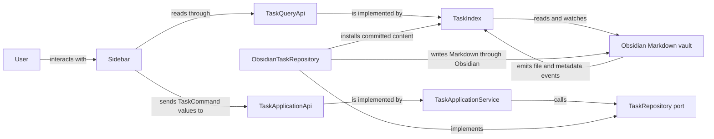

# Architecture

Abyss Tasks manages Markdown tasks through an Obsidian sidebar. Markdown is the durable record.
The plugin builds read models over the vault and writes user changes through application commands.

This document describes the implemented architecture: ownership, sources of truth, dependency
direction, and the contracts that changes must preserve. Source links lead to implementation details.
Proposed architecture belongs in an ignored design spec.

## System at a glance


```mermaid
flowchart LR
  Person[User] -->|interacts with| UI[Sidebar]
  UI -->|reads through| Query[TaskQueryApi]
  Query -->|is implemented by| Index[TaskIndex]
  Index -->|reads and watches| Vault[Obsidian Markdown vault]
  Vault -->|emits file and metadata events| Index
  UI -->|sends TaskCommand values to| Commands[TaskApplicationApi]
  Commands -->|is implemented by| Service[TaskApplicationService]
  Service -->|calls| Port[TaskRepository port]
  Repository[ObsidianTaskRepository] -->|implements| Port
  Repository -->|writes Markdown through Obsidian| Vault
  Repository -->|installs committed content| Index
```

Queries return detached, immutable snapshots. Commands validate fresh targets, perform writes, and
return structured outcomes. Successful writes enter the read model immediately; later Obsidian
events reconcile them through the same parsing path as manual edits.

## Sources of truth

| Concern                                             | Authoritative source                                         | Derived or temporary state                   |
| --------------------------------------------------- | ------------------------------------------------------------ | -------------------------------------------- |
| Tasks, metadata, and dependencies                   | Vault Markdown                                               | TaskIndex snapshots and calendar projections |
| Tracked time                                        | Markdown time entry lines                                    | TimeEntryIndex and tracked totals            |
| Project membership and fields                       | Project Markdown and configured membership/field definitions | ProjectStore snapshots and statistics        |
| Static preferences                                  | Plugin `data.json`                                           | Composed runtime CalendarSettings            |
| Saved list, section, and project views              | Versioned plugin `state.json`                                | Composed runtime CalendarSettings            |
| Navigation, selection, search, drafts, and gestures | AppState or the owning controller for the session            | Rendered DOM                                 |

`TaskIndex` and `ProjectStore` are rebuildable read models. `AppState` coordinates the interface;
it is not a persistence layer. Saved view preferences and transient interaction state remain
separate even when one controller uses both. CalendarMode owns its calendar date and view type.

## Dependency boundaries

[`src/main.ts`](src/main.ts) is the task-system composition root and Obsidian lifecycle entry point.
It loads settings, creates the status catalog and concrete task adapters, injects application
capabilities, registers views and commands, and starts and stops the index. Consumers receive those
capabilities instead of constructing alternate task repositories or indexes.

| Boundary                                         | Responsibility and allowed dependencies                                                                                                                                   |
| ------------------------------------------------ | ------------------------------------------------------------------------------------------------------------------------------------------------------------------------- |
| [Task public API](src/tasks/index.ts)            | Presentation's entry point for task queries, commands, capture, and public task values                                                                                    |
| [Task domain](src/tasks/domain/)                 | Immutable values, identity, validation, status, recurrence, dates, and time; depends on its own modules, deterministic `rrule`, and the narrow shared tag-syntax boundary |
| [Task application](src/tasks/application/)       | Resolves and validates use cases through domain contracts and application ports                                                                                           |
| [Task infrastructure](src/tasks/infrastructure/) | Obsidian adapters, index, codec, block editing, and reference authority; depends inward on application/domain and on shared Markdown helpers and Obsidian                 |
| [Shared Markdown helpers](src/markdown/)         | Shared source syntax and display parsing; imports no task layer                                                                                                           |
| [Presentation](src/panels/)                      | Composes views and interactions over public task capabilities; owns no task Markdown writer                                                                               |

The public capabilities are `TaskQueryApi`, `TaskDependencyQueryApi`, `TimeTrackingQueryApi`,
`TaskApplicationApi`, `TaskCaptureApplicationApi`, `TaskSearchApi`, and `TaskReadProjectionApi`.
Observed tag discovery belongs to `TaskQueryApi`; the read projection inherits that signature.
The application composes organization/hydration through `queries`, while the plugin injects its
one Search service into PanelView and CenterPanel through the public barrel. Domain and application
code cannot import Obsidian or presentation; infrastructure cannot import UI.

[`src/parser/`](src/parser/) adapts canonical task data to legacy presentation. It may import codec
internals for that conversion. New task behavior belongs in `src/tasks/`.

Text-write authority is explicit. The repository owns task transactions, `ProjectManager` owns
project frontmatter edits, `NoteTemplateService` owns note preparation, and `TagManager` owns global
tag renames. Settings writes pass through the composition root's persistence ports. The exact
file/owner/API roster and each exception's reason live in
[`storageAuthority.ts`](test/architecture/storageAuthority.ts).

## Task commands and reconciliation

### Source parsing and write identity

[`TaskIndex`](src/tasks/infrastructure/TaskIndex.ts) discovers tasks from Markdown, including
Obsidian comment blocks but excluding frontmatter and fenced examples. List-item metadata enriches
source candidates; its omissions do not remove tasks. The canonical
[`TaskMarkdownCodec`](src/tasks/infrastructure/markdown/TaskMarkdownCodec.ts) parses candidates.
Source exclusions, injected by the composition root, apply to path, tags, and frontmatter before
public projections or reconciliation transitions are published. Excluded content remains available
for repository proof.

The shared task-line source model recognizes dash, star, plus, and decimal ordered checkbox
markers. Edits and subtree transfers preserve authored markers, indentation, quotes, and line
endings. Creation uses its own dash-prefix policy. New nested content reuses authored indentation
or the native indentation setting through a read-only adapter injected by `main.ts`. Reading existing
source never normalizes it to the creation format.

[`TaskApplicationService`](src/tasks/application/TaskApplicationService.ts) captures the relevant
clock and behavior settings, resolves and validates the command, and delegates persistence through
repository and destination ports. The repository locates the current block, writes through
Obsidian, and installs committed content in the index before returning. Conflicts, invalid input,
missing or ambiguous targets, partial moves, and I/O failures are structured outcomes. The initiating
presentation boundary reports them.

[`TaskRefAuthority`](src/tasks/infrastructure/TaskRefAuthority.ts) distinguishes even byte-identical
occurrences without adding Markdown IDs. It records proven successor references and rejects
ambiguous or externally changed targets. A successor can preserve selection or a retry; it does not
grant general write authority. An earlier snapshot is never sufficient authority for a later write.

Committed content remains authoritative in the index until a conflicting cache observation matches
a fresh vault read. Delayed events therefore cannot roll back a published write. Vault and metadata
events use the same reconciliation path. Task-change events describe changed projections; a separate
reconciled-file signal also covers accepted metadata events with unchanged tasks or no tasks.
`ProjectStore` waits for this barrier before combining frontmatter with task statistics. A throwing
subscriber is reported without preventing delivery to later subscribers or the reconciled signal.

Link edits retain their identity in original authored Markdown. The rendered title, description,
or comment identifies an occurrence; the repository must find the corresponding source occurrence
before replacing it. Missing or synthetic joined-fragment targets fail instead of authorizing an
edit to another link.

Comments share a domain text policy and source reader. New submissions normalize line endings to LF,
remove whitespace-only lines, preserve nonblank whitespace, and escape structural continuation
markers only outside recognized literal regions. Unsafe literal edits return the existing invalid
command outcome; the presentation boundary owns its single Notice and retains the draft.
`CommentRef.originalMarkdown` owns the complete contiguous block. Continuations require the head's
explicit quote depth and list-content indentation within its final container, using fixed
four-column structural tab stops independently of visual/editor/formatter settings. The reader
consumes the shortest whole raw whitespace prefix reaching that threshold, retains the remaining
payload and physical UTF-16 coordinates exactly, and stops at the first blank, insufficiently
indented, changed-container or structural line. Existing source is never rewritten on load;
heads without a final quote-delimiter blank also retain their previously accepted exact raw
container prefix plus two spaces, subject to the same container and structural boundary guards.
References captured before external formatting remain stale. The writer and owned-change proof
share replacement formatting that preserves each accepted line's raw prefix and uses the first
continuation prefix (or the canonical head-container prefix plus two spaces) for added lines.
Canonical projection and the legacy parser consume that same range. `TaskBlockEditor.commentLink`
proves the full block, maps the logical occurrence to one physical token, and reuses coordinate
replacement in both repositories. Whole-block update/delete preserve timestamp prefixes, file line
endings and final-newline state; no-op writes preserve all bytes. Day, instant and undated legacy
heads remain supported without load-time migration. Older plugin versions preserve continuation
bytes but cannot fully display or edit those new blocks.

Task timing edits normalize duration at the codec's final correlated candidate, using the domain
`clampDurationToDay` rule. Only explicit time/duration edits and newly created task lines acquire
that normalization; legacy reads, unrelated edits, and transfers preserve authored bytes. Without a
start time, new duration is capped at 24 hours; an explicit start caps it to the remaining day,
including after a later time edit. Clearing time retains at most 24 hours without restoring discarded
overflow. Ordinary and linked-child creation share this normalization; their result proof accepts
only the exact canonical duration change. The existing duration token writer retains validation
and source ownership.
Retries compare the effective requested timing and protect any implicit companion-duration write.
Root timing retries require faithful source projections; opaque or ambiguous timing fails closed
rather than treating an invalid authored time as absent.
Subtask projections do not expose duration, so a subtask time-edit retry requires an unchanged
original block; concurrent edits within that block require a fresh user action.

### Canonical read projections

`TaskIndex` owns a disposable private search-source port over its accepted task store. It publishes
initializing, ready, failed and disposed states, accepted file changes and status-semantic changes.
Global publication generations protect organization streams; exact handles use a session epoch,
accepted file version, numeric root ID and child-relative-line path. The compact directory retains
only coordinates, accepted root ordinals and versions, never a second source block or serialized
task reference. Exact root lookup indexes the accepted file array by ordinal after version validation.
IDs are never reused within the index lifetime and accepted replacement removes the file's old handles.
Unrelated file updates preserve exact handles for unchanged files. TaskIndex also owns the ephemeral
`semanticsRevision` counter, initialized to zero for its source lifetime and advanced only by the
accepted `setStatusCatalog` semantics event. Source states and file/semantics events carry its current
value through initialization, failure, recovery and disposal. Exact addresses alone cannot prove
classification freshness: a child-only status change can leave both the root address and menu status
unchanged while fresh canonical hydration classifies its descendants differently. Inward `ensureReady()` joins
TaskIndex initialization. Rejected initialization releases its shared attempt; a new attempt clears
the failure latch, reconciles canonical files, and only then publishes ready. Event refs are acquired
once, including partial registration failures, and remain owned through unload. Bootstrap batches
settle before re-entry; recovery reconciles missed renames through the existing rename owner, prunes
vanished partial files through existing removal authority, and preserves committed-command precedence.

The source allocates compact handles one node per iterator step, reusing prefixes across partial
and overlapping iterators without extracting text. Document projection uses the current borrowed
node during that same walk, avoiding repeated root and sibling searches. It projects each node's own
Markdown, comments, tags and scalar metadata when documents are requested. The infrastructure
`taskSearchDocuments` adapter consumes shared `markdown/searchText` visible projections for each
field and separately indexes authored link destinations. Comments are projected independently
before joining for retrieval. Metadata contains canonical planning, duration, priority, recurrence
and dependency values; status rules and checkbox markers are excluded. Status-catalog changes
advance semantic generation and organization/counts without changing text documents. This boundary
does not resolve outgoing links. Organization emits detached root scalars, tree tags and tracked totals in batches of at most
200, checking its requested generation before traversal, each yield and completion. Its read-yield
hook cooperates between slices. Presentation still resolves outgoing grouping links through
`taskLinkValues` and evaluates open timer totals at its explicit instant.

The public `resolveHits` read delegates to `TaskIndex.resolveSearchHits`. Exact hydration accepts at most 200 occurrences and 50 distinct roots per allocation batch, validates every address,
detaches each requested canonical root once and reconstructs ordinary root/subtask refs against that
batch's detached trees. It never invokes proof-rebasing `resolve` or guesses child positions. Invalid
bounds, stale authority, cancellation and unavailable lifecycle states have typed outcomes; no
Notice belongs to this read boundary. Existing list, resolve and command contracts remain intact.

Observed tag strings are maintained per accepted file. Card/status badges use dependency counts
without hydrating relation trees; tag menus and inspector tag suggestions consume those detached
strings with the existing configured/selected tag policy. These reads introduce no persisted data.

### Inward full-text matching

`TaskSearchEngine` is an inward application port implemented by one pinned MiniSearch 7.2.0
instance. The disposable engine indexes own-node fields once with no stored fields; its companion
maps retain numeric IDs, root IDs, file membership, source order and per-node astral-field bits.
Seven field counts track live documents containing astral word tokens; replacements, removals and
disposal release this presence metadata without retaining another vocabulary. Exact refs remain with
TaskIndex. Root matching requires all distinct query tokens across fields and descendants; node
matching restricts coverage to that node's title, tags and optionally source path. Root relevance
combines the strongest node with a capped contribution from the rest, discounts children and
orders exact title coverage before typo alternatives. File preference breaks nonempty relevance
ties; blank browse uses it before stable source order. Replacements discard prior file handles;
explicit vacuum releases stale postings. The engine remains inward; UI consumes the public service
contract and preserves its drained relevance order, including exact-title precedence over scores.

The pure `searchMatchPolicy` owns NFC/lowercase normalization, code-point edit limits, exact short
swaps, final-token prefixes and UTF-16 match ranges. Word segmentation is injected, with a
Unicode/CJK fallback. Queries are bounded before segmentation; punctuation-only queries are not
match-all. MiniSearch measures edits in UTF-16 units. A normal branch retains its original radius
when the query and searched fields contain only BMP words; an astral query word or live astral word
in a searched field permits at most twice the semantic budget. Discarded emoji and excluded fields
cannot trigger widening. Its derived-term `boostDocument` hook rejects out-of-policy words before
scoring or coverage, caching acceptance per original token only during that query. Swap branches
remain exact. This retains MiniSearch ranking and a linear number of query branches, without a
second index or corpus scanner. Only this engine file may import MiniSearch; other infrastructure
package imports remain restricted.

Shared `markdown/searchText` owns visible text and original-field provenance. It consumes the
existing link scanner's value-only search spans and inline-code ranges, preserving editable link
occurrence numbering. Balanced delimiters and punctuation escapes share one projection pass;
code contents and compact embed labels retain their own policy. Prose excludes recognized HTML
scaffolding. Visible aliases and destinations have separate UTF-16 source maps; removed markup
creates gaps, and no generated attachment decoration becomes searchable authored text. The helper
emits contiguous literal and code contents as runs, splitting at syntax or normalization boundaries
before assembling text and provenance. Mixed prose and Markdown link labels use this same pass;
ordinary spans do not create a temporary object graph per UTF-16 unit. Delimiter pairing tracks
a finite set of character/flanking/modulo classes, so incompatible opener runs do not cause repeated
full-stack scans. Source-range lookup skips disjoint ordered map runs. Projection still completes
synchronously within each requested source document. The helper imports no task layer and grants
no write authority.

### Owned browser search

The composition root owns one lazy `TaskSearchService` for the plugin lifetime and exposes its
read-only public `search: TaskSearchApi` capability. PanelView passes that same service into
CenterPanel; panel lifetimes own only query controllers and subscriptions. Panel lifetimes do not
own or rebuild the service. PanelView uses public `prepare(signal)` once per mounted lifetime,
only after workspace readiness, completed mount, visible connected ancestors and positive viewport
geometry. Its captured owner-window frame followed by a task gives the shell a presentation
opportunity, with eligibility and owner checks at both callbacks. Hidden or migrated pending work
is cancelled and can use a later visible opportunity. Closing cancels callbacks and that panel's
wait; early input and other panels join the same plugin-owned preparation. Passive failures consume
the opportunity without a Notice or timer retry. Unload disposes search before TaskIndex.

The service subscribes before its source snapshot, publishes accepted generations synchronously,
and coalesces dirty paths to their latest accepted versions. Every public `TaskSearchState` also carries
the source-owned `semanticsRevision`, copied before publication, including the initial subscription
and failure/recovery states. It does not enter documents, cursors or the backend/Worker protocol;
semantic acceptance publishes a new generation without reindexing unchanged text. It projects only changed files through
`begin/add/commit`, checks versions across cooperative yields, and publishes readiness after every
dirty path has replayed. The service's `prepare(signal)` joins this same pump without
allocating a cursor; `open` captures its query generation after preparation. Repeated readiness with
unchanged versions and generation leaves the ready backend and live cursors intact. Normal batches are bounded to 128 documents and a conservative 256 KiB
UTF-8 payload estimate; one acknowledged batch is in flight, with oversized documents sent alone
without truncation. The neutral `browserTaskScheduler` captures an explicit owner window and supplies MessageChannel
yields with an owner-timer fallback. Each invocation closes both ports and removes listeners/timers
on completion, abort or acquisition failure; safe scheduling errors carry no arbitrary cause. The
existing browser backend factory adapts those outcomes to inward Search errors. Main injects the same scheduler into TaskIndex’s existing bounded
organization-read yield port. A single document projection remains synchronous.

`TaskSearchBackend` defines inward protocol, scheduler and failure ports. `TaskSearchRuntime` owns
one engine and at most four compact numeric result vectors in either execution mode. Accepted
publication does not wait for incremental vacuum: maintenance runs after discarded files and reports
failures through the same backend subscription. The embedded, browser-only Worker uses request IDs
and epochs; no task refs, source-bearing revisions, addresses or rich snapshots cross that boundary.
The production build embeds its child IIFE and watches every child input. The browser adapter owns
startup timeout, requests, Worker and Blob URL. Backend factories receive the service run signal;
stopping that run cancels startup and immediately terminates/revokes its resources. Individual
query cancellation does not stop shared startup or bootstrap. Failed startup selects inline compatibility mode;
a runtime Worker failure rebuilds once, repeated failure selects inline, and failed inline execution
settles unavailable. Later nonempty ordinary input may start one shared recovery attempt after a
five-second injected-clock cooldown; time, passive preparation and progress notifications never
schedule a retry. Caller cancellation ends only that caller's wait. Diagnostics contain phase/backend/generation/path count and sanitized
errors. Live backend open/read failures enter this same recovery owner independently of crash
notifications, after proving the captured run, backend, allocation, generation and caller are current.
Expected control/validation outcomes remain quiet and sanitized; obsolete backend errors cannot
restart a replacement. Failed forward transport batches release their pending-batch ownership, while
cancelling one waiter cannot suppress recovery for another live waiter. User notices remain a surface responsibility.

The service maps numeric hits through current source addresses and delegates exact bounded hydration
to TaskIndex. Root cursors advance forward and release on their final delivered batch. Node cursors
support random pages and remain live after their last page. The open signal owns cursor lifetime;
per-read cancellation leaves ownership intact, retaining at most one pending forward transport batch
of 200 hits until delivery/release. A service-wide four-cursor LRU covers backend vectors and main-only
empty browse vectors, including allocations still under construction or awaiting transport delivery.
The service reserves an ID before building either vector and passes it through the inward backend
open protocol, so abort, eviction, invalidation and recovery can release the actual pending vector
without waiting for its reply. Backend opens retain FIFO allocation; service LRU remains the global
capacity authority. Admission waits for actual backend release acknowledgment before reusing a slot
for either kind of allocation. Cancelled browse construction clears partial candidates across pending yields.
The registry contains ownership metadata, not duplicated result vectors.
Session-random cursor IDs and generation checks reject reload aliases, stale replies and obsolete
reads. Empty root queries return empty; empty node browse uses compact canonical source order without
creating an engine. Source failure and recovery are observable through immediate state subscriptions.
For a failed source, the shared recovery attempt invokes its inward `ensureReady()` once. A genuine
failed-to-ready source transition resumes wanted preparation once and replays current accepted files.
Persistent source failure remains terminal until another eligible ordinary intent. No public Retry
method or control exists; source initialization and the service remain plugin-owned.
Inline query execution remains synchronous. Dependency construction has an inward cooperative
readiness operation; existing synchronous readers still retain a potentially blocking compatibility path.

### Creation, transfer, and tags

`TaskCaptureApplicationApi` retains a creation session with a frozen destination, local date,
template, insertion policy, prefix, tags, and lifecycle settings. Planning expands the configured
path without writing. [`NoteTemplateService`](src/notes/NoteTemplateService.ts) prepares the note
when the command executes and coordinates concurrent preparation of the same path. A failed or
uncertain preparation requires proof of resolved content before a retry can write. Capture checks
current source exclusions before provisioning and before each retained-session write.

Sidebar retries reuse the session. Project capture uses the selected note and project insertion
policy; overview capture follows the active surface's logical selection. Both panel capture routes
select the query-resolved root through AppState before reveal presentation, provided their
submission still owns AppState selection intent. Blur alone does not revoke result selection.

Application code owns prefix and Inbox policy for roots, subtasks, and linked subtasks, including
atomic tag validation. Presentation supplies typed fields. Transient Inbox intent can suppress the
global prefix for one retained session and is not persisted. Tag changes share case identity,
removal-wins precedence, and preservation of authored spelling.

`applyTaskPrefixToSubtasks` is a static, opt-in preference, defaulting to false for missing or
invalid persisted values. The shared `taskPrefixForSubtask` domain policy suppresses automatic
prefixes for Inbox roots, using only the owning root's own tags and the configured tag/untagged/both
selector semantics. Ordinary and dependency-linked commands evaluate that policy against their
resolved root before applying existing authored-tag policy. Settings and the day remain frozen
through a bounded retry; ordinary retries retain only the submitted child text and recompute its
prefix after the existing source/target proof accepts a root rebase. The inspector captures the
same effective prefix for strict submitted-child proof and retains existing input/selection ownership.
Root creation policy is unchanged. This setting migrates no note data; older builds ignore the field
and resume their prior automatic subtask prefix behavior.

Moves and archives use the same root-transfer path. The repository proves the appended destination
root before removing the source. Bounded recovery receipts require fresh destination evidence and
source revision continuity on retry; identical Markdown alone cannot authorize removal. Archive
sessions freeze the date-expanded destination and share note preparation across a batch. They return
an `archived` outcome because the destination is outside public queries.

Hierarchy commands (`reparent-task` and `promote-subtask`) dispatch to
[`TaskHierarchyService`](src/tasks/application/TaskHierarchyService.ts), which resolves both
endpoints and captures immutable revision preconditions without entering the one-root edit/retry
path. Same-parent operations return unchanged without writing or handing off selection. The
repository passes its existing `Vault.process` capability into
[`taskHierarchyTransaction`](src/tasks/infrastructure/obsidian/taskHierarchyTransaction.ts).
The pure transfer uses canonical root blocks and owned subtree ranges, changes only the required
prefix and source references inside the moved range, and preserves existing metadata, duration,
comments, tracking entries, and imported Markdown. Promotion inserts after the complete old root.
Shared Markdown reference tokenization includes embeds for transfers while ordinary `parseLinks`
continues to exclude them; shared fence parsing prevents rewriting code examples. Cross-note
transfer additionally proves the bounded single-line reference inventory before any write. It rejects
uncovered bracket/HTML syntax (including empty-label and reference-style links), complex Markdown
destinations, and multiline inline-code spans whose block scope cannot be proved. For example,
`[](note.md)`, `[](note.md)`, `[text][id]`, and even literal `[aside]`
are rejected because their reference meaning is not proved; escaped `\[aside\]`, task checkboxes,
ordinary `[[note]]`, `[text](note.md)`, ``, and single-line code/fenced examples
retain their supported behavior. This is a conservative transfer boundary, not exhaustive Markdown
parsing. Same-note hierarchy changes preserve those authored forms without reference rebasing.
Ordinary editable-link and Projects clipboard policies remain unchanged.

Structural authority separately proves the complete indexed predecessor population, exact source
bytes, complete candidate population, and surviving root transitions. It supports disappearing and
newly promoted roots, including task-empty source notes; ordinary edit batches retain their equal
correspondence checks. Surviving roots retain explicit authority continuity, while new roots receive
fresh revisions. The transform's physical moved-line locator identifies a node in the committed
snapshots and grants no independent write authority.

Same-note hierarchy changes use one process callback. Cross-note changes write the destination
first, then the source. Batch installation proves every resulting root, the moved node's parent,
and owned mutation completion synchronously before publishing any candidate snapshots. Failure
compensation restores only exact owned bytes and verifies both notes. Unproved restoration returns
a structured hierarchy partial result naming both paths, reconciles readable current content,
and never retries the destructive phase. Phase/path diagnostics use the injected application sink;
callback failures do not alter compensation. Only source and destination notes are authorized.
Inbound links outside the moved subtree remain unchanged, including links elsewhere in either
note or in third notes; explicit links to the old source's moved block IDs can therefore become
stale. Markdown block and dependency IDs within the moved subtree remain intact.

Hierarchy presentation is shared by [`taskHierarchyActions`](src/ui/taskHierarchyActions.ts).
Existing centre cards, the inspector header, and the Subtasks section preview exact live endpoints through the public
`hierarchyWouldCycle` boundary, after tag/project/attachment handlers; inspector relation drags
retain dependency meaning. The ordinary selected-subtask menu sends `promote-subtask`. AppState's
single drag payload is claimed once per drop, independent of outgoing-link row occurrences.

AppState owns a transient selection-intent generation outside its published/persisted data. Explicit
selection, inspector navigation (including dependency Back), and effective mode changes advance
it; query refreshes and unavailable-result clears remain neutral. Hierarchy success can hand off
only a captured exact descendant path inside the moved subtree, with unchanged intent and a live
owner. It expires unsafe history, uses the proven outcome and current exact query path, and emits
no new selection-begun event or focus request. Unchanged or failed operations never select.
Root reparenting retains the existing removal hold through outcome application so a task inheriting
the source line cannot inherit selection; promotion keeps ordinary containing-root reconciliation.

RightPanel discriminates hierarchy mutation lifecycle events from ordinary draft writes. TaskModal
holds a continuation only for that opening's hierarchy tokens, deferring automatic clean close when
an affected selected root becomes unavailable. Settlement retains proven successor or later user
selection, restores an unchanged full-reference exact source path after failure, or closes an empty
clean modal after its continuations settle. Dirty detached drafts remain recoverable; manual close
is immediate and settlements from earlier openings are inert. Delete/archive lifetimes retain their
existing early-publication close behavior. Hierarchy partial/unknown results use the existing command
notice boundary with both paths; nested copies never enter the root-only move recovery modal.

[`TagManager`](src/tags/TagManager.ts) owns navigation tag settings, promotion, appearance, ordering,
and rollback. Effective groups combine configured groups with public root/subtask tags; discovery
is derived until an appearance or reorder action persists a group. Suggestions likewise use public
task tags, configured tags, and the selection, rather than note-only tags or excluded sources.
Navigation archives hide exact tags, discovered prefixes, or configured groups in `data.json`;
they do not change task Markdown or membership in other views. Global rename also updates saved tag
views through the settings coordinator.

### Dependencies

Tasks-compatible `🆔` and `⛔` Markdown carriers store dependencies. The index derives relations
from persisted roots and subtasks, excluding recurrence forecasts, without rewriting declarations.
The standalone graph defensively detaches and freezes its input; the index privately borrows
canonical nodes and classifies status through the captured catalog using the same graph assembly
and reverse-edge rules. Rich queries detach each requested neighbor root once and freeze only their detached result.
Graph exact-reference maps key first by the existing revision string, then by the small structural
address, preserving multiple revisions without serializing source-bearing revisions into new keys.

One resumable domain assembly serves the synchronous driver and TaskIndex's public
`prepareDependencies(expectedGeneration, signal)`. Root collection, node registration, declared
prerequisite IDs and ambiguous candidate expansion have work checkpoints. TaskIndex advances at most
128 units between existing read-scheduler yields, including a yield before collection. Global native
stable sorting retains the existing comparator and tie order, isolated between scheduling boundaries;
its synchronous cost remains a measured limitation. No clock or scheduler enters the domain.

TaskIndex owns one completed graph and one pending preparation tied to the accepted search
generation. Waiters share construction but own cancellation separately; losing the final waiter
closes unfinished traversal and cancels its scheduled continuation. Accepted replacements, deletion,
exclusion, rename, status semantics, failure and destruction invalidate pending/completed state.
Canonical replacement/deletion precedes cancellation callbacks and source notification. Only a
complete, current, live graph publishes, with pending ownership cleared before waiters settle.
A synchronous reader can drain the same suspended cursor; success precedes scheduler cancellation,
and late continuations cannot replace or clear newer work. Finished caches survive caller closure.
Failures use typed read outcomes and sanitized diagnostics; there is no automatic synchronous retry.
CenterPanel awaits this readiness for demanded Search/filter roots before the first
synchronous card dependency badge. The same request and generation must remain current after
hydration, preparation, mounting, and Markdown completion. Inspector and other ordinary synchronous
queries can still take over preparation; dense queries and rich relation detachment retain their costs.

`TaskDependencyQueryApi.searchEligibility` is a bounded compact read consumed by
[`TaskDependencySearchProvider`](src/ui/TaskDependencySearchProvider.ts). It accepts at most 200
opaque addresses, a global generation and an exact current root/subtask reference. TaskIndex joins
its existing cooperative graph preparation, validates current identity without reconciliation,
reconstructs borrowed candidates through the existing handle lookup, and uses the same graph rules
as ordinary eligibility. Candidate checks yield through the existing bounded-read scheduler and
recheck the global generation before returning; no borrowed snapshot escapes or rejected root is
hydrated.

The provider subscribes before opening one node/random cursor and captures current target and
direction for that session. `readRange` validates exact random intervals of at most 200 compact
candidates, including omitted eligibility results, without hydration. Empty terminal intervals still
validate generation and exact current identity. `options` projects only requested displayable
candidates into compact addresses, titles, contexts and reasons; it discards rich snapshots after
projection. Grouping demanded siblings by root keeps ordinary sibling windows to one detached root,
within the existing 50-root/200-address hydration limits. A demand above 200 siblings of one root
requires multiple bounded hydrations with a yield between them. Only self, duplicate and inverse
relations are omitted; other rejections remain disabled with the shared reason labels.

Sessions retain no rich root cache. Blank browse creates no fulltext index, and reading the final
range does not release the random cursor. Session operations supersede obsolete receipts and wait
for them to unwind before using the cursor again. Source invalidation, closure and owner abort cancel
only that session. Fresh selection hydrates the exact address again and reruns generation-bound
eligibility; only the commit callback receives a rich `DependencySearchCommitOption`. Commands
remain the final write authority.

PanelView and TaskModal compose the provider from the plugin's shared Search capability,
application queries and the invoking window's browser scheduler. CenterPanel passes the same
Search capability to its TaskModal. The modal uses its existing RightPanel and
InspectorDependencies owner; both directions keep the anchored picker, command callbacks and Undo.
The old whole-node options callback and InspectorDependencies' eager listNodes read are removed.

The picker paints and focuses its input before opening asynchronous candidates through an owned
frame followed by a task. Its `TaskListSurface<number>` uses raw offsets as keyed payloads and owns
native row geometry. The controller captures mounted/pinned offsets and the first intersecting DOM
holder as a demand. One generation-local omission set survives cancelled windows. Current demand
and keyboard reads share bounded unknown runs and admit omission proofs only after range and
post-await ownership validation. Demanded sparse
runs are evaluated first, then disjoint forward gaps and finally backward gaps fill omitted slots.
Backward fill also replaces missing slots above the captured anchor, even when forward survivors
already satisfy the total demand. It displaces surplus forward candidates within K+200 while
preserving demanded candidates and sparse pins. Reads and yields never rebuild the logical order.
A completed current fill filters the existing
numeric rows once only when new omission proofs exist, preserving the shared surface anchor.
Identical settled windows cause no publication; labels update mounted holders and measurements only.
The controller retains only mounted compact candidates and at most K+200 candidates during a fill,
where K includes mounted pins. It projects labels after reconciliation, then drops unused candidates.

Holders stay inert and have no option role or ID until labels settle. Raw offsets supply ARIA
positions; selected intent is one compact address plus its current-session offset rather than a
rich snapshot. Keyboard movement uses bounded raw intervals to reach logical Home/End/arrow targets,
including disabled tails, then pins and reveals the exact candidate through the shared surface.
Hydrated movement labels are remeasured and revealed through that surface before the pin is
released. Scroll events matching the pinned surface reconciliation retain movement ownership;
changed scroll positions still cancel it. Ordinary eviction retains selected identity.
Enter is consumed during query, demand, movement and exact resolve work, without queued submission.
An accepted selection owns its fresh exact resolve ahead of incidental viewport demand; deferral
invalidates the settled receipt for remounted holders, and only that resolve's current owner
schedules mounted demand again on completion or failure.
The list reserves intrinsic height before initial native publication. A picker-owned attached list
ResizeObserver and window resize listener suspend on lost geometry and resume only on zero-to-positive
availability; suspension invalidates the settled presentation receipt so remounted holders receive
labels even for identical offsets. Cancelling active movement also invalidates that receipt, while
benign unchanged callbacks retain it. Compact candidates and omission proofs survive both transitions.
Positive-to-positive measurement belongs to TaskListSurface. Reattachment positions
before native publication and adoption releases old owners. Positive element geometry is required
before any demand starts; zero geometry does no reads. The picker no longer has page/history state or Previous/Next controls.

The picker subscribes through the existing public Search state boundary to discard displayed
options and restart its owned query on source changes. SearchStatus remains its single read-failure
Notice/inline owner; ordinary input joins the shared service's recovery policy. Loading or failed
queries cannot create tasks. Settled creation preserves the original input text and existing
validation callback. Selection uses the session's fresh exact resolve and checks the current
request, inspector target, direction and owner before the existing command. InspectorDependencies
retains its advisory eligibility check, and the command remains final authority.

Synchronous same-owner inspector redraws transport the retained picker DOM without reopening its
cursor or releasing its lease/listeners. Actual close/detach releases the owned session, mounted
surface, source/document listeners, interaction lease and pending paint work. Reattachment after real
detachment starts new owned reads for the retained input/direction,
without retaining older rich snapshots or disposing Search. A cancelled selection continuation cannot
refocus or commit after reattachment. PanelView's window-migration hook closes the old inspector
picker; subsequent opening captures the new window's scheduler. Concurrent modal/inspector
pickers have independent owned sessions over the one shared service.

[`TaskDependencyService`](src/tasks/application/TaskDependencyService.ts) owns dependency commands,
linked subtask creation, and completion checks against the live status catalog. Query eligibility
is advisory: commands revalidate identity, graph constraints, and blockers at the write boundary,
including a reconciled retry.

Dependency mutations share a coordinator across service instances. Same-file changes can be atomic;
cross-file operations can partially succeed and require final proof or compensation against exact
owned source. Unproven recovery reports unknown content state and reconciles from the vault.

Linked subtask creation writes the child and edge in one root operation. Application code owns
eligibility and ID allocation; the repository owns placement and validates the resulting tree.
Removal can return exact, transient recovery data for inspector Undo, valid only while the committed
result still owns the source. Neither AppState nor Markdown stores Undo state.

### Time tracking

Nested time entry lines are the sole record of tracked time. Unreadable entries remain visible and
contribute nothing to totals. [`TimeTrackingService`](src/tasks/application/TimeTrackingService.ts)
owns start/stop operations and uses the same mutation coordinator as dependencies. Starting tracking
closes other running entries before opening the requested entry. Each step uses the previous write's
returned root. Entries that cannot be closed are reported and skipped; I/O failure aborts, so repair
may be needed when a previous entry remains running.

Completing or cancelling a node closes its subtree's running entries in a follow-up write using the
same clock reading and serialized mutation. Recurrence completion closes the completed occurrence's
entries; the next occurrence starts with none. Hand-edited status symbols trigger no writes because
the index only reads.

TaskIndex owns [`TimeEntryIndex`](src/tasks/infrastructure/TimeEntryIndex.ts) and updates it on the
same per-file path as tasks. `PanelView` and `TaskModal` each share one `TrackingTicker` and one
`TrackingActions` command boundary among their controls. The ticker listens to index changes and
runs only while an entry is active and a surface listens; ticks update cached totals without queries.
Cards and calendar items use the render snapshot, and forecasts carry no tracked time. Selection
continuity after entry writes requires proof that the task tree changed only in time entries.

## Presentation ownership

[`PanelView`](src/views/PanelView.ts) owns AppState, the rail, navigation panel, centre panel,
inspector, shortcuts, and their lifetimes. Panels share navigation and selection through AppState.
The shell constructs collaborators with explicit capabilities and callbacks; delegated UI owners
do not acquire independent task writers or duplicate shell subscriptions.

| Owner                                               | Responsibility retained by that owner                                                                                                            |
| --------------------------------------------------- | ------------------------------------------------------------------------------------------------------------------------------------------------ |
| [CompactPaneAccess](src/views/CompactPaneAccess.ts) | Compact pane DOM, responsive state, focus, observers, and pending pane intent; PanelView retains subscriptions and capture/result authority      |
| [LeftPanel](src/panels/LeftPanel.ts)                | Navigation sections, project/smart navigation, creation routing, and the shared tag/project inline-add session                                   |
| [TagNavigation](src/panels/left/TagNavigation.ts)   | Tag/group rows, menus, expanded state, reorder, and drops through retained TagManager/task command paths                                         |
| [CenterPanel](src/panels/CenterPanel.ts)            | Mode composition, state/query subscriptions, Markdown Component, task selection, whole-card interactions, and task modal/recurrence coordination |
| [RightPanel](src/panels/RightPanel.ts)              | Inspector edit session, selected targets, command execution, drafts and recovery, Undo, history, subscriptions, and result ordering              |
| [TaskModal](src/ui/TaskModal.ts)                    | A local AppState and the same inspector, with its own interaction lifetime, owner document, and tracking surface                                 |
| [CalendarSettingsTab](src/settings/SettingsTab.ts)  | Settings staging, commit/retry, semantic rebuild, and shared lifecycle; section owners render their controls                                     |

Today list membership and sidebar counts share the date-only
[`todayTaskCategory`](src/task-lists/todayTaskCategory.ts), supplied an explicit local date. Past due
dates take precedence over scheduling today. The list selector retains its configured status filters;
LeftPanel counts unique active roots (open and in-progress) by file and line and displays separate
today/overdue totals. Shared `taskListDate` uses Today membership when the selected list is Today,
so ordinary snapshots and compact records sort and group a task scheduled today by today's date
even when its due date is later. Other lists retain due/scheduled/start precedence. Date sort keeps
time as its secondary key and the configured direction remains authoritative.

### Centre services, rows, and calendar

CenterPanel shares these services across its task surfaces. They depend on task contracts and host
capabilities, never on CenterPanel itself.

| Service                                                   | Responsibility                                                                                                                                    |
| --------------------------------------------------------- | ------------------------------------------------------------------------------------------------------------------------------------------------- |
| [TaskCommands](src/panels/center/TaskCommands.ts)         | Task submissions and result presentation, archive batch rebasing, link edits, project moves, and completion confirmation                          |
| [TaskMenus](src/panels/center/TaskMenus.ts)               | Single/bulk menus and tag pickers, using TaskCommands and live shell callbacks                                                                    |
| [CaptureSessions](src/panels/center/CaptureSessions.ts)   | Capture target/session lifetime, placement, remounting, feedback, and focus                                                                       |
| [ListViewControls](src/panels/center/ListViewControls.ts) | Saved list options, property chips, and popovers through the existing view-state save callback                                                    |
| [TaskSearch](src/panels/center/TaskSearch.ts)             | Search/filter request and generation join, compact organization, full row order and mounted render completion, reusing shell cards and navigation |
| [TaskCardRenderer](src/panels/center/TaskCardRenderer.ts) | Shared card DOM, Markdown, metadata, and tracked badges; shell retains selection and whole-card interactions                                      |

[`src/panels/task-list/`](src/panels/task-list/) separates the pure ordered row model and
multi-selection from DOM mounting. `TaskRowSelection` works against an explicit display order;
`MountedTaskListRows` maps row keys to mounted elements. Logical multi-selection belongs to Lists
and Tags; other surfaces reuse card rendering without acquiring that selection model. CenterPanel
owns selection across renders and mode changes.

Global Search and nonempty Tasks filters use `taskSearchOrganization` over compact canonical
records, with the same structural membership, property/status filters, comparator and grouping
routines as ordinary snapshots. Selected groups resolve through the shared effective-tag catalog
using canonical observed tags, independently of the query's matching roots. TaskSearch reads the
existing compact observed-tag port within its generation guards; ordinary selection derives those
tags from its unfiltered input. Configured IDs and discovered aliases retain the shared identity policy.
All logical matches are organized before native viewport mounting. Relevance
preserves the engine cursor's complete ordering; explicit sort ties use created date then canonical
source order. Host outgoing-link resolution remains presentation-owned and link lifecycle/settings/
project events re-organize even when task text is unchanged. `collectionSteps` defines pure cheap/atom
checkpoints and stable cooperative merging with an adjacent-order fast path and one scratch vector.
Selector, effective-tag catalog and grouping owners share their rule bodies and prepared contexts;
ordinary synchronous entry points retain native sorting at every sort site. Search composes only
the cooperative entry points and gates unused catalog, outgoing and comparator-key preparation.

TaskSearch captures only its selected list/view, five organization settings branches and one explicit
date/time before asynchronous preparation. Every cursor batch (including final/empty batches) and every
projection batch hands off through the captured window. `runTaskOrganization` makes an initial task
yield, then shares one 4 ms/8,192-step budget across nested organization helpers, checking time after
every atom and at most 32 cheap steps. Cancellation checks surround every advancement. These tuning
values do not bound indivisible parser, locale, resolver, configuration, registry, whole-root projection
or GC work; native measurements remain required. Completed publication retains compact occurrences
and finite demanded root leases, with preparation vectors and sort workspaces request-local.

`TaskSearch` publishes one complete compact order to CenterPanel's existing native `TaskListSurface`.
`TaskSearchRows` acquires at most 50 distinct exact roots per allocation batch, sharing one detached
snapshot and presentation context across duplicate occurrences. Hydrated snapshots and card Components
exist only for mounted rows, sparse interaction pins or an explicit acquisition; the last lease drops
the rich root. Headers/counts describe the complete logical order, independent of viewport demand.
Tasks selection, ranges and Ctrl/Cmd+A operate on that order, retaining occurrence identity while counts
and actions deduplicate physical roots. Same-query sort/group updates reconcile selection and retain
connected holders, capture/input/focus and key/fractional anchors. Changed query replaces the surface,
resets its viewport and clears only row selection; inspector history remains independently owned.
Global Search remains activation-only. Unfiltered ordinary lists retain their existing snapshot owner.
An accepted Search navigation receipt activates compact cooperative organization with no query
restriction (`hits: null`). Organization checks the exact target, reuses its occurrence or appends one
transient “Revealed from search” occurrence when membership or saved filters exclude it. CenterPanel
pins without scrolling, waits for exact hydration and the current card receipt, then uses the existing
native reveal once. This writes no saved filter or collapse preference. Search options remain a
transient CenterPanel session through ListViewControls; Relevance is never persisted.

TaskMenus receives distinct compact summaries without reading rich tasks. Selection/count/indicator
and menu-open paths acquire no selected roots. Choosing an action resolves operation-owned exact
snapshots through TaskSearchRows; originating source/selection/mode/window intent guards pre-submit
work. Date/tag dialogs repeat this proof at final commit. Ordinary lists validate their held snapshots
through the existing public exact resolve. TaskCommands retains submissions, archive rebasing, history,
Undo and command failure ownership; cancellation after submission ends only transient UI permission.
Keyboard movement pins the logical target and awaits exact hydration/current Markdown before reveal
and inspector/focus handoff, yielding to later selection, source, outside focus or window changes.

`TaskSearchPages`, its model/test, the hydrated page row builder, page-local selection and Search pager
DOM/state are removed. Dependency picker paging DOM/state and CSS are also removed. Allocation-batch bounds are read contracts, not UI page limits.

TaskSearch subscribes before opening, drains one forward root cursor, joins each compact organization
batch to that cursor's generation (including zero hits), then supplies the compact order and prepares dependencies before demanded card hydration.
Accepted service generations are observed synchronously, so an unrelated accepted update cancels
the entire old match-set publication even when individual unchanged handles remain hydratable.
Only the live current request in a ready matching service generation can publish complete.
`SearchStatus` owns a screen-reader-only busy/error live region and one Notice per failed episode
within its mounted instance. Current genuine failures render through the results empty-state owner
(or the dependency picker's existing error element); Search has no visible footer/count/status strip.
A retained Tasks shell keeps that status and its mounted subscription across nonempty
query/view refreshes. Each refresh cancels the old controller while a validated same-query replacement can reuse exact
rich roots across unrelated generations. The completed request signal remains live for later mounts. A successful nonempty search
resets the failure episode; empty or invalid input preserves it. Close/reopen creates a new surface
lifetime. PanelView's existing window-migration hook delegates through CenterPanel to the mounted
TaskSearch owner. Migration cancels old query/render work and captured-window debounce/focus timers,
then rebinds the retained compact organization through the new window when its source generation
is still current, without retrieval or another application completion. Otherwise it resumes current
preparation. The input, IME/selection, status owner and shared backend remain owned. Passive preparation failures remain quiet outside active nonempty Search. No global Notice
registry is involved.

CenterPanel's narrow `refresh(view | source | projects | links)` routing preserves ordinary
Tasks/Projects refreshes. Mounted Search and nonempty Tasks filters consume source changes through
the shared service; PanelView's public query subscription still refreshes navigation and reconciles
the inspector without scheduling duplicate Search work. ProjectStore notifications keep their owning
surfaces current without resetting plain Search/filter retrieval. Host note/link notifications only
restart those surfaces for outgoing grouping or explicit non-relevance outgoing sort. Genuine view,
settings and time organization changes retain their refresh path. CSS changes preserve completed
Search/filter requests while ordinary calendar repaint recomputes theme-dependent tag contrast.

Abort/stale supersession is silent and expired cursors restart once. Live preparation failures become
unavailable inline; raw cancellation-shaped errors without matching owner/source invalidation
are operational failures. TaskSearch alone logs safe phase/category, numeric request/generation,
observed backend and secondary-cleanup metadata. Obsolete requests cannot report or clear newer work.
Query text, settings, titles, paths and arbitrary exception causes never enter these diagnostics.

`renderTaskText` returns an optional receipt: plain text is synchronous; Markdown becomes ready only
after the host render Promise, paragraph unwrapping, exact source-token link wiring and onRendered
callback. Replacement, abort, detach and Component unload cancel stale work. `TaskRenderScope`
collects title, description and context work within each card's current generation. The row's current
`settled` receipt joins real Markdown, exact links and marks; replacement cancels obsolete receipt
ownership. TaskSearch completes only after TaskSearchRows settles the current sparse mounted set.
Later scrolling reconciles row leases/receipts and measurements, without retrieval, organization,
query reset, application completion or a new shell focus generation.

Search activation uses an explicit shared-card callback for main clicks and Enter/Space. Existing
link, status, property, menu and drag handlers retain their own commands; there is no capture-phase
card interceptor. The callback retains its mounted request and generation, and rehydrates the exact
address before navigation. The mounted source subscription and AppState selection-intent generation
remain live across a delayed project-editor guard. Source/semantic changes, project-context changes,
new intent, query replacement, migration and disposal veto the old continuation before any
list-state persistence or navigation mutation.

`TaskListNavigation` shares exact address hydration and the accepted navigation transition. Inspector
refs scan only their source note's compact organization at the captured generation, close the iterator,
and compare the full hydrated node ref before constructing the ancestor path. RightPanel offers
“Show in task list” only with an outer capability; the menu captures its original node owner and
selection intent. PanelView forwards to CenterPanel, and TaskModal forwards only an actual outer
callback. The existing navigation transition retires activation subscriptions in its batch, then
runs its accepted `afterCommit` notification synchronously after state publication. The originating
modal validates its opening session and original request before handing off its latest live bundle
and separately originated detached bundles. PanelView routes this transient handoff to the mounted
RightPanel, which checks the exact root and ancestor path, preserves newer receiver drafts through
its existing recovery conflict rules, and restores or detaches incoming drafts without submitting.
The receiver preflights detached conflicts before any mutation; incompatible recovery payloads
keep both owners intact. Only successful handoff (or a clean modal without a receiver) closes the overlay and releases its
shortcut scope; this close does not restore the calendar opener's focus. Rejected, replaced, stale,
or cancelled transitions do not run the handoff. Menu dismissal does not end accepted navigation. CenterPanel keeps inspector source/state
subscriptions until the delayed transition commits or is cancelled; stale refs receive specific
feedback, while later intent cancels silently. A rejected project-editor guard has no rejection
callback: at most one outstanding inspector activation retains its subscriptions until replacement,
source/context invalidation, later intent, window migration or disposal retires it. Superseded delayed
callbacks cannot commit. Search retains its existing failure boundary.

`PanelNavigator.openList` accepts an optional synchronous transition. Inside its accepted batch it
installs CenterPanel's `TaskSearchReveal` receipt and the exact `taskSelectionRefPath` through AppState
before publishing list/mode. Ordinary callers retain their established navigation flow. Destination
policy uses current ProjectStore source membership, then configured visible tag leaves in sidebar
order (pins first), then the shared Today/date fallback. Sidebar prefix children and Search reuse
`tagNavigationGroupTags`; tag membership traverses the hydrated task tree with exact case-insensitive
identity. No fallback membership is assumed.

CenterPanel owns receipt lifetime and the captured-window two-second reveal marker, using its existing
native reveal primitive without stealing focus. The receipt consumes scroll authority once and
retains an absolute owner-clock two-second pulse deadline. Eviction/remount can restore only the
remaining pulse through the guarded row-settled callback, never another reveal or deadline. Later selection cancels pending presentation. Explicit
navigation (including the same list), filters and teardown clear the receipt. Stale activation stays
in Search, announces “Task changed. Search again.” accessibly and refreshes. After navigation, an unprovable receipt
expires through CenterPanel's ordinary Tasks renderer; normal command/index inspector reconciliation
keeps its authority. The expired surface drops Search counts and remains usable without a mode switch.

The internal pure `tasks/infrastructure/search/taskSearchContext` helper projects a pruned actual
task tree from one detached hydrated root. It retains every contributing field and its exact ancestor
chain, sharing addresses across fields, with separate comment-relative lines and UTF-16 source
provenance from `markdown/searchText` and `searchMatchPolicy`. An iterative postorder traversal
avoids an additional depth limit; unmatched branches are absent. Allocation grows with evidence,
retained ancestors and their paths, full authored Markdown and match ranges. Documents and this
helper share `taskSearchMetadata`; scalar evidence has no fabricated source range. The public task
barrel exposes the tree/evidence and shared matcher directly to presentation. TaskSearch extracts
context only for demanded rich roots and shares it across occurrences in its per-publication
WeakMap; there is no corpus context cache. The service, Worker, context and marks receive the same
explicit production segmenter, with the existing shared fallback.

TaskCardRenderer keeps the ordinary root header/status/actions once. Its thin `TaskSearchTree`
composer resolves exact snapshots and interleaves contributing comments and retained child headers
in owner-relative source order. Matched descriptions use full Markdown in caller-owned
`.abyss-task-desc` elements. Shared `taskNodeText` primitives also serve InspectorSections while
preserving Inspector's description DOM, editors, attachment drop and link callbacks. Every text
receipt remains in the existing finite card/text generation. Authored links use snapshot-derived
root/child/comment TaskTextTargets and full-field occurrence indices through TaskCommands;
destination-only evidence renders the owning anchor, without diagnostic target text or alias marks.
Evidence grants no edit authority.

TaskCardRenderer owns the contributing semantic header renderer for both roots and exact children,
reusing existing date/time/tag filter and recurrence badge primitives. It deduplicates equal metadata
text per node, preserves all contributing accessible key meanings and excludes unmatched metadata
and recurrence on refresh. Root tags retain their existing drop command context; child tags retain
color/filter clicks and stop bubbling drops without accepting them or acquiring write authority.
TaskCommands uses the shared `TaskSelectionNode` union for status/toggle/priority; children execute
their exact subtask targets while roots retain calendar/forecast handling. `requestTaskStatusChange`
shares only the completion confirmation decision with RightPanel, whose owned command/draft
reconciliation remains local. Child markers read the public exact-node dependency summary, and
CenterPanel's existing combined status/priority menu pins the owning root and releases its finite
interaction lease through the existing close/eviction lifecycle.

`markSearchText` aligns the shared projected visible text with actual owner-document text nodes,
allowing only corresponding whitespace runs and rendered block boundaries. A whole-field mismatch
omits marks. Alignment retains non-whitespace runs rather than a per-character offset map; ordered
interval lookup and a reverse sweep skip disjoint provenance and DOM runs. Proven matched ranges
wrap text fragments without replacing anchors or their listeners.
Marks run in the existing onRendered callback after link wiring and before the same receipt is ready;
there is no timer completion barrier.

List organization can use the exact containing source-note path or outgoing wiki-note links in the
root title. `taskLinkValues` derives links once per organization pass with the shared Markdown
tokenizer and a host-supplied resolver. Resolved paths retain exact case; aliases, headings, and
blocks share note identity. Unresolved targets retain source context. Shared `markdown/linkTarget`
owns target/subpath parsing; the Projects helper is a compatibility export of that parser.

Outgoing-link groups show a task in each linked note group. Logical and mounted row keys identify
visual occurrences; each row also carries its physical file/line key. Selection, ranges, keyboard
navigation, and focus receipts retain occurrence keys. Focus restoration also checks the full task
reference and yields to outside focus. Menu counts and command lists deduplicate physical tasks in
visual order. Archive rebasing preserves selected occurrence groups through proven source-line
successors. Running timers retain mounted badge elements per physical root. Legacy render-wide badges clear
at render boundaries; row-owned badges unregister on content replacement or eviction and survive
legacy refresh. Both read the shared ticker time without new subscriptions.

The `source-note` and `outgoing-link` group/sort choices are additive saved list enums in `state.json`.
Existing defaults and schema version remain unchanged, and list sort merges preserve unknown nested
extensions. Older binaries may use their existing fallback for these choices; task Markdown needs
no migration.

`TaskListSurface<T = TaskSnapshot>` implements bounded keyed row mounts over `RowViewport`, with sparse interaction
and focus pins, synchronous reveal, revision-aware measurements, and content-relative anchoring.
It owns its document's observer, animation frame, font/resize/scroll listeners, inert spacers, and
row eviction. Generic rows retain structural physical/occurrence lookups without requiring snapshots.
The production `TaskSearchRows` owner retains one compact order and finite demanded exact-root leases.
Its identity carries request, generation, query, signal and the public `semanticsRevision`. A semantic
revision change drops classified snapshots and obsolete row receipts, reacquiring only demanded roots
after dependency readiness while retaining same-source cards/holders. An unrelated generation with
the same semantic revision reuses exact roots; request/abort guards reject old hydration and Markdown
settlement. TaskSearch captures the public revision from the same observed generation as the compact
organization; presentation never reconstructs semantic revision from menus or local counters.
`mountedKeys()` reports the current sparse set; `refreshMeasurements()` wakes the same native
measurement pass without advancing application render/focus ownership. `pin(key, onInvalidated?)` registers one cancellable interaction acquisition. Conflicting
non-focus owners are invalidated before reordering; removal, disposal, and document rebind also
invalidate before eviction. Normal release does not invalidate. Callbacks cancel transient owners,
not submitted commands; real interaction owners must provide them. Acquisition during cancellation
is ignored, and reentrant updates supersede the outer pass. The actual focused subtree stays in
place while ordinary neighbors move, and intentional scroll corrections follow the new DOM extent.
Ordinary native scrolling never writes normalized geometry back to the scroller.
A transient hidden/detached native callback stops mounting and measurement while retaining
element-local scroll/focus wakeups and current-owner size observation. An adopted host admits its new document
before coalescing frames, cancels work through the captured old owner, and retires callbacks by
native generation and frame identity. Ordinary reconnection/scroll therefore recovers without a
query or application render. Explicit suspension and destruction remove element wakeups as well;
resume revalidates layout and document ownership. Synchronous updates default to reporting through
the supplied owner; Search requests per-call propagation so its
result-pass owner can clean partial mounts and report once without completing the failed pass.
Deferred native failures remain surface-owned and stop until an explicit refresh. CenterPanel uses
this adapter for Tasks, project-dashboard lists, and the complete compact occurrence order supplied by
Search. Search retains its input while native scrolling demands only newly mounted rich roots. The
dependency picker also uses this surface with numeric raw offsets and compact mounted labels. Same-query refreshes
retain the surface anchor; changed queries replace row lifetimes. Each retained-card update releases
and rebinds Search navigation to the current snapshot. Search generations and captured input/results
invalidate obsolete callbacks before they can render, complete, or report. Later Markdown failures
belong to live card/text generations and never complete or fail a newer Search pass.

`TaskCardRenderer.mount` owns one loaded Component per row, disposable Markdown generations,
and its own badge registrations. Mounted title and description generations also own their link
listeners, so replacing or evicting a generation retires its held links. Its optional `TaskCardInteractionContext` gives whole-card hosts
the row Component and a current snapshot getter: ordinary events read current authority, while
started commands retain their captured reference. Explicit row updates refresh status, dependency blocking, and metadata even when the task reference
is unchanged. The shared `StatusMarker` primitive refreshes checkbox/wrapper semantics in place; a
focused status marker and Delete control survive refreshes. Only the title or description region
containing actual focus retains its rendered source generation until focus leaves; the other text
region, recurrence/count badges, timer creation/removal/totals, status, and metadata stay current. The optional host failure reporter receives live asynchronous render failures;
legacy callers retain shared asynchronous diagnostics. DOM access serves rendering, pointer
targeting, focus, and reveal; logical rows remain the authority for ordering.

[`CalendarMode`](src/panels/calendar/CalendarMode.ts) owns date/view state, calendar view lifetime,
navigation, query-driven patches, and forecast presentation. Its host interface connects it to the
centre shell. CalendarCommands translates gestures into public task commands; the view factory
selects Today, Week, or Month. Calendar policy/content helpers receive time and data explicitly.
Capture placement belongs to the grid; CaptureSessions retains the capture session. Calendar
collaborators use their owning document/window and release scheduled work on teardown.

The shared timed-day layout bounds effective durations before overlap packing and caps minimum
heights at the next block or day end. Labels and gesture origins consume this derived geometry,
including for legacy overflow and recurrence forecasts, without writing source. Move previews
project the final time-only command candidate at the destination: a legacy oversized duration can
therefore occupy more of the day when moved earlier. Preview boxes remain bounded by day end.

### Inspector sessions and interaction continuity

RightPanel constructs three presentation owners:

| Owner                                                                      | Responsibility                                                                                |
| -------------------------------------------------------------------------- | --------------------------------------------------------------------------------------------- |
| [InspectorPlanningSurfaces](src/panels/right/InspectorPlanningSurfaces.ts) | Planning/status controls, chips, menus, recurrence editor, placement, and local focus cleanup |
| [InspectorDependencies](src/panels/right/InspectorDependencies.ts)         | Dependency sections, disclosure, search, badge, and drop gestures                             |
| [InspectorSections](src/panels/right/InspectorSections.ts)                 | Title/description editors, subtask/comment sections, attachments, and link-edit UI            |

They read live shell state and invoke retained command callbacks. RightPanel keeps write targets,
submission records, late-result handling, draft ownership, and the decision to restore a draft.
The owners share its lifecycle and drag cleanup rather than introducing separate subscriptions or
persistence. InspectorSections owns disposable Markdown components for mounted title, description,
subtask and comment regions. Transient title, description, existing-comment and subtask-entry
editors have removable child Components; closing, exact submitted-editor consumption, row removal,
and teardown unload and unlink their paste/dismissal resources immediately. The persistent comment
creation input retains its inspector lifetime owner. Secondary-pointer dismissal retires subtask
submission immediately but keeps the entry layout through contextmenu delivery (or pointer end),
then removes it on the owning window's next task. RightPanel owns a disposable Markdown component for each breadcrumb
title and refreshes changed ancestor titles before their next action. A proven owned command updates
affected regions and counters in place;
unaffected headers, text, rows and continuous-entry inputs remain connected. Planning controls obtain
one current `InspectorTaskOwner` snapshot when an action opens. Open editors, confirmations and
submitted commands retain their captured target; attachment drops capture at the synchronous drop
boundary before asynchronous file saving. `proveOwnedTaskSelection` checks the whole transition once
and indexes exact surviving occurrences for all mounted owners. RightPanel alone advances those owners
from the accepted proof, and retirement clears them. Link saves participate in the same owned
submission flow; their proof requires the exact parsed occurrence replacement in the selected field
and a single corresponding replacement in the complete root source block, including comment source
blocks. Existing comment updates/deletions prove the captured complete block splice, normalized text,
authored prefixes, timestamp and line endings, with all neighboring source and timer semantics intact.
The accepted proof indexes surviving comment occurrences for retained rows; draft consumption retires
only the exact submitted editor, while deleted rows dispose their components. Multiline comments keep disclosure state on the retained row and render their first line
through the shared Markdown renderer; preview link edits require matching raw tokens and original
full-field offsets. Editors retain the complete field. Comment Enter and description Enter (with
or without Shift) begin one submission, await the existing paste-settlement boundary, and read the
original live textarea before dispatch. Cancellation or retirement invalidates pending insertion and
submission. Attachment paste supports a captured insertion context, acquired once before attachment
work, so reusing an entry cannot revive a cancelled paste; disposal suppresses its late callback.
The existing paste helper tracks every outstanding acquisition and awaits all captured live work before
submission. Captured session validity excludes cancelled acquisitions from later plaintext submission
waits, while preventing their insertion into a reused input.
Completion/cancellation may publish status and timer changes separately. Only that existing application
completion phase marks an internal repository close request as a completion follow-up. The repository
attaches a transient `CompletionTrackingWitness` to its existing exact staged root transition: before
and after root revisions, the captured original entry, the atomic clock stamp and actual epoch,
minimum duration and actual close/discard outcome. Authority acquisition and observations, reconciliation
basis and index transport copy nested evidence defensively; abort/restoration removes it, and later
unrelated transitions cannot inherit it. No persisted task field or additional write authority is added.
A second publication can obtain an owned ref only from RightPanel's still-pending, already-consumed
status submission with the exact before-root alias, current successor epoch and selected stack. Both
sidebar and modal use that accepted ref for proof and draft/convergence handoff; the original editor
escrow is consumed once. The proof permits only the identified running entry's canonical closure or
the existing under-minimum discard, preserving starts, previous entries, source neighbors and tree
semantics. Written clock stamps have second precision; proof checks the canonical written second,
while discard uses the captured actual millisecond duration and fixed application minimum. Pending
command settlement or newer selection retires this authority. A witness alone grants no continuity.
Submitted drafts retain the original DOM value for result comparison, including normalized comment
writes and clear-to-delete. Unrelated source changes cannot acquire successor authority. Ordinary explicit redraws keep their existing
teardown and settlement semantics; exact unchanged index events are filtered by the shells. Window
migration retires document listeners and components, then restores eligible drafts into the new owner.

Refresh continuity depends on identity and interaction ownership. Focused, unsubmitted date/tag
entries keep their connected input and original command target while the full selected reference
is unchanged. Dependency sections retain an open interaction only while its selected/counterpart
references and relevant relations/status inputs still match. Drop eligibility is checked again at
the actual drop; a retained preview or menu never grants write authority.

Continuous subtask/comment entry and selected-child restoration after owned writes require a
command-specific successor proof. Insertion proof excludes only a time entry’s derived line position;
its content, state, order and owner remain protected by semantic and exact source checks. Sidebar
and modal index reconciliation skip draft capture and selection replacement only for an exact, fully
unchanged root snapshot and selected ancestor path, including status and presentation semantics.
This read-only equality grants no successor or write authority. The proof checks the permitted source
change and captured creation or tag policy. Only a proven successor can receive continuation, selection,
or focus. A recovered draft may reopen only for its original selection or proven successor and draft owner. Newer live
input, including an intentionally empty value, wins; conflicting recovery stays unfocused in Unsaved
drafts with its origin. Navigation, dismissal, and teardown end the owned interaction.

AppState distinguishes beginning a selection from refreshing one. Compact details can open for an
explicit selection or navigation transition; an ordinary refresh does not open them. During a
panel-owned root delete, archive, move, or qualifying Delete-on-completion command, a transient
removal hold prevents index reconciliation from selecting the task that inherits the old line.
The exact result clears only the initiating selection. Valid recurrence successors remain selectable;
a successful move carries proven subtask selection and history to the destination. Repository policy
remains authoritative even when presentation predicts removal.

Navigation completes an active project editor before changing mode; a rejected draft keeps the
current mode and projection. Focus return is local to the interaction's owner and actual opener,
requires a connected target and valid identity, and yields to later user focus or navigation.
Inspector history records structural paths for its session, not durable task identity. Focus
restoration never writes data or changes task selection. PanelView rebinds shortcuts and
native interaction blocking when its document changes. Owners release listeners, observers,
interaction leases, and scheduled work on teardown.

Local Find and plain-search Escape use finite Obsidian Scope bindings, with the existing DOM
listeners as guarded fallbacks. PanelView owns one inherited `View.scope`, restores its previous
scope on teardown, and lets the host activate it. Its router checks current document, active visible
leaf, native surfaces, blocking leases and editor paths on every invocation, before navigation
shortcut validation. Scope-origin neutral document focus may use the active panel's target.
The native popout bridge can have a single host Window in its path, distinct from the target and
owner Window. Scope routing accepts that transport (or a single-target path) only when the event
target is the current document's actual focused element contained by the owner, after the event-view
document guard. Window identity is realm-independent; the path Window does not grant ownership.
DOM routes still require the owner path.
Tasks and Search supply their mounted input; Projects supplies only its connected visible overview
toolbar, outside an active editor or dashboard. Successful DOM handling stops later listeners;
explicit Search focus cancels pending initial autofocus.

RightPanel forwards the parent's scope/keymap through InspectorDependencies. Each attached dependency
picker pushes one inherited child scope with only Find/Escape registrations, releasing exact handles
and its stack lease on detach/close. Reattachment uses the current document and retires stale callbacks;
PanelView's existing window migration closes inspector pickers. First plain Escape focuses the picker
wrapper without changing query or selection; second Escape uses its original close/restore owner.
The custom TaskModal creates one `Scope(app.scope)` per open, pushes after successful attached mount,
and binds only plain Escape to its existing user-close behavior. Its DOM fallback preserves nested
editor cancellation and dirty-draft behavior. Actual close destroys child pickers before releasing the
modal scope; failed mount and repeated/reentrant close leave no lease. It remains the same custom
inspector/modal and interaction-registry owner. Settings icon search retains its local wrapper behavior.
There is no global search-target registry or all-key capture. Public Scope key-value registration does
not prove physical-layout normalization; native non-Latin and popout dispatch need host acceptance.

### Task text

[`renderTaskText`](src/ui/renderTaskText.ts) shares title-only inline presentation across cards,
inspector titles, and real calendar titles. It uses Obsidian MarkdownRenderer with the source path
and Component lifetime. Compact title embeds/images become inert labels instead of loading previews.
Cards and Inspector description/comment fields explicitly select Markdown presentation so formatting
without links also reaches the host renderer; genuine plain single-line fields stay synchronous.
Project values retain their ordinary Markdown contract.

Editable links keep original source offsets and occurrence order even when display labels change
length; inert labels gain no edit authority. Anchor pairing requires path-preserving destination
identity; labels cannot override contradictory destinations. A destination group with extra or missing
rendered anchors is ambiguous and gets no edit wiring. Ordered repeated authored occurrences retain
their original indices. Before installing edit listeners, renderTaskText also requires whole-field
alignment and maps each anchor's text span through the shared projection into that exact authored
token's source span. This proof substitutes the destination-matched host label at the candidate token
to support full wiki paths and heading labels; indexing keeps its original search projection.
Destination counts alone are not source proof: HTML-block literals or displaced
generated anchors can leave equal counts. Title embed transformations must preserve the original
raw token sequence before their presented offsets are used. Unprovable fields/anchors omit editing.
Internal `.md` omission preserves folders and subpaths; basename coincidence never grants edit
authority. Ordinary opening and search marks remain independent. Forecast/continuation titles share
[`plainGhostTaskTitle`](src/ui/plainGhostTaskTitle.ts) and remain inert.

## Projects

### Discovery and field authority

[`ProjectStore`](src/projects/ProjectStore.ts) evaluates note membership against paths, tags, and
frontmatter, and combines reconciled task snapshots into statistics. Rename/delete updates the
visible path or removes the snapshot immediately, followed by a source refresh. It adds no persisted
cache. [`ProjectManager`](src/projects/ProjectManager.ts) creates notes and owns guarded frontmatter
writes. Task moves go through TaskApplicationApi, including the caller's selection-aware wrapper
when provided.

[`projectFields`](src/projects/projectFields.ts) owns case-insensitive field lookup, source binding,
and the shared catalog. Status comes from a configured frontmatter property and literal definition
names, independently of project tags. Derived statistics use the task/time indexes and remain
read-only, so field rendering cannot create a competing persisted value.

Curated types are fixed. Custom types and presets in `projects.propertyDefinitions` form the static
configured inventory, independently of native discovery or column visibility. All overview views
use that catalog. A custom definition assigned to a curated source remains saved but inactive.
Malformed, ambiguous, or unsupported sources remain available for recovery; curated collisions
preserve metadata and make the affected roles read-only. The native property adapter suggests types
and values but never writes Obsidian's registry.

Hide changes view preferences. Remove deletes one unambiguous custom definition and prunes known
references from initialized views without touching note metadata. Typed preset identity, validation,
and presentation come from [`projectPropertyPresets`](src/projects/projectPropertyPresets.ts).

### Shared projections and retained surfaces

[`projectTableModel`](src/projects/projectTableModel.ts) is the DOM-free source of search, typed
sorting, filtering, grouping, and unique visible counts. Kanban and Timeline reuse it. The overview
supplies one render instant for all models and tracked totals; pure models never read ambient time.
The controller supplies the same production Intl word segmenter used by task Search, with the shared
capability fallback, explicitly to the pure model. Local project search prepares one shared query
per filtering pass; Kanban reuses that prepared query across status projections. Discovery combines
the name with existing displayed-property formatters at the supplied instant, preserving visibility,
view sessions and organization. Note, tag, property-value and status-icon candidates use the same
prepared matching policy without indexes or candidate caches, retaining original values, literal
matching, ordering, limits and create validation.
Link groups use resolved note paths as identity while retaining raw values and source context for
rendering and edits. Each view has independent saved organization, initially derived from Table
when first requested. Table and Timeline group collapse is independent saved organization in
`state.json`, namespaced by the active grouping field. Collapse defaults empty rather than being
copied from Table into Timeline. Hidden groups retain their saved collapse; reset and reveal change
only the owning view through the existing view-state mutation flow.

`ProjectsPanel` owns a retained [`ProjectsTableView`](src/panels/projects/ProjectsTableView.ts)
overview controller. The controller shares toolbar, field rendering, editor boundary, mutation
queues, receipt projection, history, and clipboard operations across Table, Kanban, and Timeline.
Surfaces retain their own search, selection, organization, and viewport, and are hidden rather than
rebuilt on a view switch. A dashboard temporarily detaches the overview without ending its session.

[`ProjectsOverviewSurface`](src/panels/projects/ProjectsOverviewSurface.ts) separates the complete
logical cell list from mounted cells. Selection, keyboard movement, clipboard operations, creation,
and reveal all use the active surface contract. Reveal mounts a logical cell before focus.
Grouped selection distinguishes occurrences, while mutations deduplicate physical cells. Clipboard
payloads serialize the selected logical row/column union in projection order, padding sparse holes
with blank data. They carry raw types and source context, rebase links, and confer no write/history
authority; paste still requires real editable destination cells. Editors retain failed drafts, and
navigation uses their shared completion boundary. The editor lifecycle alone owns failure refocus:
explicit completion may retain correction focus, while passive dismissal or later outside/window
departure revokes it without closing the draft or releasing its pin.

[`ProjectsTableSurface`](src/panels/projects/ProjectsTableSurface.ts) owns Table DOM, scrolling,
row windowing, and physical drag. The controller retains drop planning, validation, writes, and
history. Editors and native drag sources pin their occurrence rows; evicted rows release listeners
and Markdown Components. Detached or zero-size Table refreshes retain mounted rows and pending
viewport state; connected layout resumes reconciliation from that saved viewport before consuming
new native geometry. [`RowViewport`](src/panels/virtualization/rowViewport.ts) owns shared pure
row geometry: prefix offsets, consumed overscan, sparse pins, revision-aware measurements, reveal,
and anchor recovery against prior row order. Callers supply explicit rows and content-relative
offsets; native owners account for sticky occlusion and viewport height. Anchors share an immutable
key vector per replacement; final scroll clamping happens when a window's height is known.
Measurement accepts an optional pre-replacement anchor: TaskListSurface, Kanban, and Timeline
retain that key through synchronous replacement and measurement, so a tall row's old within-row
offset cannot become an estimated neighbor's anchor. Native owners temporarily include that row
when reconciling its replacement window. Ordinary scroll measurement omits the anchor, and explicit
reveal starts from its own current target; no retained anchor outlives the reconciliation.
TaskListSurface retains the explicit reveal key through at most sixteen synchronous measurement
and window reconciliations, including newly demanded rows after shrinking geometry and minimal
actual-rectangle correction. It writes native scroll once the measured mount set stabilizes and
returns a row only after validating actual containment in the scroll content viewport (or intersection
for a taller row). An initially offscreen tall destination aligns its header; only a preexisting
intersection retains tall-row placement. Revision, reentrant reconciliation, document/window change,
and disposal cancel the old operation between host callbacks without reporting an operational failure.
Invalid placement or finite nonconvergence reaches the existing surface failure owner and returns no
successful row. The reveal key and its scroll authority end with that operation; subsequent ordinary
frames preserve their existing fractional/key anchors. Async hydration and Markdown receipts remain
with their existing presentation owners. Task lists supply offsets from the host's actual content origin, including padding and nested-host borders,
while retaining negative displacement when the scroller still shows preceding dashboard content.
[`projectTableViewport`](src/panels/projects/projectTableViewport.ts) adapts the existing Table
estimates and signatures to that neutral module. Logical projection, sorting, and grouping still
process the full collection.
Table, centre Tasks/dashboard lists, Kanban cards, and Timeline rows use bounded native windows.
[`ProjectKanbanColumnViewport`](src/panels/projects/projectKanbanViewport.ts) owns each column's
RowViewport, sparse spacers, measurements, pins, native bindings, and one loaded Markdown Component
per mounted card/header. The view supplies full logical rows and keyed card rendering; mounted cells
remain a logical-order subset. Column shells, horizontal layout, and independent vertical offsets
survive eviction. Visible columns plus one neighboring column activate; offscreen interaction pins
retain only their sparse rows. Same-project/group moves across status columns transfer the mount,
loaded Component, and existing pin-release tokens before either column reconciles, preserving cell
contexts and focus. The controller acquires `ProjectsKanbanView.pinEditorCell` for the current
mounted card before relocating a picker to the overview root. That finite pin survives horizontal
deactivation and failed saves; the existing editor cleanup releases it only after the editor handle
is invalidated on close or destruction. Eviction removes cell references before unloading Markdown
once.
[`projectKanbanRows`](src/panels/projects/projectKanbanRows.ts) computes insertion over full logical
geometry, excluding the physical source even across duplicate occurrences. Landing previews resolve
the planner's insertion against full measured row geometry independently of the pointer hit target,
including unmounted neighbors and exact group occurrences. Each column indexes logical groups and
supplied group/path row keys on projection replacement, resolving live measured bounds without
rebuilding the indexes.
The drag owner retains one semantic preview plan for unchanged RAF targets; real dragover and queued
commit still plan freshly. The overview invalidates that plan before deferred renders and accepted
source observations; direct board projection changes also invalidate it. Invalidation retains the
native gesture and pointer while retiring stale delayed/open hover forecasts. Hover titles and group
contexts are indexed once per forecast and retired with its viewport. Drag owns capture,
preview, hover delay, auto-scroll, and commit; it retargets the last pointer after edge scrolling.
[`ProjectKanbanHoverViewport`](src/panels/projects/projectKanbanHoverViewport.ts) composes the same
native owner for bounded title-only forecast rows. Completion validates source existence and focus
ownership before reveal and again before focusing. Native failures reach the existing surface/drag
reporter; destroyed callbacks publish nothing.
Retained Kanban view/drag, Timeline pointer, and cell-editor lifetimes bind native document/window
listeners through their actual acquisition owners. Obsidian window-migration notifications and local
interaction wakeups rebind without a render; migration cancels gestures, pointer suppression and
presentation permission before acquiring the new owner. Old owner callbacks are inert, including
queued timers/frames with reused numeric IDs. Editor drafts and submitted command receipts survive.
Kanban's existing drop-focus revision is revoked by outside focus, window departure, hide, and
migration. The same departure also disables ordinary render fallback focus; window focus returning
alone cannot restore that permission, while fresh board pointer/keyboard intent can. This does not
revive a revoked pending drop. Each native owner releases its migration notification at disposal.
`CenterPanel` owns one [`TaskListSurface`](src/panels/task-list/TaskListSurface.ts)
for the active task host. Tasks use their list scroller; dashboard tasks use the dashboard scroller
and a content-relative origin. The surface’s supplied logical occurrence order drives selection and
physical writes remain deduplicated. Ordinary unfiltered lists and compact Search/filters supply their full logical order. Direct Ctrl/Cmd+A in Tasks selects that complete current logical order while
preserving the range and keyboard lead, native focus, and viewport. Interactive inputs and other
modes retain their keyboard ownership. Keyed `TaskCardRenderer.mount` instances own Markdown Components and current
snapshot interactions; eviction unloads each row. `mountInto` uses the existing attached card holder.
The card's `settled` getter joins its actual current text-generation receipts, including Markdown,
link wiring and search marks. Each replaceable text region owns its finite scope/Component; focused
deferred text reports the displayed generation until blur, independently of current metadata. Native scrolling only reconciles mounts and
selection visuals, without completing an application render or advancing its focus generation.
Selection announcements recount distinct physical tasks only on selection/projection changes; mounted
row reconciliation never collects the full logical selection. Host metric revisions include font
weight, style, and letter spacing alongside family, size, line height, and width, invalidating cached
offscreen measurements when wrapping changes.
Explicit reveal checks captured source and focus ownership before scrolling and again before focus.
Native focus and bounded menu/editor/drag owners retain rows; invalidation cancels UI ownership
before eviction without cancelling submitted commands. Search uses the same bounded surface while
retaining its own query, ordering, input, and navigation semantics.

A same-project dashboard refresh retains its dashboard/task/capture hosts while updating current
project presentation. `ProjectsPanel` invokes its `unmountTasks(): void` owner callback when leaving
or replacing a dashboard, after capturing overview focus-return eligibility and before removing the
host. `CenterPanel` releases its surface and active capture/editor ownership there. Ordinary Tasks
and dashboard refreshes keep the same capture input connected, preserving selection and IME state.
List/project capture results carry an optional per-result `CreationRevealAuthority` through the
existing CenterPanel/PanelView callback. Its reveal request carries an AbortSignal and currentness
proof, and authorities may return either an immediate element or a Promise. The controller retains
one attempt across reentrant renders, validates the full canonical ref and originating root/window,
and resumes presentation directly on accepted settlement. Source publication, expiry, replacement
and destruction cancel an in-flight attempt. Immediate authorities retain same-turn feedback.
`refreshMounted` repaints only already-started exact highlights with their remaining deadline.
CenterPanel coalesces guarded row-settled callbacks after native reconcile and ready receipts;
PanelView forwards them directly to `refreshMounted`, without shell/render completion. Compact
creation and navigation share CenterPanel's exact reveal preparation. It pins the target and joins
both its row receipt and the current sparse mounted-window receipts. The existing native reveal
performs geometry; preparation repeats only after that mounted/receipt set changes, for at most eight
destination-window rounds. Compact mounts expose optional `measurementReady()` tied to their current
settled card receipt; remounts and replacement receipts invalidate that proof. TaskListSurface skips
provisional holder heights and its optional `reveal(key, { waitForReady: true })` yields the explicit
`'pending'` result when a destination window needs hydration. The caller awaits that current sparse
receipt set before another round. Cancellation remains `undefined`, never a successful reveal.
Existing synchronous `reveal(key)` callers retain actual containment and the 16-pass measurement
bound; ordinary anchor reconciliation retains its existing policy. Ordinary rows expose only their
finite mounted card receipts. A reveal pin may carry a synchronous native-write observer: CenterPanel
validates the last accepted native top before TaskListSurface changes scroll or DOM extent, and the
surface acknowledges the actual post-clamp top only to still-live captured owners under the same
reconciliation/window generation. During that synchronous DOM mutation, one transient inert spacer from the existing spacer family
reserves the old extent so intermediate layout reads cannot clamp the viewport. Guards are excluded
from normal spacer reuse and removed in `finally`, including reentrant owner loss. Movement while
reserved rejects the request before cleanup; otherwise removing that guard and immediately reading
the actual native top proves the final clamp without reconstructing fractional geometry from rounded
DOM dimensions. This reservation and acknowledgement are used only while native-write observers exist;
ordinary reconciliation retains its existing path. A mismatching top vetoes the mutation, including
when a user scroll event has not yet arrived; no-op writes and final preparation checks retain that
proof. Coalesced owned writes update one expected top, with no historical grace or extra scroll owner.
Other native scroll, source/query/selection changes, owner loss and window migration cancel pending preparation;
creation also retains its controller's three-second deadline. Captured ref/query/source/window/visibility/capture intent and
controller expiry are rechecked after each await; cancellation releases pins and never falls back
to legacy scrolling or focus. Finite active attempts are drained by state, source and window owners.
[`CaptureRevealIntent`](src/ui/taskCapture/CaptureRevealIntent.ts) forwards the request through a
submission epoch, joins request aborts with input/blur/unmount cancellation, and forwards the
presenter's `onPresented` acceptance. Both CaptureSessions and QuickCaptureCoordinator retain that
finite owner while leaving submitted commands and drafts with TaskCaptureController. Physical Q
acquires CenterPanel's live `captureCreationReveal` origin capability when opening, before destination
resolution. TaskCaptureController's submission callback obtains fresh scroll and selection witnesses
for each actual write; neither opening time nor result time resets those witnesses. Before the new
row is known, CenterPanel's existing scroll lifetime joins TaskListSurface's native-write observers
without pinning a placeholder row. It remains valid across acknowledged native scroll/clamp writes
and the command's source publication, and spans excluded-root preparation/resolution. Changed native
top before its scroll event still revokes it. Exact destination preparation additionally binds the
current source and selection after the result's own selection.
PanelView checks the submission's independent `canSelect` proof against AppState's intent generation
before selecting the canonical result. Later explicit selection or navigation wins; undisturbed blur
still saves, selects and announces success while revoking reveal. The focused capture proof permits
the submitting phase, but closed or revoked results stay scoped. Each new submission acquires fresh
permission after earlier scrolling. Calendar and project overview expose no list capability, including
disconnected surfaces left by rendering, and retain their unscoped reveal behavior. PanelView also
freezes Q's selection generation through its submission callback, independently of the optional list
capability, so those routes cannot replace a later selection or reopen cleared details either.
Presentation attempts may abort and retry during source publication. The submission witness outlives
those individual attempts and is released on acceptance, capture revocation, failure, or the presenter's
`onFinished` callback at final disposal/expiry. Acceptance consumes scroll permission while retaining
only the ordinary highlight/inclusion lifetime; no new timer or navigation owner is introduced.
A finite `TaskListInclusion` distinguishes navigation from creation without persisted metadata.
Creation preserves the actual query hits and list filters, adding only the exact created root under
“Created task” when excluded; ordinary lists insert that snapshot into the retained surface. The
compact publication handoff belongs to the originating request and retires on cancellation or
replacement. A returned card does not accept membership: CreationPresentationController calls the
optional `onPresented` acknowledgement only after its canonical identity/root/currentness proof and
before successful cleanup abort. CaptureSessions keeps forwarding abort through that acceptance
boundary. Preaccept cancellation removes the exception; accepted membership survives pulse expiry
until another selection, creation, filter, navigation or stale source retires it.
CaptureSessions owns request/input-focus validity;
CenterPanel binds it to the originating surface and list/query revision and reveals the exact
canonical TaskRef without moving focus. `CreationPresentationController` remains the only pending
reference, publication retry, expiry, and highlight owner. Its in-flight guard prevents reentrant
reveal; initial successful presentation consumes scrolling authority, so eviction/remount can only
reapply remaining highlight. Revoked scoped results cannot fall back to legacy scrolling. Calendar
and other creation callers retain their existing unscoped presentation behavior.

All three surfaces reconcile keyed DOM and update surviving listeners' contexts. Table and Kanban
retain viewport offsets across dashboard detachment; explicit Back can restore the exact retained
cell after those offsets settle. Outside input focus wins. Hidden, detached, or disposed Timeline
occurrences lose gesture and preview authority; reattachment cannot revive queued work. Native
surfaces use their owning document/window and dispose pending callbacks.

Kanban manual path ranks are saved view state. Filtering and sorting retain hidden ranks; rename
moves them, deletion removes them, and absence from a scan does not prune them. A drop revalidates
captured source and current group meaning inside the mutation queue, batches metadata assignments,
and changes rank only after success. Drag presentation owns payload and cleanup, not writes.

### Mutation ordering, receipts, and history

The overview orders submitted actions and serializes session mutations with history recording.
ProjectManager separately serializes metadata operations per App, including operations from other
panels and Settings. Active-editor completion happens outside the metadata queue so a retry can
persist; failure cancels the waiting range command.

`ProjectManager.applyEdits` preflights a batch, then rechecks field/type binding, exact source key,
property presence, and expected value inside each note's `Vault.process` transaction. Multi-file
failure returns exact applied and failed receipts. Status and description edits use the same path.
Successful receipts enter the session projection immediately. Ordinary store/settings/task refreshes
do not retire them: only verified per-path source observations acknowledge or supersede them.
Observations during a write are revalidated afterward; old observations cannot retire newer receipts.
Delete, rename, and membership loss retire affected paths so overlays cannot resurrect them.

[`ProjectEditHistory`](src/projects/projectEditHistory.ts) stores bounded session-only receipt
groups. Undo/Redo use the same guarded batch path, preserving expected values, source-key spelling,
and property presence without overwriting external edits or rebound fields. A receipt for clearing
an inferred custom property can retain authority to restore/refill that exact cell. Supersession,
eviction, discard, or session end removes it; this is not general authority to create missing
properties or change native types.

### Timeline and creation

Timeline separates pure model, axis, and endpoint planning from native interaction and rendering.
[`projectTimelineEndpointEdits`](src/projects/projectTimelineEndpointEdits.ts) translates calendar
geometry into source-preserving date/datetime edits; preview and persistence use the same plan.
Interaction supplies intents, while the controller revalidates their source authority at the queue turn.
The manager validates both endpoints together inside the source transaction, preventing a range
edit from overwriting an independently changed companion field.

Preview authority remains tied to captured source until receipts arrive. Source replacement,
supersession, hiding, or teardown invalidates it, and older settlements cannot alter newer previews.
Axis windowing changes physical rendering without changing logical date mapping.
[`timelineViewportRows`](src/panels/projects/projectTimelineRowModel.ts) builds the pure ordered
header/project sequence. [`ProjectTimelineRows`](src/panels/projects/projectTimelineRows.ts) owns
its shared RowViewport geometry, sparse pins/spacers, measurements, vertical anchors, owner-window
bindings, and one loaded Markdown Component per mounted row/header. The retained Timeline view owns
horizontal calendar rendering and supplies its current axis before the native owner's coalesced
vertical pass; new mounts use that axis. Vertical corrections never change horizontal position.
Complete logical cells continue to drive selection, clipboard, keyboard movement, and reveal.
The interaction's read-only pinned-occurrence seam includes provisional/active captures and pending
successful previews until existing projected-source reconciliation retires them. The view mirrors
that authority into native pins and invalidates gestures before collapse, hide, detach, or disposal
can evict their nodes. Actual row focus and explicit editor ownership also pin rows, including
pickers relocated outside the row. Mount cleanup removes view-owned cell references, DOM, and
explicit row listeners before the native owner unloads Markdown once. In all three project surfaces,
each mounted row Component owns stable field-resource children. Those children own the cell-host
handlers and one replaceable content Component for Markdown resources and descendant handlers.
Content updates remove the previous content child; individual field retirement removes its field
child through the controller's internal release callback. Both operations remove parent membership
as well as unload resources. Native row owners still perform final row unload exactly once, and
Kanban transfers preserve the row, field children, and current-context host callbacks.
Group-label rendering similarly replaces one content child of its supplied group-row Component.
Projects passes these finite content children as the shared Markdown helper's explicit link-event
owners; callers that omit that option keep their existing event behavior. Content invalidation
uses the helper's existing current-generation guard to suppress retired wiring and render failures;
it does not cancel native Markdown work, whose holder remains unique to that retired generation.
Native project owners compose measured heights with their wrapping-width/font revisions and
owner-document metric generations. Font completion and reactivation invalidate offscreen measurements
while preserving logical anchors and fractional offsets; ordinary scroll does not normalize native
positions. Table rebinds its observer, font listeners and pending frame to the current owning window;
retired callbacks cannot act on a replacement binding. Layout-only passes retain row/field ownership.
Table guards initial, public reveal and native render passes, retires failed partial content/mounts,
and allows explicit updates to retry without disturbing unrelated editors. Finite cell and group
content generations report live asynchronous failures once through the controller render feedback,
diagnostic and Notice boundary;
retired generations stay quiet and failed signatures remain retryable. A failed overview field that has
not reached its row cell map also releases its stable field owner; its creating surface removes
the unpublished field wrapper. Kanban and Timeline native failures latch only the failed pass:
ordinary callbacks stay quiet until an explicit update starts a fresh attempt. Render feedback is separate
from drag/drop, date and other mutation feedback.

Overview creation retains a session with a configured status. ProjectManager prepares the note
through NoteTemplateService and applies status through serialized metadata mutation. ProjectStore
owns publication; the overview matches the created path/status and reveals it through ordinary
selection. `ProjectCreationError` identifies the owned file and failed phase: status recovery writes
only that file, and template recovery requires a fresh draft before another create. Sidebar creation
uses the same manager without a recovery session, opens its owned note, and retries only while no
note exists. Failures must not silently duplicate a project.

Status-definition renames share per-App metadata serialization. They recheck membership, field
binding, and expected literal against fresh source, track owned edits, and persist the definition.
Failure restores the definition and compensates only values still owned by that operation.
Cross-file/settings recovery is best effort, not crash-atomic.

## Settings and compatibility

### Persistence and migration

[`SettingsPersistenceCoordinator`](src/settings/persistence.ts) serializes `data.json` and adjacent,
versioned `state.json` through composition-root ports. One composed CalendarSettings object remains
the runtime authority; panels do not receive separate settings copies. Static saves advance the
rollback revision and refresh project settings. View-state saves use a separate callback and do
neither. Task-status changes rebuild the catalog, registry, and index interpretation together;
ProjectStore rescans membership/status changes while presentation changes reuse its snapshots.

Migration captures untouched legacy data, writes and verifies the state envelope with a recovery
snapshot, then removes moved static keys. Recognized state wins when both copies exist. Corrupt,
unreadable, or future-version state stays untouched; view writes suspend and runtime uses temporary
defaults. Static saves preserve unmarked legacy view fields until recovery is verified. Unknown
static and nested view values survive ordinary writes. Detached snapshots queue in order, duplicate
writes are skipped, and a rejected write does not stop later operations.

[`ViewStatePathOwner`](src/settings/ViewStatePathOwner.ts) follows note deletes/renames for the
plugin lifetime, updating Kanban ranks, project list states, and file filters. PanelNavigator brings
session navigation into line. A moved note's list state keeps recognized fields; unknown fields come
from any existing raw entry at its destination key. Tag renames have a separate
[`tagViewState`](src/settings/tagViewState.ts) transform that carries entire raw entries, including
inactive keys and unknown extensions. Conflicting aliases or occupied destinations reject before
vault writes. A later view-write failure retains staged preferences for retry, and older queued
saves cannot replace the newer staging base.

Archive-path and source-exclusion settings commit as one validated draft. Changing the archive path
adds the previous destination to the ignore expression. Only successful persistence replaces the
effective predicate and rebuilds task projections; rejection restores the prior configuration.

Custom-property schema is static configuration. Its
[initialization](src/projects/initializeProjectPropertyDefinitions.ts) and
[versioned definitions](src/projects/projectPropertyDefinitions.ts) prevent later native discovery
from undoing explicit schema edits; unknown versions preserve data and disable schema editing.
Schema changes persist before view cleanup. If cleanup fails, durable schema remains authoritative
and the cleanup can be retried. These saves are not a two-file transaction: stale view references
can survive restart or be recaptured by an older binary after partial failure. Active views derive
safe choices through the configured catalog.

Settings drafts that can be retried retain later edits. Suspended view writes are reported once
without Retry. Presentation owns user-facing failure reporting; the persistence coordinator performs
plain writes, and background note-path saves log failures. ShortcutSettings retains its save/retry
queue across redraw/hide; TaskStatusSettings owns control rendering and local cleanup. The Settings
tab retains staging, persistence, and semantic rebuild authority. Legacy project-status migration
keeps recoverable conflicts and never rewrites vault notes on load. Persisted-contract changes need
an explicit compatibility and migration design.

### Shared syntax and host compatibility

[`tagSyntax`](src/markdown/tagSyntax.ts) defines Unicode/nested non-numeric validity and
locale-independent case comparison. Scanners retain their context and source ranges; commands
preserve authored spelling and unrelated Markdown. Derived group IDs use lowercase identity;
configured IDs remain exact. Saved-view lookup resolves case aliases without deleting or rebinding
physical keys.

Task-domain atomic ranges and shared Markdown link tokens have separate readers because shared
Markdown cannot import the task layer. Their link/inline-code interpretation and duplicated code
point search are held in agreement by [link-reading tests](test/link-reading-layers.test.ts) and
[code-point tests](test/preceding-code-point.test.ts). Embeds/images are atomic source ranges, so task
fields and editable link tokens cannot originate inside them. Source and shipped code avoid regex
lookbehind to support older iOS engines.

[`obsidianMoment.ts`](src/obsidianMoment.ts) is the single boundary for Obsidian's host Moment
export. It repairs the callable TypeScript declaration without wrapping or replacing the runtime
instance; the bundle keeps Obsidian external. Consumers import through this boundary. Remove the
type correction when upstream declarations support the same callable use.

## Architecture checks

| Contract                                   | Enforcement and limits                                                                                                                                                                                                     |
| ------------------------------------------ | -------------------------------------------------------------------------------------------------------------------------------------------------------------------------------------------------------------------------- |
| Import direction and public task consumers | [Dependency rules](dependency-cruiser.config.cjs) and [architecture tests](test/architecture-boundaries.test.ts)                                                                                                           |
| Text-write acquisition                     | [Exact storage roster](test/architecture/storageAuthority.ts) and [audit](test/storage-authority.test.ts); does not follow every passed capability or dynamic property name                                                |
| Settings ownership and migration           | [Key classification](test/architecture/settingsOwnership.ts) and [real coordinator tests](test/settings-persistence.test.ts)                                                                                               |
| Pure models and native lifetime            | [ESLint rosters](eslint.config.mts), [project policy](eslint-project-policy.mts), and [lifecycle tests](test/project-owner-lifecycle.test.ts); lexical checks do not establish transitive purity or native popout behavior |
| Host lint and supported syntax             | [Lint parity](test/obsidian-lint-parity.test.ts), [community review configuration](test/store-review.test.ts), and [built artifacts](test/build-artifacts.test.ts)                                                         |
| CSS scope, tokens, and runtime variables   | [CSS policy](tooling/css-policy.mjs) and [finite contracts](tooling/css-contracts.mjs), checked in authored and shipped CSS; native layout, inheritance, and contrast still require visual inspection                      |

New write acquisitions, settings keys, pure modules, and dynamic CSS values must extend their exact
rosters with reasons and tests. Fix violations at their source rather than weakening checks. Reuse
existing commands, UI primitives, menus, and state semantics when extending a workflow.

Update this document in the implementing commit when ownership, a public boundary, dependency
direction, critical data flow, persisted authority, or compatibility changes. Private helpers,
render recipes, styling details, and test inventories belong in their source and tests.

```shell
pnpm arch
pnpm verify
```

`pnpm verify` is the authoritative local, CI, and pre-push gate. `pnpm verify:task` is the fast
iteration gate. Styles stay scoped to plugin-owned surfaces and use semantic host tokens.
The full gate includes source CSS, community review rules, and freshly built
artifact CSS. UI changes also require native interaction, screenshots, DOM evidence, and captured
runtime errors in `dev-vault-tasks`, including constrained widths when layout changes. Follow
[AGENTS.md](AGENTS.md) for development-vault restoration and integration rules.
