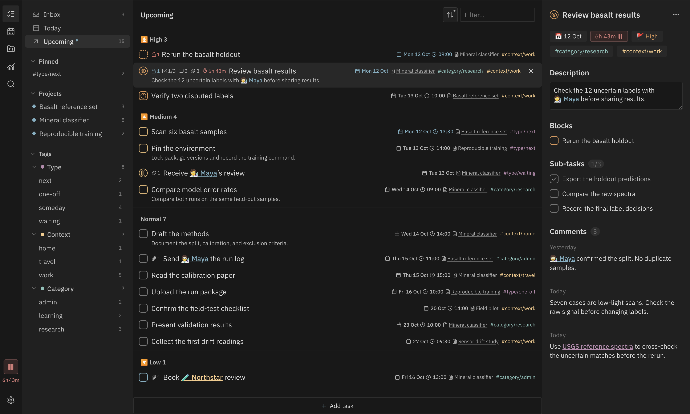

# Abyss Tasks

Manage Markdown tasks in Obsidian with [Tasks-compatible syntax](https://publish.obsidian.md/tasks/Introduction). Plan work with nested
tags, note-based projects and a calendar, then review where your time went.

## Quick start

1. [Install Abyss Tasks](https://community.obsidian.md/plugins/abyss-tasks) and enable it.
2. Run **Abyss Tasks: Open view** from the command palette.
3. Click **Inbox**, press `Q`, [type your first task](assets/screenshots/quick-capture.png)
   and press `Enter`.

Start without changing any settings. Untagged tasks go to Inbox. For a small GTD-style
setup, add the groups below as you need them. A task only needs the tags that help you
choose what to do next.

| Group    | Examples                                                        |
| -------- | --------------------------------------------------------------- |
| Type     | `#type/next`, `#type/one-off`, `#type/waiting`, `#type/someday` |
| Context  | `#context/work`, `#context/home`, `#context/travel`             |
| Category | `#category/research`, `#category/admin`, `#category/learning`   |

The sidebar picks up these tags from your tasks. Select a group or tag to focus your list.

## Features

Click a feature name to see it in use.

- **[Task details](assets/screenshots/task-details.png)**. Edit dates, priorities and
  tags, add subtasks and comments, and link to notes, people or external references.
  Set repeat rules for recurring work. Tasks stay in your Markdown files.
- **[Custom statuses](assets/screenshots/custom-statuses.png)**. Define statuses such
  as Review, Waiting or Approved, with their own checkbox symbols and icons.
- **[Filtering and grouping](assets/screenshots/grouping.png)**. Group by priority,
  date or tag, sort the list and choose which statuses to show. Each list remembers its view.
- **Calendar and time blocks**. Plan your [day](assets/screenshots/calendar-day.png),
  [week](assets/screenshots/calendar-week.png) or [month](assets/screenshots/calendar-month.png).
  Drag a task to a time slot, then move or resize its block to adjust the plan.
- **Projects**. Click **New project** to create a note in `projects/`. Keep its
  description and properties in the note, with tasks below. Switch between the
  [table](assets/screenshots/projects-table.png), [kanban](assets/screenshots/projects-kanban.png)
  and [timeline](assets/screenshots/projects-timeline.png) to compare progress, change statuses
  or adjust dates.
- **[Dependencies](assets/screenshots/task-details.png)**. Link tasks to their
  prerequisites. See what is blocked and what becomes available when you finish a task.
- **[Search](assets/screenshots/search.png)**. Find tasks across your vault with fuzzy
  matching, including text in descriptions and subtasks.
- **[Time tracking](assets/screenshots/time-tracking.png)**. Start or pause a timer on
  a task and review its recorded sessions.

With the panel focused, use `Q` to capture, `T` for Today, `U` for Upcoming, `C` for
Calendar, `P` for Projects, `A` for Analysis and `S` for Search. Change these in the shortcut settings.

The screenshots use [Base16 Default Dark](https://github.com/flowing-abyss/obsidian-base16-default-dark), IBM Plex fonts through
[Local Fonts](https://github.com/flowing-abyss/obsidian-local-fonts), and
[Supercharged Links](https://github.com/mdelobelle/obsidian_supercharged_links) for note icons and colours.

## Analysis

Review task flow, project health and recorded time across your vault or within a project.

- **[Timeline](assets/screenshots/analysis.png)**. See recorded sessions across each day
  and compare weekly totals.
- **[Allocation](assets/screenshots/analysis-allocation.png)**. Compare time spent by
  project, tag or priority, then open a group to inspect its daily totals.
- **[Patterns](assets/screenshots/analysis-patterns.png)**. See when you work in a heatmap
  of recorded time by weekday and hour.

Other views cover completion, deadlines, project aging and dependencies.

## Roadmap

- [ ] Optimize the mobile interface.
- [ ] Add AI integration and voice input.
- [ ] Add hybrid search alongside fuzzy search.

## Contributing

Bug reports, ideas and pull requests are welcome. See [Contributing](CONTRIBUTING.md)
for setup and checks.

## License

[MIT](LICENSE)
